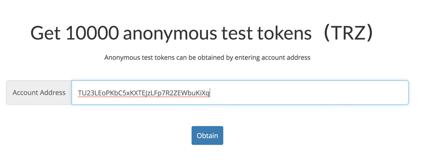

# Abstract
This document offers an explanation for wallet-cli users and TRON developers on how to use shielded transaction feature with wallet-cli on Nile Testnet.
 
## 1 Shielded transaction on Nile Testnet
Currently, a TRC-10 token named TRONZ (TRZ, Token id: 1000016) supports shielded transaction on Nile Testnet.
 
## 2 Use wallet-cli
### 2.1 Build wallet-cli
Wallet-cli project code is hosted at: `https://github.com/tronprotocol/wallet-cli`  
Wallet-cli is a command-line-based wallet application. We will quickly go through the building of a wallet-cli. Feel free to skip it if you are familiar with the process. Simply put, there are a few steps you need to go through before you can use the wallet-cli software:  

1) **Download the source code of the project**  
```test
git clone https://github.com/tronprotocol/wallet-cli.git
```
 
2) **Change configuration files**  

You can find publicly available [nodes](http://nileex.io/status/getStatusPage) on [Nile Testnet](http://nileex.io). 
```text
Public Fullnode List
47.252.19.181
47.252.3.238
```
And you can make changes to ip.list in the fullnode in this configuration file src/main/resources/config.conf.  

```text
net {
 type = mainnet
}

fullnode = {
  ip.list = [
    "47.252.19.181:50051"
  ]
}

#soliditynode = {
#  ip.list = [
#    "127.0.0.1:50052"
#  ]
#}

RPC_version = 2
```
3) **Build the source code of the project** 
```test
$ cd wallet-cli
$ ./gradlew build
```
 
4) **Use the built wallet-cli.jar**
```test
$ cd build/libs
$ java -jar wallet-cli.jar
```
 
Please refer to [wallet-cli get started](https://github.com/tronprotocol/wallet-cli#get-started) if you encounter any problems during the process of building wallet-cli software. Your wallet-cli software is running properly if you see the output below.
```text
Welcome to Tron Wallet-Cli
Please type one of the following commands to proceed.
Login, RegisterWallet or ImportWallet
 
You may also use the Help command at anytime to display a full list of commands.
 
wallet> 
```
 
*All of the following command demos are run in wallet-cli*   
### 2.2 Shielded wallet and shielded address
You may create multiple shielded addresses in one shielded wallet. Shielded addresses can be exported from or imported to a shielded wallet. Here are some related commands.
#### 2.2.1 Create a shielded address
> Execute the command `GenerateShieldedAddress` to generate a shielded address. If there is no shielded wallet locally, this command will create a shielded wallet first and then a shielded address.  
```text
wallet> GenerateShieldedAddress 
ShieldedAddress list:
ztron13ef0cjxz536snelt0rdnyqe80h2qq8j2zsh8kx7fqm4grh35rnnycx5rmewq6xwsn5elzfyshrx
``` 
 
Now a shielded address is generated:  
`ztron13ef0cjxz536snelt0rdnyqe80h2qq8j2zsh8kx7fqm4grh35rnnycx5rmewq6xwsn5elzfyshrx`  
**Please note: the command `GenerateShieldedAddress n` also supports generating n shielded addresses. The default value for n is 1. If you want to generate 5 shielded addresses at one time**
```test
GenerateShieldedAddress 5 
```
Now you can check out the shielded addresses you have created.
#### 2.2.2 View the shielded address  
> Execute the command `ListShieldedAddress` to view the shielded addresses created in the shielded wallet.  
```test  
wallet> ListShieldedAddress 
ShieldedAddress :
ztron13ef0cjxz536snelt0rdnyqe80h2qq8j2zsh8kx7fqm4grh35rnnycx5rmewq6xwsn5elzfyshrx
```
  
If you re-run wallet-cli, you can log into the local shielded wallet you have created using the command below.
#### 2.2.3 Log into the shielded wallet  
> Execute the command `LoadShieldedWallet` to log into the local shielded wallet.  
```test 
wallet> LoadShieldedWallet
LoadShieldedWallet successful !!!
```
  
Surely you may need to back up the local shielded address to other shielded wallets. You can do so by executing the two commands below: 
#### 2.2.4 Export the shielded address  
> Execute the command `BackupShieldedAddress` in the local wallet to export the shielded address:  
  
```test
wallet> BackupShieldedAddress
Please input your password for shielded wallet.
password: 
The 1th shielded address is ztron13ef0cjxz536snelt0rdnyqe80h2qq8j2zsh8kx7fqm4grh35rnnycx5rmewq6xwsn5elzfyshrx
Please choose between 1 and 1
1
00645e78310c0619a62defeb5be3d48ba183f66e249c63e2eed4164e072e87ea8e52fc48c2a47509e7eb78
BackupShieldedAddress successful !!!
```
#### 2.2.5 Import the shielded address  
> Execute the command `ImportShieldedAddress` in other shielded wallets to import the shielded address:  
```test  
wallet> ImportShieldedAddress
Please input your password for shielded wallet.
password: 
Please input shielded address hex string. Max retry time: 3
00645e78310c0619a62defeb5be3d48ba183f66e249c63e2eed4164e072e87ea8e52fc48c2a47509e7eb78
Import new shielded address is: ztron13ef0cjxz536snelt0rdnyqe80h2qq8j2zsh8kx7fqm4grh35rnnycx5rmewq6xwsn5elzfyshrx
ImportShieldedAddress successful !!!
```
  
**Warning: The string (`00645e78310c0619a62defeb5be3d48ba183f66e249c63e2eed4164e072e87ea8e52fc48c2a47509e7eb78`) used for exporting and importing the shielded address is confidential. Please do not disclose the information to anyone else.**
 
After the shielded wallet is all set up, you can maket a shielded transaction. Before proceeding to the next step, let's first acquire some TRZ via a wallet that is not shielded. The first step is to create a wallet that is not shielded which contains an public address. Here, we use a registered wallet with the public address `TU23LEoPKbC5xKXTEJzLFp7R2ZEWbuKiXq` and request some TRZ on the [page](http://nileex.io/join/getJoinPage) for further tests.
  
 
*After making these preparations, here are some steps to start a shielded transaction based on the shielded wallet address in wallet-cli*  
 
### 2.3 Shielded transaction
 
#### 2.3.1 Overview
There are three types of transfer that involve shielded addresses. They are:
 
| sender address | ---> | receiving address |
| ---------|---------|-------- |
| `public address` | ---> | `shielded address` |
| `shielded address` | ---> | `shielded address` |
| `shielded address` | ---> | `public address` |

The above three types of shielded transactions can all be executed using the command `SendShieldedCoin`. **Each type of transfer costs a flat fee of 10 TRZ**. Please keep this number in mind as it affects the settings of command parameters. In addition, the TRZ amount in the command `SendShieldedCoin` is always `1,000,000` times the actual input, meaning you need to set the parameter as `1000000` to put `1 TRZ` in the command .
 
#### 2.3.2 Use SendShieldedCoin command
Here are the full description and explanation of relevant parameters of the command `SendShieldedCoin`:
```test
SendShieldedCoin publicFromAddress fromAmount shieldedInputNum input1 publicToAddress toAmount shieldedOutputNum shieldedAddress1 amount1 memo1 shieldedAddress2 amount2 memo2 
```
`publicFromAddress` The public sender address. The parameter is used when transferring from a public address to a shielded address. Otherwise, please set to `null`.  
`fromAmount` Amount of transfer to a transparent address. If `publicFromAddress` is set to `null`, this parameter needs to be set to `0`.  
`shieldedInputNum` Number of shielded notes to be sent. This can be set to `0` or `1`.  
`input1` Local serial numbers of shielded notes. The number of notes should equal the value of `shieldedInputNum`. No need to set these parameters if `shieldedInputNum` is `0`.  
`publicToAddress` Public address to receive the transfer. This parameter is used when transferring from a shielded address to a public address.  
`toAmount` The amount sent to the public address.  
`shieldedOutputNum`  Number of shielded notes that receive the transfer. This can be set to 0, 1 or 2.  
`shieldedAddress1` Shielded address to receive the transfer.  
`amount1` The amount sent to the shielded address `shieldedAddress1`.  
`memo1` Remarks of note (512 bytes at most). This parameter can be set to `null` when not in use.  
`shieldedAddress2` Shielded address to receive the transfer.  
`amount2` The amount sent to the shielded address `shieldedAddress2`.   
`memo2` Remarks of note (512 bytes at most). This parameter can be set to `null` when not in use.  

**Note: A legitimate `SendShieldedCoin` command needs to make sure the TRZ transferred from a sender address equals the sum of TRZ received by all receiving addresses plus the fees paid. We'll touch upon it in the following examples.
 
*Below are examples of the three types of transactions:*    
##### 2.3.2.1 Transfer from a public address to a shielded address

```test
SendShieldedCoin TU23LEoPKbC5xKXTEJzLFp7R2ZEWbuKiXq 210000000 0 null 0 2 ztron16uz8hugh397ndwrxxxfr6kne2jc3zry4msdls4rw8d0m79v9w0tus9czwafys8qa9ynpkzlz4ym 120000000 first ztron13ef0cjxz536snelt0rdnyqe80h2qq8j2zsh8kx7fqm4grh35rnnycx5rmewq6xwsn5elzfyshrx 80000000 second 
```
  
Please note that additional signature is needed when transferring from a public address. You will see the result below if the transfer is successful.

```test
wallet> SendShieldedCoin TU23LEoPKbC5xKXTEJzLFp7R2ZEWbuKiXq 210000000 0 null 0 2 ztron16uz8hugh397ndwrxxxfr6kne2jc3zry4msdls4rw8d0m79v9w0tus9czwafys8qa9ynpkzlz4ym 120000000 first ztron13ef0cjxz536snelt0rdnyqe80h2qq8j2zsh8kx7fqm4grh35rnnycx5rmewq6xwsn5elzfyshrx 80000000 second

... ...
Please confirm and input your permission id, if input y or Y means default 0, other non-numeric characters will cancell transaction.
y
Please choose your key for sign.
The 1th keystore file name is UTC--2019-12-31T17-01-51.940000000Z--TEKqBNRDPRW7MGS4SHvNwHAcgkhH6jzH87.json
The 2th keystore file name is UTC--2019-12-31T09-22-43.363000000Z--TU23LEoPKbC5xKXTEJzLFp7R2ZEWbuKiXq.json

Please choose between 1 and 2
2
Please input your password.
password: 

... ...

txid is ecd3149beb35b3dd817a1f26ebd5a471a3273429af643484f07bece892d4e45b
SendShieldedCoin successful !!!
```
  
*Command Interpretation:*  
Transfer 210 TRZ from the public address `TU23LEoPKbC5xKXTEJzLFp7R2ZEWbuKiXq. Out of the total 210 TRZ, send 120TRZ to the shielded address `ztron16uz8hugh397ndwrxxxfr6kne2jc3zry4msdls4rw8d0m79v9w0tus9czwafys8qa9ynpkzlz4ym` with the note "first" 
and send 80 TRZ to the shielded address `ztron13ef0cjxz536snelt0rdnyqe80h2qq8j2zsh8kx7fqm4grh35rnnycx5rmewq6xwsn5elzfyshrx` with the note "second".  
The transfer fee is 10TRZ.
> *It is verified that 210 TRZ = 120 TRZ + 80 TRZ + 10 TRZ*
 
2 notes will be added to the local wallet after the command is successfully executed. Run the command `listshieldednote 0` to obtain all notes in Unspend state within the local wallet. Results are followed:  

```test
wallet> listshieldednote 0
Unspent note list like:
0 ztron16uz8hugh397ndwrxxxfr6kne2jc3zry4msdls4rw8d0m79v9w0tus9czwafys8qa9ynpkzlz4ym 120000000 ecd3149beb35b3dd817a1f26ebd5a471a3273429af643484f07bece892d4e45b 0 UnSpend first
1 ztron13ef0cjxz536snelt0rdnyqe80h2qq8j2zsh8kx7fqm4grh35rnnycx5rmewq6xwsn5elzfyshrx 80000000 ecd3149beb35b3dd817a1f26ebd5a471a3273429af643484f07bece892d4e45b 1 UnSpend second
```  
  
**Reminder: All notes in Unspend state are designated with a specific number - the one each note starts with. This number is critical when transferring from a shielded address, which we will address in details later.**

When transferring from a shielded address to other addresses, only notes marked UnSpend can be sent via shielded transaction. As one shielded address may contain multiple notes, the note number must be entered to identity the note to be sent.
 
##### 2.3.2.2 Transfer between shielded addresses 
We will only talk about transfer between two shielded addresses in the local wallet for the sake of simplicity.  

```test
wallet> SendShieldedCoin null 0 1 1 null 0 1 ztron16uz8hugh397ndwrxxxfr6kne2jc3zry4msdls4rw8d0m79v9w0tus9czwafys8qa9ynpkzlz4ym 70000000 third
```
  
*Command Interpretation:*  
80 TRZ are sent from the No.1 note of the shielded address `ztron13ef0cjxz536snelt0rdnyqe80h2qq8j2zsh8kx7fqm4grh35rnnycx5rmewq6xwsn5elzfyshrx`. 70 TRZ are received by the shielded address `ztron16uz8hugh397ndwrxxxfr6kne2jc3zry4msdls4rw8d0m79v9w0tus9czwafys8qa9ynpkzlz4ym`.  
The transfer fee is 10 TRZ.
> *It is verified that 80 TRZ = 70 TRZ + 10 TRZ*

After executing the command, you can check the notes in your local wallet where you'll find that the note with 80 TRZ is now in Spent state and there is a new UnSpend note with 70 TRZ.  

```test
wallet> listshieldednote 1
All notes list like:
ztron16uz8hugh397ndwrxxxfr6kne2jc3zry4msdls4rw8d0m79v9w0tus9czwafys8qa9ynpkzlz4ym 120000000 ecd3149beb35b3dd817a1f26ebd5a471a3273429af643484f07bece892d4e45b 0 UnSpent first
ztron16uz8hugh397ndwrxxxfr6kne2jc3zry4msdls4rw8d0m79v9w0tus9czwafys8qa9ynpkzlz4ym 70000000 f95185394430b49a865488a7ffc8c7e4306eecd6fcd94d9bdc3018a810879a49 0 UnSpent third
ztron13ef0cjxz536snelt0rdnyqe80h2qq8j2zsh8kx7fqm4grh35rnnycx5rmewq6xwsn5elzfyshrx 80000000 ecd3149beb35b3dd817a1f26ebd5a471a3273429af643484f07bece892d4e45b 1 Spent second
```
 
##### 2.3.2.3 Transfer from a shielded address to a public address  
Execute the command `listshieldednote 0` to get the note associated with the local shielded address.  
  
```test
wallet> listshieldednote 0
Unspent note list like:
0 ztron16uz8hugh397ndwrxxxfr6kne2jc3zry4msdls4rw8d0m79v9w0tus9czwafys8qa9ynpkzlz4ym 120000000 ecd3149beb35b3dd817a1f26ebd5a471a3273429af643484f07bece892d4e45b 0 UnSpend first
2 ztron16uz8hugh397ndwrxxxfr6kne2jc3zry4msdls4rw8d0m79v9w0tus9czwafys8qa9ynpkzlz4ym 70000000 f95185394430b49a865488a7ffc8c7e4306eecd6fcd94d9bdc3018a810879a49 0 UnSpend third
```
 
Then execute the command below: 

```test
sendshieldedcoin null 0 1 0 TU23LEoPKbC5xKXTEJzLFp7R2ZEWbuKiXq 110000000 0
```
  
*Command Interpretation:*  
120 TRZ are sent from the No.0 note of the shielded address `ztron16uz8hugh397ndwrxxxfr6kne2jc3zry4msdls4rw8d0m79v9w0tus9czwafys8qa9ynpkzlz4ym`. 110 TRZ are received by the public address `TU23LEoPKbC5xKXTEJzLFp7R2ZEWbuKiXq`  
Transfer fee is 10 TRZ.  
> *It is verified that 120 TRZ = 110 TRZ + 10 TRZ。* 
  
After the command is executed, execute the command `listshieldednote 1` and you'll see the note with 120 TRZ has changed from UnSpend to Spent state.  
  

```test
wallet> listshieldednote 1
All notes list like:
ztron16uz8hugh397ndwrxxxfr6kne2jc3zry4msdls4rw8d0m79v9w0tus9czwafys8qa9ynpkzlz4ym 70000000 f95185394430b49a865488a7ffc8c7e4306eecd6fcd94d9bdc3018a810879a49 0 UnSpent third
ztron13ef0cjxz536snelt0rdnyqe80h2qq8j2zsh8kx7fqm4grh35rnnycx5rmewq6xwsn5elzfyshrx 80000000 ecd3149beb35b3dd817a1f26ebd5a471a3273429af643484f07bece892d4e45b 1 Spent second
ztron16uz8hugh397ndwrxxxfr6kne2jc3zry4msdls4rw8d0m79v9w0tus9czwafys8qa9ynpkzlz4ym 120000000 ecd3149beb35b3dd817a1f26ebd5a471a3273429af643484f07bece892d4e45b 0 Spent first
```

## Support
This document is dedicated to wallet-cli software with a focus on the basic commands to make shielded transactions through wallet-cli. If you have any problems or find any mistakes, please join our discussion [Gitter](https://gitter.im/tronprotocol/wallet-cli).

