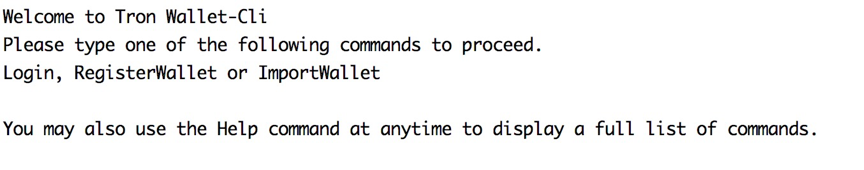
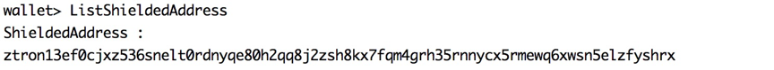
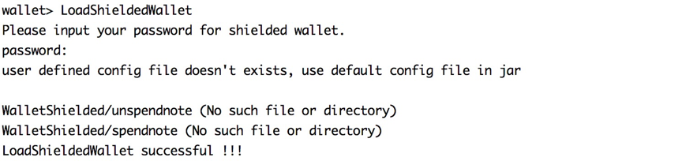
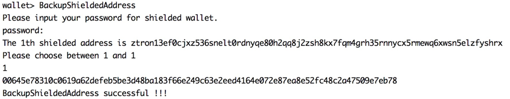
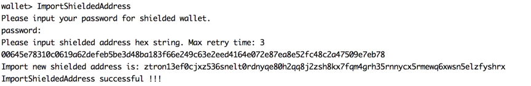

## Nile测试网匿名转账介绍
在Nile测试网中，已经支持一种基于TRC-10发行的通证TRONZ（代币TRZ，通证id：1000016）的匿名转账功能
## 匿名钱包和匿名地址
## 使用wallet-cli
wallet-cli项目代码托管在：`https://github.com/tronprotocol/wallet-cli`  
wallet-cli是一个基于命令行的钱包应用，我们简单介绍wallet-cli的构建过程，如果你已经对此很熟悉了，可以略过这个部分。  
简单来说，使用wallet-cli软件进行需要完成这几步：  
1）下载项目源代码  
```test
git clone https://github.com/tronprotocol/wallet-cli.git
```

2）修改配置文件  
你可以在这个[页面](http://nileex.io/status/getStatusPage) 找到[Nile测试网](http://nileex.io)提供的公开可用节点，并在src/main/resources/config.conf这个配置文件中对fullnode中的ip.list进行修改。  

3）将项目源代码进行构建
```test
$ cd wallet-cli
$ ./gradlew build
```

4）使用构建好的wallet-cli.jar包
```test
$ cd build/libs
$ java -jar wallet-cli.jar
```

如果你在构建wallet-cli软件的过程中遇到任何问题，请参考[wallet-cli使用教程](https://github.com/tronprotocol/wallet-cli#get-started)，如果你看到以下输出，说明你已经成功运行了wallet-cli软件。


以下所有命令的演示过程都是在wallet-cli这个软件中进行的。  
- 创建匿名地址
执行命令GenerateShieldedAddress创建匿名地址，如果此时本地还没有匿名钱包，这个命令会首先创建一个匿名钱包，然后再创建匿名地址。


`ztron13ef0cjxz536snelt0rdnyqe80h2qq8j2zsh8kx7fqm4grh35rnnycx5rmewq6xwsn5elzfyshrx`

note：GenerateShieldedAddress命令也支持一次性创建多个匿名地址，如一次性创建5个匿名地址的命令：
```test
GenerateShieldedAddress 5 
```
此时，你可以尝试查看之前已经创建的匿名地址。

- 查看匿名地址  
执行命令ListShieldedAddress可以查看匿名钱包中已经创建的匿名地址。


如果你重新运行wallet-cli程序，可以通过下面命令登陆到已经创建成功的本地钱包。

- 登陆匿名钱包  
执行命令LoadShieldedWallet登陆本地的匿名钱包。


当然，你有时可能需要将本地的匿名地址同时备份到其他匿名钱包中，通过以下两个命令完成：  
首先，在本地钱包执行BackupShieldedAddress命令将匿名地址进行导出。

然后在其他匿名钱包中执行ImportShieldedAddress命令将该匿名地址进行导入：  

注意：00645e78310c0619a62defeb5be3d48ba183f66e249c63e2eed4164e072e87ea8e52fc48c2a47509e7eb78 这个字符串是重要的秘密信息，请不要泄露给其他人。

如果你准备好了匿名钱包，就可以进行匿名转账了，当然在这之前，我们先通过普通钱包获取一些TRZ。你可以首先创建一个普通钱包，它包含了一个公开地址。我们使用已经注册好的一个普通钱包，它包含一个公开地址`TU23LEoPKbC5xKXTEJzLFp7R2ZEWbuKiXq`
然后在[页面](http://nileex.io/join/getJoinPage)上请求获取一些TRZ用于测试。

### 匿名转账
有三种模式的转账涉及到匿名地址，分别是：
转出地址     转入地址
公开地址 ——> 匿名地址
匿名地址 ——> 匿名地址
匿名地址 ——> 公开地址
以上三种模式的匿名转账都可以通过同一个命令完成————`SendShieldedCoin`，你需要谨记的一点是，无论是哪种模式的转账，都要花费固定的手续费10TRZ，这个数据会影响后面参数的设置，因此请务必谨记。
`SendShieldedCoin` 命令中所有的TRZ数量单位都是106的。

下面我们先看一下`SendShieldedCoin`命令的使用方法
```test
SendShieldedCoin publicFromAddress fromAmount shieldedInputNum input1 input2 input3 ... publicToAddress toAmount shieldedOutputNum shieldedAddress1 amount1 memo1 shieldedAddress2 amount2 memo2 ... 
```

下面是这些参数的含义：
`publicFromAddress` 转出公开地址，公开地址转账给匿名地址时使用，不需要则设置为 null
`fromAmount` 转出到透明地址金额，如果publicFromAddress为null，该变量必须设置为0
`shieldedInputNum` 转出匿名note的个数，可以设置成0或者1。
`input1 input2 input3 ...` 匿名note在本地的序号，个数跟shieldedInputNum保存一致，如果shieldedInputNum 为0，则该变量不需要设置
`publicToAddress` 转入公开地址，匿名地址转账给公开地址时使用
`toAmount` 转入到公开地址金额
`shieldedOutputNum` 转入匿名note的个数
`shieldedAddress1` 匿名地址
`amount1` 转入到匿名地址shieldedAddress1的金额
`memo1` note的备注（最多512个字节）可以在不需要时设置为null

同时还要特别注意：一个合法的SendShieldedCoin命令必须保证转出地址转出的TRZ数量等于所有转入地址收到的TRZ数量与手续费之和。

下面是分别为这三种转账模式举的例子：
-	公开地址向匿名地址转账
```test
SendShieldedCoin TU23LEoPKbC5xKXTEJzLFp7R2ZEWbuKiXq 210000000 0 null 0 2 ztron16uz8hugh397ndwrxxxfr6kne2jc3zry4msdls4rw8d0m79v9w0tus9czwafys8qa9ynpkzlz4ym 120000000 first ztron13ef0cjxz536snelt0rdnyqe80h2qq8j2zsh8kx7fqm4grh35rnnycx5rmewq6xwsn5elzfyshrx 80000000 second
```

注意公开地址转出，需要额外进行签名的步骤，如果成功，可以看到

从公开地址TU23LEoPKbC5xKXTEJzLFp7R2ZEWbuKiXq转出210TRZ，其中向匿名地址ztron16uz8hugh397ndwrxxxfr6kne2jc3zry4msdls4rw8d0m79v9w0tus9czwafys8qa9ynpkzlz4ym转出120TRZ，并附言first，向匿名地址 
ztron13ef0cjxz536snelt0rdnyqe80h2qq8j2zsh8kx7fqm4grh35rnnycx5rmewq6xwsn5elzfyshrx转出80TRZ，并附言second。
可以验证 210 TRZ = 120 TRZ + 80 TRZ + 10 TRZ

命令成功执行之后，本地钱包中会增加2个note，通过listshieldednote 0命令获取本地钱包中所有UnSpend状态的note，可以看到如下结果：
注意所有UnSpend状态的note都会有一个编号，即每条note开头的那个数字，这个会在我们下面介绍转出地址是匿名地址的时候很有用。

通过匿名地址向其他地址进行转账，首先需要通过只有标记为UnSpend的note才能做为匿名转出地址，由于1个匿名地址可以有多个note，所以需要填写note编号来指定要转出匿名地址中具体是哪个note。

- 匿名地址向匿名地址转账  
为了更方便地说明，我们选择在本地钱包的两个匿名地址之间进行转账， 
```test
sendshieldedcoin null 0 1 1 null 0 1 ztron16uz8hugh397ndwrxxxfr6kne2jc3zry4msdls4rw8d0m79v9w0tus9czwafys8qa9ynpkzlz4ym 70000000 third
```
匿名地址ztron13ef0cjxz536snelt0rdnyqe80h2qq8j2zsh8kx7fqm4grh35rnnycx5rmewq6xwsn5elzfyshrx的1号note转出的金额为80TRZ，转入到匿名地址ztron16uz8hugh397ndwrxxxfr6kne2jc3zry4msdls4rw8d0m79v9w0tus9czwafys8qa9ynpkzlz4ym的金额为70TRZ。
手续费是10TRZ。
可以验证 80 TRZ = 70 TRZ + 10 TRZ

命令执行成功之后，再查看本地钱包所有的note，可以看出之前80TRZ的那个note已经变成Spent状态，多出来一个UnSpend状态的70TRZ的note，刚好符合预期。

- 匿名地址向公开地址转账  
首先依然通过`listshieldednote 0`命令获取本地匿名地址对应的note，

然后执行下面的命令
```test
sendshieldedcoin null 0 1 0 TU23LEoPKbC5xKXTEJzLFp7R2ZEWbuKiXq 110000000 0
```

匿名地址ztron16uz8hugh397ndwrxxxfr6kne2jc3zry4msdls4rw8d0m79v9w0tus9czwafys8qa9ynpkzlz4ym的0号note转出120TRZ，公开地址 TU23LEoPKbC5xKXTEJzLFp7R2ZEWbuKiXq收到110TRZ。
手续费10TRZ。
可以验证 120 TRZ = 110 TRZ + 10 TRZ。
如果命令执行成功，再通过执行listshieldednote 1命令可以看到之前的UnSpend状态的120 TRZ的note已经变为Spent状态了，符合预期。
