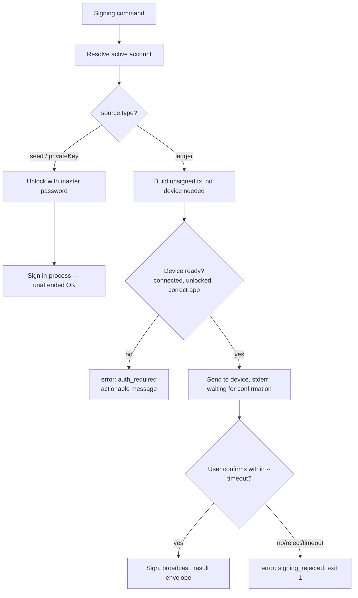
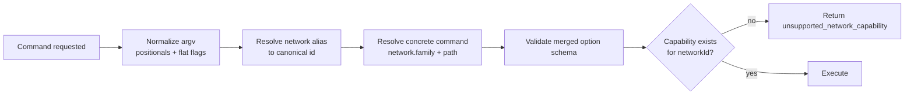
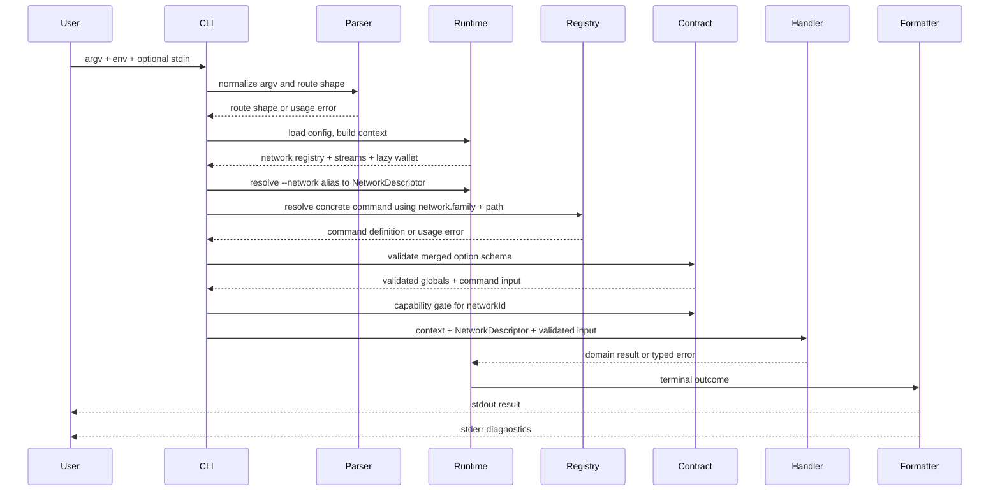
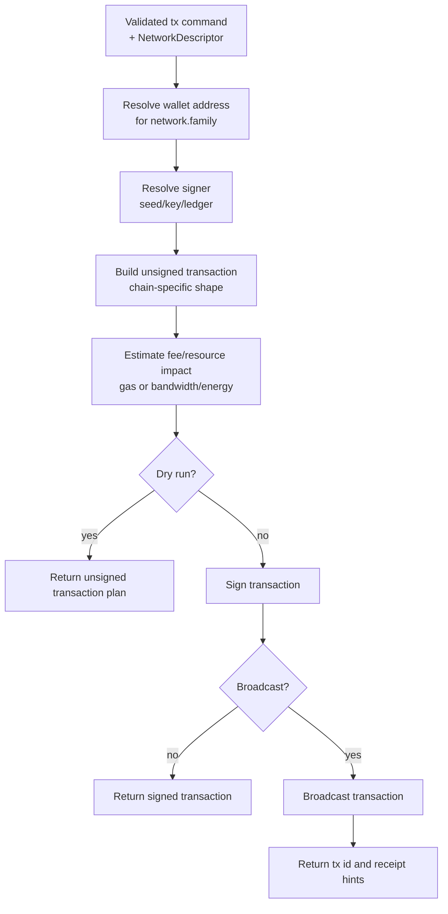

# TypeScript Wallet CLI Architecture Plan — V2

> Restructured edition of `typescript-wallet-cli-architecture-plan.md`. Same decisions and content,
> reorganized into five sections: **(1) Goals → (2) Layered architecture diagram → (3) Per-layer
> responsibilities + pseudo code → (4) Planned commands → (5) Design decisions & detail breakdown.**
> Scope is **TRON + EVM** (Solana out of scope). Locked decisions are marked **[Decision]**.

---

## 1. Goals

What this project sets out to deliver:

**Product**

- A new **TypeScript** implementation of `wallet-cli`.
- A **human-friendly and AI-friendly** entry point to blockchains.
- **Standard CLI only — no REPL, no interactive stdin prompts.** Every command is complete from argv, env, stdin-flags, or config, and runs once.
- Multi-chain for **TRON and EVM chains (Base, Optimism, …)**, without pretending the two behave the same.

**Engineering principles**

- **AI-readable by default.** JSON mode emits a fixed envelope with predictable fields; text mode is for humans and is never the only source of meaning.
- **Strict stream discipline.** `stdout` = results, `stderr` = diagnostics, `stdin` = only flags that explicitly declare it.
- **Stable output contract.** Fields may be added, never renamed/removed without a versioned change.
- **Deterministic exit codes** (`0/1/2`) with the detailed reason in `error.code`.
- **Order-independent flags.** Users perceive one flat flag namespace — global and command options can appear before, between, or after the positional command path. The global/command split is internal only.
- **Share infrastructure, not domains.** Chains share *libraries* (keystore, derivation, output, parsing, config), not a forced domain interface. Each chain owns its full command surface.
- **Composable internals.** Parse → validate → plan → sign → broadcast → format are separate, testable stages.

**Explicit non-goals**

- No interactive REPL; no hidden prompts during execution.
- No universal blockchain abstraction that erases chain differences.
- No output that mixes logs/warnings/data on one stream.
- **No backward compatibility with the Java keystore layout** (`Wallet/`, `Mnemonic/`, `Ledger/`). **[Decision: clean break.]**
- Solana and other non-EVM/non-TRON chains.

**Why this shape (lesson from the Java Standard CLI)**

- The Java Standard CLI has **116 commands** (~70 read-only, ~44 signing).
- **~40+ are TRON-only with no EVM equivalent** (freeze/unfreeze, delegate-resource, vote-witness, proposals, TRC10, Bancor, GasFree, resource queries).
- The genuinely shared surface is only **~15–20%** (native balance, native/token transfer, block/tx queries, contract call/deploy, wallet management).
- → Forcing both chains under one provider interface would serve only that 15–20% and dump the rest into an escape hatch. Hence: per-chain namespaces, shared infrastructure only.

**Contract ideas preserved from Java**: global vs command-local options separated; structured success/error envelope; exit codes distinguish success/execution/usage; explicit env/stdin auth (`MASTER_PASSWORD`); exactly one terminal outcome per command; `--quiet`/`--verbose` affect diagnostics only.

**First milestone (narrow & complete)** — proves the architecture before high-risk signing:

- TS scaffold, Standard CLI only; `--output text|json`, `--quiet`, `--verbose`, `--help`, `--version`.
- Stable JSON envelope, `0/1/2` exit-code contract.
- Seed/vault keystore with master-password unlock; `wallet create/import/list/set-active`.
- `chains list`, `capabilities --network <id|alias>`.
- `account balance --network nile` + `account balance --network base` **from one shared wallet identity**.
- Golden tests proving stdout/stderr behavior and keystore round-trips.

---

## 2. Layered Architecture (left → right)

Data flows left to right, one layer feeding the next. Chain modules consume the shared
infrastructure libraries rather than implementing a shared domain interface.

```mermaid
flowchart LR
    %% =========================
    %% Styles
    %% =========================
    classDef input fill:#E8F0FE,stroke:#4C78A8,color:#1F2D3D,stroke-width:1.5px;
    classDef cli fill:#EAF7EA,stroke:#59A14F,color:#1F2D3D,stroke-width:1.5px;
    classDef contract fill:#FFF4E5,stroke:#F28E2B,color:#1F2D3D,stroke-width:1.5px;
    classDef runtime fill:#F3E8FF,stroke:#9C6ADE,color:#1F2D3D,stroke-width:1.5px;
    classDef chain fill:#E6F7F5,stroke:#2CB1A1,color:#1F2D3D,stroke-width:1.5px;
    classDef infra fill:#FDEBEC,stroke:#E15759,color:#1F2D3D,stroke-width:1.5px;
    classDef output fill:#F5F5F5,stroke:#7F7F7F,color:#1F2D3D,stroke-width:1.5px;
    classDef sink fill:#FFF1F2,stroke:#D37295,color:#1F2D3D,stroke-width:1.5px;

    %% =========================
    %% Layers
    %% =========================
    subgraph L1["① Input"]
        direction TB
        IN["argv<br/>env<br/>stdin"]
    end

    subgraph L2["② CLI Layer"]
        direction TB
        GP["argv normalizer<br/>(positionals + flat flags)"]
        RT["route shape resolver"]
        RG["concrete command registry"]
    end

    subgraph L3["③ Contract Layer"]
        direction TB
        SCH["schema validation<br/>(zod)"]
        CAP["capability gate"]
    end

    subgraph L4["④ Runtime Layer"]
        direction TB
        CTX["execution context"]
        CFG["config loader"]
        NREG["network registry<br/>alias resolver"]
        BCFG["built-in defaults"]
        UCFG["~/.wallet-cli/config.yaml"]
        OVR["env vars<br/>CLI flags"]
    end

    subgraph L5["⑤ Chain Modules"]
        direction TB
        TRON["TRON module<br/>(~100 cmds)"]
        EVM["EVM module<br/>(~20 cmds)"]
    end

    subgraph L6["⑥ Infra Libraries (shared)"]
        direction TB
        KS["keystore"]
        DV["derivation"]
        RPC["RPC clients"]
        SGN["signer / ledger"]
    end

    subgraph L7["⑦ Output Layer"]
        direction TB
        FMT["json / text formatter"]
    end

    subgraph L8["⑧ Stream Manager"]
        direction TB
        SM["stream manager<br/>(stdout/stderr/stdin discipline)"]
    end

    subgraph L9["⑨ Sinks"]
        direction TB
        OUT["stdout<br/>result envelope"]
        ERR["stderr<br/>diagnostics"]
    end

    %% =========================
    %% Main Flow
    %% =========================
    IN --> GP --> RT
    RT -- route shape + global flags --> CTX
    CTX --> NREG
    NREG -- network.family + path --> RG
    RG --> SCH --> CAP
    CAP --> TRON
    CAP --> EVM

    %% Module -> Shared Infra
    TRON --> KS
    TRON --> DV
    TRON --> RPC
    TRON --> SGN

    EVM --> KS
    EVM --> DV
    EVM --> RPC
    EVM --> SGN

    %% Module -> Output
    TRON --> FMT
    EVM --> FMT

    %% Runtime Support
    BCFG -.-> CFG
    UCFG -.-> CFG
    OVR -.-> CFG
    CFG -. injects .-> CTX
    CFG -. builds .-> NREG
    CTX -. configures .-> SM

    %% Output -> Stream Manager -> Sinks
    FMT --> SM
    SM --> OUT
    SM --> ERR

    %% =========================
    %% Class Mapping
    %% =========================
    class IN input;
    class GP,RT,RG cli;
    class SCH,CAP contract;
    class CTX,CFG,NREG,BCFG,UCFG,OVR runtime;
    class TRON,EVM chain;
    class KS,DV,RPC,SGN infra;
    class FMT output;
    class SM runtime;
    class OUT,ERR sink;
```



Each chain module (⑤) registers whatever commands it actually supports and reaches into the shared
libraries (⑥). There is **no** `AccountProvider` / `TransactionProvider` / `TokenProvider` /
`SigningProvider` that both chains must implement — the key inversion versus the original revision.

---

## 3. Layer Responsibilities

Each layer below lists its **responsibility**, a **core pseudo code** sketch, and **design notes**.
Where a layer behaves specially for Ledger (signing), it links to [§6](#6-design-decisions--detail-breakdown).

Summary table:

| Layer | Module(s) | Responsibility |
| --- | --- | --- |
| ② CLI | `cli/` | Normalize argv, resolve network-bound or top-level command, run one command, return exit code. |
| ③ Contract | `contract/` | Stable schemas for inputs, outputs, errors, capabilities. |
| ④ Runtime | `runtime/` | Build execution context from config/env/flags; resolve network registry and process resources. |
| ⑤ Chain Modules | `chains/<family>/` | Implement a chain's full command set, codecs, RPC client, signer, address format. |
| ⑤ Chain core | `chains/core/` | Define the `ChainModule` interface and the capability registry. Nothing more. |
| ⑥ Keystore | `keystore/` | Chain-agnostic storage of seeds, keys, wallet identities; unlock with master password. |
| ⑥ Derivation | `derivation/` | BIP39/BIP32 derivation, per-chain coin types. |
| ⑦ Output | `output/` | Convert outcomes into JSON or text without changing behavior. |
| ⑧ Stream Manager | `runtime/stream-manager.ts` | Enforce stdout/stderr/stdin discipline and quiet/verbose behavior. |
| ⑨ Sinks | process streams | Final destinations: `stdout` for results, `stderr` for diagnostics. |
| — Errors | `errors/` | Normalize usage, execution, transport, chain-specific failures. |
| — Top-level cmds | `commands/` | Chain-neutral commands: `chains`, `capabilities`, `config`, `wallet`. |

Full package layout:

```text
src/
  cli/        main.ts  global-options.ts  command-router.ts  command-registry.ts  help-renderer.ts  exit-codes.ts
  contract/   output-envelope.ts  error-codes.ts  command-schema.ts  capabilities.ts
  runtime/    execution-context.ts  stream-manager.ts  config-loader.ts  logger.ts
  keystore/   store.ts  vault.ts  key.ts  crypto.ts  unlock.ts  wallet.ts         # SHARED, chain-agnostic
  derivation/ bip39.ts  bip32.ts  coin-types.ts                                    # tron=195, evm=60
  chains/
    core/  chain-module.ts  network-descriptor.ts  capability-registry.ts
    tron/  tron-module.ts  tron-commands/  tron-rpc-client.ts  tron-signer.ts  tron-address.ts   # Base58Check, tronweb
    evm/   evm-module.ts   evm-commands/   evm-rpc-client.ts   evm-signer.ts   evm-address.ts     # 0x/EIP-55, viem
  commands/   chains.ts  capabilities.ts  config.ts  wallet.ts   # create/import/list/set-active/export-address
  output/     json-formatter.ts  text-formatter.ts  diagnostic-writer.ts
  errors/     cli-error.ts  usage-error.ts  execution-error.ts  chain-error.ts
  tests/
```

### ② CLI Layer (`cli/`)

**Responsibility:** normalize argv into a command path + a flat flag set, resolve network aliases when
needed, resolve the concrete command, validate flags against the resolved command, run exactly one
command, return an exit code.

**[Decision: order-independent flags.]** The user perceives a single flat flag namespace — there is no
visible global-vs-command distinction. Positional tokens (non-`--`) form the command path; flags may
appear **anywhere** (before, between, or after positionals) and are collected regardless of position.
`wallet account balance --network nile --address T... --output json` and
`wallet --output json account --address T... balance --network nile` are equivalent.

```ts
function main(argv): exitCode {
  // pass 1 — custom normalization before parser subcommand semantics
  const { positionals, flags } = splitArgv(argv)     // positionals = command path; flags = every --x
  const route = registry.resolveRouteShape(positionals) // top-level or network-bound command shape
  if (!route) return EXIT.USAGE                         // 2

  // pass 2 — parse only global/meta flags needed to resolve runtime and network
  const globals = GLOBAL_OPTIONS.parse(flags.pickGlobalAndMeta())
  const ctx = buildExecutionContext(globals)             // loads config, streams, lazy wallet
  const network = route.network === "required"
    ? resolveNetworkAlias(globals.network, ctx.config)   // e.g. "bsc" -> "evm:56"
    : undefined

  // pass 3 — resolve the concrete command and validate the merged option schema
  const cmd = registry.resolveConcrete(route, network?.family) // e.g. evm + tx.send-native
  if (!cmd) return EXIT.USAGE
  const schema = mergeSchema(GLOBAL_OPTIONS, cmd.input)
  const parsed = schema.parse(flags)                  // unknown/duplicate flag → usage_error
  try {
    checkCapability(cmd, network)                                  // network-aware gate
    const out = await cmd.run(ctx, pick(parsed, cmd.input))         // → Contract layer (zod)
    formatter.success(cmd.id, chainMeta(cmd, network), out)         // → Output layer
    return EXIT.OK                                                   // 0
  } catch (e) {
    formatter.error(normalizeError(e))                              // typed → envelope
    return e.isUsage ? EXIT.USAGE : EXIT.EXEC                        // 2 or 1
  }
}
```

**Notes:**
- The global/command split is an **internal** concern (which struct a flag routes to), never a
  syntactic one the user must respect. A flag name must be unique across the merged namespace; a
  collision between a global and a command flag is a registration-time error, not a runtime one.
- Positional order *does* matter (it is the command path); flag order never does.
- Unknown flags are rejected **after** command resolution because command-specific flags may appear
  before the command path. Do not rely on a traditional subcommand parser that treats "before command"
  options as global and "after command" options as local.
- Network-bound command paths are resolved through `--network`: the alias parser returns a canonical
  network id and family, then the registry resolves `family + command path` to a concrete command id.
- Network-free top-level commands (`wallet`, `chains`, `config`) do not require `--network`.
- One terminal outcome per run; never throw raw to the console.

#### Option Taxonomy

Users see one flat option namespace, but developers must classify options by owner and sensitivity.
This classification decides which layer handles the option, whether it may be persisted, and whether
its value may appear in logs or output.

| Category | Owner layer | Value source | Can be logged? | Can be stored in config? | Examples | Purpose |
| --- | --- | --- | --- | --- | --- | --- |
| Global runtime options | Runtime | argv / env / config | Yes, if non-secret | Yes, except network defaults | `--output`, `--network`, `--wallet`, `--timeout`, `--quiet`, `--verbose` | Shape execution context. |
| Command options | Command / Chain module | argv | Yes, if non-secret | No | `--address`, `--to`, `--amount-sun`, `--token`, `--contract`, `--method` | Business input for one command. |
| Endpoint override options | Runtime config-loader | argv / env / config | Yes, sanitized | Yes | `--grpc-endpoint`, `--rpc-url` | Override the resolved network endpoint. |
| Secret-bearing options | Runtime secret resolver | stdin / env / encrypted file | No | No | `--password-stdin`, `--private-key-stdin`, `--mnemonic-stdin`, `--tx-stdin` | Read secrets without putting values in argv/config/logs. |
| Meta options | CLI | argv | Yes | No | `--help`, `-h`, `--version` | Short-circuit normal command execution. |

Rules:

- Secret-bearing flags are options, but their **values are not ordinary parsed flag values**. The flag
  only authorizes the runtime to read from a secret source.
- Do not support raw secret values in argv, such as `--private-key <value>`, `--mnemonic <words>`, or
  `--password <value>`. They leak through shell history, process lists, and logs.
- `--password-stdin` may unlock encrypted vault/key files. `--private-key-stdin` and
  `--mnemonic-stdin` are import-only secret sources. `--tx-stdin` is for explicit transaction input,
  not general business stdin.
- Endpoint override options are runtime options even when they are documented near chain commands;
  they override `~/.wallet-cli/config.yaml` for one command run.
- Network definitions and aliases live in config, but default network selection does not. Network-bound
  commands must receive `--network` explicitly.

### ③ Contract Layer (`contract/`)

**Responsibility:** own the stable input/output/error/capability schemas. Validation here is the
single source of truth for help text, JSON-schema export, and agent introspection.

```ts
type CommandDefinition<I, O> = {
  id: string                  // "tron.account.balance"
  path: string[]              // ["account", "balance"] or ["wallet", "list"]
  summary: string
  family?: string             // "tron" | "evm" for concrete network-bound commands
  network: "none" | "required"
  capability?: string         // gated against the chain's capability registry
  wallet: "none" | "optional" | "required"
  auth: "none" | "optional" | "required"
  fields: z.ZodObject<any>    // per-field schemas; for incremental/interactive validation
  input: z.ZodType<I>         // = fields.superRefine(...); whole-object + cross-field, one-shot parse
  examples: CommandExample[]
  run(ctx: ExecutionContext, input: I): Promise<O>
}
```

**Notes:** `zod` is the backbone — one schema drives validation + help + agent JSON-schema.
Required/optional/default values and cross-field validation live in the `input` schema, not in
separate `required[]`, `optional[]`, or `validateOptions()` fields. `network` describes whether the
command needs a resolved network descriptor; `wallet` describes whether it needs a wallet
identity/address; `auth` describes whether it needs secret unlocking or hardware signing. The
capability gate rejects unsupported commands after the runtime layer resolves the target network, but
before the command performs any chain operation (see capability flow in §6).

Conditional option requirements are expressed with `zod` too:

```ts
const sendNativeFields = z.object({
  to: evmAddressSchema,
  amountWei: uintStringSchema.optional(),
  amountEth: z.string().optional(),
  gasPrice: uintStringSchema.optional(),
  maxFee: uintStringSchema.optional(),
  maxPriorityFee: uintStringSchema.optional(),
  dryRun: z.boolean().default(false),
})
const sendNativeInput = sendNativeFields.superRefine((v, ctx) => {
  if (!v.amountWei && !v.amountEth) {
    ctx.addIssue({ code: z.ZodIssueCode.custom, path: ["amountWei"], message: "Provide an amount" })
  }
  if (v.amountWei && v.amountEth) {
    ctx.addIssue({ code: z.ZodIssueCode.custom, path: ["amountWei"], message: "Use only one amount unit" })
  }
  if (v.gasPrice && (v.maxFee || v.maxPriorityFee)) {
    ctx.addIssue({ code: z.ZodIssueCode.custom, path: ["gasPrice"], message: "Use legacy or EIP-1559 fees, not both" })
  }
})
```

Schema validation checks shape and cross-field rules. Capability/network validation checks whether the
resolved network supports that command or fee model (for example, BSC legacy gas vs Base EIP-1559).

**[Decision: interactive front-ends reuse the per-field schemas.]** Standard mode has no interactive
prompts (see §1 design constraints). But if an interactive front-end is later layered on top of the CLI
(prompting the user field by field, analogous to the Java REPL), it must **not** ship a second
validation path — that would drift from the schema. It reuses the contract layer's per-field
sub-schemas instead.

`zod` rules naturally split into two kinds, each with a different earliest point at which it can run:

| Rule kind | Example | Earliest it can be validated |
| --- | --- | --- |
| Single-field shape | `to` is a valid address, `amountWei` is a uint | the **moment** the user enters that field |
| Cross-field relation (`superRefine`) | one amount unit only, fee models mutually exclusive | only **after** the related fields are collected (impossible earlier) |

So the command definition exposes both `fields` (per-field) and `input` (= `fields.superRefine(...)`,
whole-object + cross-field):

- **Standard (non-interactive) path**: unchanged — `input.parse(flags)` validates in one shot.
- **Interactive path (lives in the CLI layer ②, not the contract layer ③)**: resolve network →
  resolve the concrete command → take `fields.shape` → prompt field by field, validating each answer
  immediately with `fields.shape[key].safeParse(answer)` and re-asking the same question on failure →
  once all fields are collected, run `input.parse(collected)` to apply the cross-field rules.

A bad address then errors immediately (single-field sub-schema), while things like amount-unit exclusivity
are checked at the end (cross-field rules cannot run earlier anyway). Interactive and standard share the
exact same field schemas, so they never drift. Interactive only changes *how the input object is
assembled*; once assembled it goes through the same `cmd.run(ctx, input)` pipeline. Interactive mode must
also resolve the network first to obtain the `fields` for the right `network.family` — consistent with
the pass2→pass3 order in §2; interactive just inserts "prompt + validate each field" between
`resolveConcrete` and the final `input.parse`.

### ④ Runtime Layer (`runtime/`)

**Responsibility:** assemble the `ExecutionContext` from layered config, env, and flags; build the
network registry and configure process resources such as streams and timeouts.

```ts
function buildExecutionContext(globals): ExecutionContext {
  const config = loadConfig(globals)                  // built-ins < ~/.wallet-cli/config.yaml < env < flags
  const networkRegistry = buildNetworkRegistry(config) // canonical ids + alias index
  const streams = new StreamManager(globals.output, globals.quiet)  // configured I/O controller
  const resolveWallet = () => resolveActiveWallet(globals) // lazy; many read/config cmds need none
  return { config, networkRegistry, streams, resolveWallet, output: globals.output }
}
```

**Notes:** secrets are never placed in the context's serializable surface. Wallet resolution is lazy so
wallet-free commands (`chains list`, `capabilities`, `config get`) do not fail when no wallet exists.
`config-loader` owns endpoint resolution, including user overrides for built-in networks and custom
network definitions.

#### Network Registry And Aliases

The system's canonical network identity is `{family}:{chainId}`. User input may use aliases, but
runtime, config merge, capability checks, caches, and output contracts use the canonical id.

```ts
type ChainFamily = "tron" | "evm"
type NetworkId = `${ChainFamily}:${string}` // e.g. "tron:nile", "evm:56"

type NetworkDescriptor = {
  id: NetworkId
  family: ChainFamily
  chainId: string                 // EVM numeric chain id as string; TRON network id/name
  aliases: string[]               // user-facing names accepted by --network
  rpcUrl?: string                  // EVM JSON-RPC
  grpcEndpoint?: string            // TRON gRPC
  solidityGrpcEndpoint?: string    // TRON solidity node, optional
  feeModel?: "legacy" | "eip1559" | "tron-resource"
  capabilities: string[]
}
```

Examples:

```text
tron      -> tron:mainnet
nile      -> tron:nile
shasta    -> tron:shasta
eth       -> evm:1
bsc       -> evm:56
sepolia   -> evm:11155111
base      -> evm:8453
optimism  -> evm:10
```

Rules:

- `--network` accepts either a canonical id (`evm:56`) or a globally unique alias (`bsc`).
- Alias parsing happens only at the CLI/runtime boundary. Chain modules receive a
  `NetworkDescriptor`, not the raw user alias.
- Aliases must be globally unique. If user config creates an ambiguous alias, commands fail with
  `ambiguous_network_alias`.
- Network-bound commands require `--network`; there is no default network for commands that touch a
  chain. This avoids accidentally reading from or signing on the wrong chain.
- Network-free commands (`wallet list`, `wallet import`, `chains list`, `config get`) do not require
  `--network`.

### ⑤ Chain Modules (`chains/`)

**Responsibility:** each chain implements its **entire** command surface. The only contract is:

```ts
// chains/core/chain-module.ts  — [Decision: no universal provider interfaces]
interface ChainModule {
  family: string                                        // "tron" | "evm"
  networks(): NetworkDescriptor[]
  capabilities(): CapabilityDescriptor[]
  registerCommands(registry: CommandRegistry, ctx: RuntimeContext): void
}

// chains/tron/tron-module.ts
const TronModule: ChainModule = {
  family: "tron",
  networks: () => [NILE, SHASTA, MAINNET],
  capabilities: () => [...account, ...tx, ...resources, ...governance],   // includes TRON-only keys
  registerCommands(reg) {
    reg.add(tronAccountBalance)
    reg.add(tronFreeze)            // TRON-only, no EVM counterpart
    reg.add(tronVoteWitness)       // TRON-only
    // …~100 commands grouped by family
  },
}
```

**Notes:**
- **When to share a command:** bottom-up, *rule of three*. A shared helper (e.g. a `balance` factory)
  appears only once **two** chains have the same intent *and* input shape. Even then the data stays
  chain-shaped (TRON balance carries bandwidth/energy; EVM carries gas).
- Address encoding, codecs, RPC client, and signer are chain-local (`tron-*` vs `evm-*`).

### ⑥ Infra Libraries — Keystore / Derivation / RPC / Signer (`keystore/`, `derivation/`)

**Responsibility:** chain-agnostic storage and key handling consumed by every chain. The signer
resolves how to sign based on the active wallet's `source.type` and the command's chain family.

```ts
// derivation/paths.ts — coin types are hardcoded; paths are computed from a template + account index
const COIN_TYPE = { tron: 195, evm: 60 }
const derivationPath = (family, account) => `m/44'/${COIN_TYPE[family]}'/${account}'/0/0`

// keystore/store.ts — registry is plaintext; secrets are separate encrypted files. Unit = account (index)
function resolveAddress(wallet, accountIndex, chainFamily): string {
  const address = wallet.addresses[accountIndex ?? ""]?.[chainFamily]
  if (!address) throw new WalletError("missing_wallet_address")
  return address
}

function resolveSigner(wallet, accountIndex, chainFamily, ctx): Signer {
  switch (wallet.source.type) {
    case "privateKey":                                          // non-HD: no path, no index
      return softwareSigner(decryptKey(wallet.source.keyId, masterPassword()))
    case "seed": {
      const path = derivationPath(chainFamily, accountIndex)    // template + index, not stored
      return softwareSigner(deriveKey(decryptVault(wallet.source.vaultId), path))
    }
    case "ledger": {
      const path = derivationPath(chainFamily, accountIndex)
      return ledgerSigner(wallet.source.deviceId, path)  // ⚠ see §6 Ledger
    }
  }
}
```

**Notes:**
- Storage unit is the **wallet backed by a seed, raw key, or Ledger registration**; the addressing unit is an **account** under it (HD wallets hold several). Not a single-chain address — one account exposes both TRON and EVM addresses.
- Wallet metadata is plaintext (so `wallet list` needs no password); only seeds/keys are encrypted.
- **Ledger behaves differently from every software source** — it holds no secret and blocks on a hardware confirmation. Full behavior, flow, and the watch-only model are in [§6 → Ledger](#ledger-model--active-wallet-driven-signing). This layer only routes to `ledgerSigner`; it does not special-case the caller.

### ⑦ Output Layer (`output/`)

**Responsibility:** turn a domain outcome (success or typed error) into result and diagnostic frames,
without altering command behavior. It formats content; the stream manager writes it to process streams.

```ts
function emit(outcome, ctx) {
  if (ctx.output === "json") {
    ctx.streams.result(JSON.stringify(envelope(outcome, ctx)))   // exactly one stdout frame
  } else {
    if (outcome.ok) ctx.streams.result(renderText(outcome))
    else            ctx.streams.diagnostic(concise(outcome.error))
  }
  for (const w of outcome.warnings) ctx.streams.diagnostic(w)  // stderr / meta.warnings
}
```

**Notes:** JSON mode produces exactly one result frame; stream manager sends that frame to stdout and
all diagnostics to stderr. Empty data is `{}` not `null`; large amounts are strings; binary declares
its encoding.

### ⑧ Stream Manager (`runtime/stream-manager.ts`)

**Responsibility:** enforce terminal I/O discipline. It is runtime-owned, but sits between the output
formatter and process streams.

```ts
class StreamManager {
  result(bytes: string): void        // stdout, final command result only
  diagnostic(msg: Diagnostic): void  // stderr, warnings/progress/debug/human errors
  readSecretOnce(kind: SecretKind): Promise<string>
}
```

**Notes:**
- `stdout` is reserved for command results. In JSON mode it receives exactly one result envelope.
- `stderr` receives diagnostics, warnings, progress messages, text-mode errors, Ledger waiting
  messages, and verbose debug output.
- `stdin` is closed by default for business input. Only explicit stdin flags may read from it, and each
  read is memoized so multiple consumers cannot hang the process.
- Third-party library output must not pollute JSON stdout; wrappers should route or suppress noisy
  dependency output through this manager.

---

## 4. Flag Classification

This section defines the CLI's flag surface. It is intentionally separate from command grouping:
developers should first know what kind of flag they are adding, which layer owns it, and whether it may
be persisted or logged.

**Product shape**

```text
wallet <resource> <action> --network <id|alias> [options...]
wallet <command> [options...]
```

The **positional path** (`<resource> <action>`, or a top-level `<command>`) is order-sensitive and
identifies the command shape. For network-bound commands, `--network` is required and resolves to a
canonical `NetworkDescriptor`; the descriptor's `family` then selects the concrete chain command
implementation (`tron.*` or `evm.*`).

**Flags are position-independent** ([Decision](#-cli-layer-cli) in §3). Global options and
command-options share one flat namespace from the user's point of view — any `--flag` may appear
before, between, or after the positionals. The tables below classify flags by ownership and handling,
not by where the user must type them.

### 4.1 Global Runtime Flags

| Flag | 說明 |
| --- | --- |
| `--output text\|json` | 輸出格式;`json` 走固定 envelope。 |
| `--network <id\|alias>` | 選具體網路，可用 canonical id(`evm:56`) 或 alias(`bsc`, `nile`)。Network-bound commands 必帶。 |
| `--account <ref\|label>` | Primary selector for tx/sign, precise to an account (`wlt_x.0` or a unique label); defaults to `activeAccount`. |
| `--wallet <id\|label>` | Selects a whole wallet → uses its active/default account (e.g. index 0). A convenience; prefer `--account` for high-risk operations. |
| `--quiet` | 抑制非必要診斷(不影響 command data)。 |
| `--verbose` | 輸出 debug 級診斷到 stderr。 |
| `--timeout <ms>` | 操作逾時(含 Ledger 等待確認)。 |
| `--no-device-wait` | Ledger 簽名時不等待,立即失敗(給自動化用)。 |
| `--help` / `-h` | 顯示說明。 |
| `--version` | 顯示版本。 |

### 4.2 Endpoint Override Flags

| Flag | 說明 |
| --- | --- |
| `--grpc-endpoint <host:port>` | 覆寫本次 TRON command 的 resolved gRPC endpoint。 |
| `--rpc-url <url>` | 覆寫本次 EVM-compatible command 的 resolved JSON-RPC endpoint。 |

Endpoint override flags are runtime flags owned by `config-loader`. They override built-ins and
`~/.wallet-cli/config.yaml` for one command run, but they are not command business inputs.

### 4.3 Secret-Bearing Flags

| Flag | 說明 |
| --- | --- |
| `--password-stdin` | 從 stdin 讀 master password 以解鎖 vault/key；可覆寫 `MASTER_PASSWORD` env。 |
| `--private-key-stdin` | `wallet import --type privateKey` 從 stdin 讀 raw private key。 |
| `--mnemonic-stdin` | `wallet import --type seed` 從 stdin 讀 BIP39 mnemonic。 |
| `--tx-stdin` | 從 stdin 讀明確指定的 transaction payload。 |

Secret-bearing stdin flags are explicit opt-in and read stdin exactly once (see §6 Stream management).

### 4.4 Common Command-Input Flag Families

Command input flags are defined by each command's `zod` schema. The table below is descriptive only;
required/optional/default/conditional behavior comes from the schema for the concrete command resolved
by `network.family + path`.

| Flag family | Examples | Owner | Notes |
| --- | --- | --- | --- |
| Target address | `--address`, `--to`, `--receiver` | Chain command | Validated against the resolved network family's address codec. |
| Amount | `--amount`, `--amount-sun`, `--amount-wei` | Chain command | Large values are strings; units are command-specific. |
| Token / contract | `--token`, `--contract`, `--method`, `--params` | Chain command | TRON and EVM share names where intent matches, but codecs differ. |
| Fee/resource | `--fee-limit`, `--gas-price`, `--max-fee`, `--max-priority-fee`, `--resource` | Chain command + capability gate | Schema handles shape; capability/network gate handles fee model support. |
| Execution mode | `--dry-run`, `--broadcast` | Chain command | Pipeline controls whether to return plan, signed tx, or broadcast result. |
| Wallet management | `--type`, `--label`, `--account`, `--chain` | Top-level `wallet` command | Local wallet/account management, not chain execution. Paths derive from account index + a hardcoded template, so there is no `--path-*`. |

---

## 5. Planned Command Groups

> Representative grouping only. The full surface will be enumerated in a follow-up against the Java
> Standard CLI command inventory plus the EVM-compatible additions. Commands are grouped by user intent,
> not by flag category.

Network-bound commands use:

```text
wallet <resource> <action> --network <id|alias> [options...]
```

Top-level local commands use:

```text
wallet <command> [options...]
```

### 5.1 Local Wallet And Config

| Group | Representative commands | Network required? | Purpose |
| --- | --- | --- | --- |
| Wallet identity | `wallet create`, `wallet import`, `wallet list`, `wallet set-active`, `wallet export-address` | No | Manage local wallet identities, encrypted secrets, and derived addresses. |
| Config | `config get`, `config set` | No | Read/write non-secret user config such as endpoints and network aliases. |
| Chains / networks | `chains list`, `chains networks` | No | List supported chain families, canonical network ids, aliases, and endpoint metadata. |
| Capabilities | `capabilities --network <id\|alias>` | Yes | Show machine-readable capabilities for the resolved network. |

### 5.2 Account And Query

| Group | Representative commands | Network required? | Notes |
| --- | --- | --- | --- |
| Account | `account balance`, `account info`, `account resources` | Yes | Shared names, chain-shaped data. TRON can include bandwidth/energy; EVM can include nonce/gas-relevant account data. |
| Blocks / transactions | `get-block`, `tx status`, `tx receipt` | Yes | Read-only chain queries. |
| Tokens | `token balance`, `token info`, `token allowance` | Yes | TRC20/ERC-20 share intent but use chain-specific address and ABI/codecs. |

### 5.3 Transaction And Contract

| Group | Representative commands | Network required? | Notes |
| --- | --- | --- | --- |
| Native transfer | `tx send-native` | Yes | Resolves to TRON or EVM implementation by `network.family`. |
| Token transfer | `tx send-token` | Yes | TRC20/ERC-20 transfer; schema and codecs are chain-specific. |
| Transaction pipeline | `tx build`, `tx sign`, `tx broadcast` | Yes | Planned stages for dry-run, offline signing, and agent workflows. |
| Contract | `contract call`, `contract send`, `contract deploy`, `contract trigger` | Yes | Shared command intent; TVM/EVM encoding remains chain-specific. |

### 5.4 TRON-Specific Resource And Governance

| Group | Representative commands | Network required? | Notes |
| --- | --- | --- | --- |
| Resources / staking | `freeze`, `unfreeze`, `delegate-resource`, `undelegate-resource` | Yes | TRON-only capabilities gated by `networkId`. |
| Governance | `vote-witness`, `witness list`, `proposal create`, `proposal approve`, `proposal delete` | Yes | TRON-only command groups from the Java CLI surface. |
| TRC10 / exchange / gasfree | `asset-issue`, `participate`, `exchange`, `market-order`, `gasfree` | Yes | TRON-only areas preserved as first-class commands, not hidden behind EVM abstractions. |

### 5.5 EVM-Compatible Specifics

| Group | Representative commands | Network required? | Notes |
| --- | --- | --- | --- |
| Fee controls | `tx send-native` with `--gas-price` or EIP-1559 fee flags | Yes | Network descriptor controls `legacy` vs `eip1559` capability. |
| Message signing | `message sign`, typed-data signing | Yes | EVM signing formats are separate from TRON message/TIP-712 behavior. |
| Contract deployment | `contract deploy` | Yes | EVM bytecode/ABI flow; TRON deployment remains chain-specific. |

---

## 6. Design Decisions & Detail Breakdown

Breakdown of details under the big architecture above. Anything that did not belong in §1–§5 lives here.

### Keystore & Key Management

The part hardest to change later, so specified concretely. **[Decisions: seed/vault-centric storage;
single master password; clean break from the Java layout.]**

**Why wallet-centric, not address-centric.** A BIP39 seed is inherently multi-chain: the same seed
derives a TRON account via coin type 195 and an EVM account via coin type 60. A raw secp256k1 private
key can also be rendered as both an EVM address and a TRON address. The Java format stored a mnemonic
bound to a single TRON address, which makes multi-chain impossible to express. Here the **unit of
user-visible storage is the wallet identity**, backed by one seed vault, raw private key, or Ledger
registration. Addresses are derived views stored under `addresses[chain]`, not separately-stored
secrets.

Importing a software secret does **not** ask the user whether it is "a TRON key" or "an EVM key".
The secret is chain-agnostic. The CLI derives and records the supported address views for that wallet:
TRON as Base58Check `T...`, EVM as EIP-55 `0x...`. Secrets and wallet metadata are **separated**: the
wallet list is plaintext so `wallet list` works without unlocking; only seeds and raw keys are
encrypted.

**On-disk layout:**

The root defaults to `~/.wallet-cli/` and can be overridden to any path via the `WALLET_CLI_HOME`
environment variable (test/CI isolation, sandboxes without `$HOME`, multiple profiles). The override
relocates the **entire tree** — `config.yaml`, `wallets.json`, `vaults/`, `keys/`, `ledger/` move
together — because `wallets.json`'s wallet entries point to `vaults/` and `keys/` via `source` under
the same tree, so all four must stay co-located. `WALLET_CLI_HOME` changes location only, never encryption:
secrets stay encrypted at the new location.

```text
$WALLET_CLI_HOME/ or ~/.wallet-cli/   # latter is the default; former relocates the whole tree
  config.yaml              # plaintext user config — no secrets
  wallets.json             # plaintext registry — no secrets
  vaults/<vaultId>.json    # encrypted BIP39 seed/entropy
  keys/<keyId>.json        # encrypted raw private key
  ledger/<deviceId>.json   # watch-only: device + registered paths (no secret)
```

**`wallets.json`:**

```json
{
  "version": 1,
  "activeAccount": "wlt_x.0",
  "wallets": [
    {
      "id": "wlt_x",
      "source": { "type": "seed", "vaultId": "vlt_9f3a", "accounts": [0, 1] },
      "addresses": {
        "0": { "tron": "T...", "evm": "0x..." },
        "1": { "tron": "T...", "evm": "0x..." }
      }
    },
    {
      "id": "wlt_k",
      "source": { "type": "privateKey", "keyId": "key_7b2c" },
      "addresses": { "": { "tron": "T...", "evm": "0x..." } }
    },
    {
      "id": "wlt_l",
      "source": { "type": "ledger", "deviceId": "led_a1", "accounts": [0] },
      "addresses": { "0": { "tron": "T...", "evm": "0x..." } }
    }
  ],
  "labels": {
    "wlt_x":   "main-seed",
    "wlt_x.0": "main",
    "wlt_x.1": "savings",
    "wlt_k":   "hot",
    "wlt_l":   "ledger"
  }
}
```

Rules:

- **The addressing unit is an account, not a wallet.** One wallet (`wlt_x`) = one secret source
  (vault/key/ledger). Seed and Ledger are HD; the `accounts` array lists the known BIP44 account
  indices (`[0, 1]`), each index being one account with its own TRON+EVM addresses. `wlt_k` (a raw
  private key) is non-HD: no `accounts`, no index, a single account.
- **An account reference** is the addressing unit threaded through the whole structure: `wlt_x.<index>`
  (HD) or `wlt_x` (privateKey). It is simultaneously what `activeAccount` points to, the key in
  `labels`, what `--account` selects, and the key in the `addresses` cache.
- **Paths are not stored as strings; they are computed from a template.** `m/44'/{coinType}'/{account}'/0/0`,
  where the coin type (tron=195, evm=60) and `purpose/change/address_index` are hardcoded in the
  project; only the `accounts` indices are stored. `add-account` appends the next index for seed/ledger
  (privateKey has **no** such command).
- `addresses` is a cache of derived public identifiers, **keyed by account index** (privateKey uses
  `""`). Stored plaintext for fast `wallet list` and read-only commands; recomputable after unlocking
  the secret or querying the device.
- `activeAccount` points at an account ref (`wlt_x.0`), **not a whole wallet** — because the unit of
  signing / transacting is an account. A TRON command uses that account's `addresses[index].tron`, an
  EVM command uses `.evm`; a missing chain view fails with `missing_wallet_address`.
- A secret (seed or raw secp256k1 key) is chain-agnostic; **chain membership is expressed by which
  address views exist under the account**, not by the secret file.

**Identity and display name: `id`, account ref, `labels`** — identity (the machine reference) and
display name (what the user chose) are stored separately:

| Field | Role | Properties |
| --- | --- | --- |
| `id` (`wlt_3f9k2p7q`) | wallet-level stable key | system-generated, immutable, never reused, opaque |
| account ref (`wlt_x.0` / `wlt_k`) | addressing unit | `id` + account index; privateKey has no index |
| `labels[ref]` (`"main"`) | human display name | user-chosen, **unique**, renamable; lives in the **root `labels` map** |

- **`id` generation**: format `wlt_` + Crockford base32 of CSPRNG bytes (e.g. `randomBytes(5)`, 40
  bits). **Do not seed it with the current time** (same-millisecond collisions, predictable);
  uniqueness comes from "generate, then check against the registry's existing ids, regenerate on
  collision." The `id` is **never derived from the secret**, to avoid leaving a key-correlated
  fingerprint in the plaintext `wallets.json`. `vaultId`/`keyId` follow the same "random, never reused"
  rule (the `vlt_9f3a`/`key_7b2c` above are illustrative; real ones are random).
- **`labels` moves to the root, keyed by account ref.** The wallet record stays "purely which
  keys/accounts exist"; the label is a separate presentation layer. A key may be wallet-level (`wlt_x`,
  pure grouping) or account-level (`wlt_x.0`, what signing actually selects), so one map names both a
  whole wallet and individual accounts.
  - **Uniqueness spans the entire `labels` map** (wallet-level + account-level share one namespace) so
    `--account main` reverse-resolves to exactly one target; `import`/`rename` compare trimmed +
    case-insensitive and reject collisions. Reserved prefix: a label must not start with `wlt_`, or it
    would be confusable with a ref.
  - **Deletes must clear orphans explicitly**: removing an account/wallet does not auto-remove its
    `labels[ref]` (separate structure, not embedded), so it must be cleaned up actively.
- **Why keep `id`/ref when `label` is already unique**: a unique label is unique only *at a point in
  time*, **not across time** — the user can delete `main` and later create a new `main` (a different
  private key). If a label were the reference, a script would **silently rebind to a different key**
  after delete+recreate. An immutable, never-reused `id`/ref makes a pinned reference "either hit
  exactly or error" — never a silent rebind; rename touches only the `labels` map, leaving
  `activeAccount` and external references intact.
- **Selection resolution**:
  - `--account <ref | label>` — the **primary selector** for tx/sign, precise to an account. If the
    value starts with `wlt_`, resolve as a **ref** (exact hit or not-found); otherwise as a **label** →
    exactly 1 uses it, 0 is not-found, **2 or more is an ambiguity hard error** (list candidate refs +
    addresses, require a ref), and **signing / transaction paths never guess for the user**.
  - `--wallet <id | label>` — selects a **whole wallet** → uses its active/default account (e.g. index
    0). A convenience; high-risk operations should pin with `--account`.
  - The ambiguity branch is defense in depth: write-time uniqueness normally prevents it, but it still
    hard-stops a hand-edited file.
- **import responsibilities**: the user supplies the secret (`--private-key-stdin`/`--mnemonic-stdin`)
  and an optional `--label`; the CLI auto-generates the `id`, creates account 0, derives `addresses`,
  writes the encrypted vault/key, fills in `vaultId`/`keyId`, and writes the ref's display name into the
  root `labels`. When `--label` is omitted, a default is assigned (e.g. `wallet-N`). Duplicate-import
  de-duplication compares `addresses`, not the id. Renaming uses `wallet rename --account <ref|label>
  --label <new>` (or `--wallet <id|label>`) and touches only the `labels` map.

**Encryption envelope** — each `vaults/*.json` and `keys/*.json` is an independent encrypted blob in
the standard Web3-style envelope (chosen for crypto quality, not compatibility):

```json
{
  "id": "vlt_1",
  "type": "bip39-seed",          // or "raw-privkey" for keys/*.json
  "version": 1,
  "crypto": {
    "cipher": "aes-128-ctr",
    "ciphertext": "…",
    "cipherparams": { "iv": "…" },
    "kdf": "scrypt",
    "kdfparams": { "n": 262144, "r": 8, "p": 1, "dklen": 32, "salt": "…" },
    "mac": "keccak256(dk[16:32] || ciphertext)"
  }
}
```

- Each secret file carries its own `salt`, so the **single master password** derives a distinct key per file. A leaked file remains individually encrypted.
- Master password is resolved from `MASTER_PASSWORD` env var, or `--password-stdin`. Secrets are never logged and never appear in any JSON envelope.
- Plaintext is the BIP39 entropy (vault) or the 32-byte private key (key).

**Import methods.** `wallet import` supports: raw private key, BIP39 mnemonic (becomes a vault), and
Ledger wallet registration (becomes a watch-only wallet identity). Software imports default to all
supported chain views (`tron` and `evm`) unless a future advanced flag narrows the set. There is
intentionally **no** importer for the old Java directory format.

### Ledger Model & Active-Wallet-Driven Signing

**[Decision: Ledger wallets are watch-only registry entries — no secret on disk.]** A
`ledger/<deviceId>.json` records the device and the registered account indices; each Ledger
wallet in `wallets.json` references `{ deviceId, accounts }` (paths are computed from the index + a
hardcoded template, not stored). All signing is delegated to the device at command time. Ledger uses
the same HD/account model as a seed, differing only in that the secret lives in hardware and signing
happens on-device.

Registering a Ledger wallet is a one-time **human** action (device connected, app open). It caches
only the public address — it does **not** cache any signing capability. After registration the device
can be unplugged; read-only and tx-build commands keep working, but every signature still requires the
device and a physical button press.

**Active wallet drives behavior.** Signing behavior is not a per-command flag — it is decided at
runtime by the **active wallet's `source.type`** (the `resolveSigner` switch in §3 ⑥). The active
active account is whatever `wallet set-active` last selected (`activeAccount`), or an explicit
`--account`/`--wallet` override. The same command (`tx send-native --network nile …`) behaves differently depending on which
wallet is active, with no change in arguments:



This mirrors normal wallet UX: **"which wallet is active" decides "is a device needed"**. A software
key signs unattended; a Ledger wallet makes the same command block on hardware confirmation.

**This stays fully non-interactive.** The Ledger device confirmation is **not** CLI interactivity. The
CLI never shows a stdin prompt, never enters a REPL, and reads no extra input — it simply **blocks on
external hardware I/O**, the same way it would block on a slow RPC call. The command is still fully
specified by flags up front and runs once. So Ledger does not violate the non-interactive design; the
only inherent fact is that a hardware wallet's button press cannot be pre-authorized by any flag.

**Concrete Ledger signing flow:**

1. Active account = an account of a Ledger wallet (via prior `wallet set-active`, or `--account`/`--wallet`).
2. Run `wallet tx send-native --network nile …` (all flags up front, single shot).
3. Build the unsigned tx and estimate fees — **no device required** for these stages.
4. Check device: if not connected / locked / wrong app, return `auth_required` with an actionable message (e.g. "connect Ledger and open the TRON app").
5. Device ready → send to device for signing; block up to `--timeout`; print `waiting for device confirmation…` to **stderr** (in JSON mode also surface `meta.warnings: [{ "code": "awaiting_device_confirmation" }]`). stdout stays silent.
6. User confirms on device → signature → broadcast → emit the result envelope to stdout.
7. Rejection or `--timeout` elapsed → `error.code: signing_rejected`, exit `1`.

**Human vs agent emerges naturally — no session sniffing.** Human and agent run the **same command on
the same path**; the CLI does not detect or special-case who is calling (no TTY sniffing — that would
make behavior depend on hidden state instead of flags). The difference is emergent:

- **Human:** a hand is present to press the device button → the block resolves and signing succeeds.
- **Agent:** no one presses the button → the block reaches `--timeout` and returns an error.

If an agent should fail fast instead of waiting out the timeout, that is expressed by an **explicit
flag** (`--no-device-wait`), keeping behavior flag-driven and deterministic. Building and signing are
separate pipeline stages precisely so the no-device work completes and is validated before the device
is ever needed — a transaction that would fail never asks the user to plug in their Ledger.

#### Ledger integration research (Node CLI)

| Need | Package | Notes |
| --- | --- | --- |
| Transport | `@ledgerhq/hw-transport-node-hid` | Node HID via `node-hid`/`usb`. **WebHID is browser-only and requires a click-context UI event — a hard blocker for a CLI**, so it is not an option here. |
| Transport (CLI reuse) | `@ledgerhq/hw-transport-node-hid-singleton` | Manages a single reused connection; convenient for a one-device-at-a-time CLI. |
| TRON app | `@ledgerhq/hw-app-trx` | `getAddress(path)`, `signTransaction(path, rawTxHex, tokenSignatures, …)`, `signTransactionHash(path, hash)`, `signPersonalMessage`, `signTIP712HashedMessage`, `getAppConfiguration()`. |
| EVM app | `@ledgerhq/hw-app-eth` | `getAddress(path)`, `signTransaction`, `signPersonalMessage`, `signEIP712Message`. |

Keep transport and app-module versions aligned — there is a known class of `undefined`-response bugs
(e.g. `signPersonalMessage` reading `response[0]`) caused by version drift. Ledger is also moving
toward a newer `@ledgerhq/device-management-kit`; worth evaluating, but the `hw-transport-node-hid` +
`hw-app-*` stack is the proven path today.

**How Ledger maps onto the keystore model:**

- **Register** (`wallet import` Ledger): open the relevant device app(s), call `app.getAddress(derivationPath(family, 0))` for each chain of account 0, store `{ deviceId, accounts: [0] }` in `ledger/<deviceId>.json` and a wallet entry in `wallets.json` with `source: { type: "ledger", deviceId, accounts: [0] }` plus the index-keyed derived `addresses`, then write the display name into the root `labels`. **No secret is written.** `add-account` asks the device for the new index's public key and appends it.
- **Sign** (transaction pipeline, `source.type === "ledger"`): build the unsigned tx, compute the path via `derivationPath(chainFamily, accountIndex)`, then for TRON call `signTransaction(path, rawTxHex, …)` (or `signTransactionHash` per app config); for EVM call `signTransaction`. Attach the returned signature. The private key never leaves the device.

`deviceId`: Ledger HID does not expose a convenient stable serial. The Java CLI identifies a device by
the address at a canonical default path. That trick is chain-coupled, so for the multi-chain design the
cleaner option is a **user-supplied label** plus the address-at-reference-path as a sanity check.
(Open design point — decide at implementation time.)

Device preconditions (unlocked, correct app open, blind-signing/contract-data enabled where the tx
requires it) should be checked via `getAppConfiguration()` and reported as actionable errors rather
than opaque transport failures.

_Sources:_ [@ledgerhq/hw-app-trx (npm)](https://www.npmjs.com/package/@ledgerhq/hw-app-trx) ·
[Node HID integration — Ledger Developer Portal](https://developers.ledger.com/docs/device-interaction/ledgerjs/integration/desktop-application/node-electron-hid) ·
[@ledgerhq/hw-transport-node-hid (npm)](https://www.npmjs.com/package/@ledgerhq/hw-transport-node-hid) ·
[Transports — Ledger Developer Portal](https://developers.ledger.com/docs/device-interaction/integration/how_to/transports)

### Capability-First Design

Every chain publishes machine-readable capabilities so humans, scripts, and agents can discover what is
supported before calling a command.

```text
account.balance.native    account.balance.token
tx.native.transfer        tx.token.transfer
tx.estimate  tx.sign  tx.broadcast  message.sign
contract.call  contract.deploy
resources.energy  resources.bandwidth      # TRON only
staking.freeze  staking.delegate            # TRON only
governance.vote  governance.proposal        # TRON only
fee.eip1559                                   # EVM only
```



### Command Surface: Shared vs Chain-Specific

| Family | TRON | EVM | Shared command name? |
| --- | --- | --- | --- |
| `account balance` (native) | ✅ | ✅ | Yes (helper, chain-shaped data) |
| `account info` | ✅ | ✅ | Yes |
| `tx send-native` | ✅ | ✅ | Yes |
| `tx send-token` (TRC20/ERC-20) | ✅ | ✅ | Yes |
| `tx build / sign / broadcast / status` | ✅ | ✅ | Yes (pipeline below) |
| `contract call / deploy` | ✅ (TVM) | ✅ (EVM) | Name shared, codecs not |
| `freeze / unfreeze / delegate-resource` | ✅ | ✗ | TRON-only namespace |
| `vote-witness / witness / brokerage` | ✅ | ✗ | TRON-only namespace |
| `proposal create/approve/delete` | ✅ | ✗ | TRON-only namespace |
| TRC10 `asset-issue / participate` | ✅ | ✗ | TRON-only namespace |
| Bancor `exchange / market-order` | ✅ | ✗ | TRON-only namespace |
| `gasfree` | ✅ | ✗ | TRON-only namespace |
| EIP-1559 fee controls | ✗ | ✅ | EVM-only namespace |

### Output Contract

JSON output always emits exactly one object to `stdout`.

Success:

```json
{
  "schema": "wallet-cli.result.v1",
  "success": true,
  "command": "tron.account.balance",
  "chain": { "family": "tron", "networkId": "tron:nile", "network": "nile", "chainId": "nile" },
  "data": {},
  "meta": { "durationMs": 123, "warnings": [] }
}
```

Error:

```json
{
  "schema": "wallet-cli.result.v1",
  "success": false,
  "command": "evm.tx.send-native",
  "chain": { "family": "evm", "networkId": "evm:8453", "network": "base", "chainId": "8453" },
  "error": { "code": "insufficient_funds", "message": "…", "details": {} },
  "meta": { "durationMs": 98, "warnings": [] }
}
```

Rules:

- JSON mode writes only the final result envelope to `stdout`; diagnostics go to `stderr` only.
- Text mode may write human-formatted output to `stdout`; text-mode errors write a concise message to `stderr`.
- One command run emits exactly one terminal result.
- Empty data is `{}`, never `null`.
- Amounts are **strings** when precision may exceed JavaScript safe-integer range (always true for wei/sun).
- Binary data declares its encoding (`hex`, `base64`, or chain-native address format).
- `chain.networkId` is the stable canonical network identity. `chain.network` is the alias used by the
  request or the descriptor's primary alias and is for readability only.

### Exit Codes

**[Decision: keep 0/1/2 only.]** The detailed failure reason lives in `error.code`, which is the real
contract for automation. Extra numeric codes complicate shell scripting for little gain.

| Code | Meaning |
| --- | --- |
| `0` | Success |
| `1` | Execution error (RPC failures, signing failures, insufficient funds, rejected transactions, auth/secret errors) |
| `2` | Usage error (malformed flags, missing required options, invalid command shape) |

### Error Code Taxonomy

```text
usage_error  unknown_command  invalid_option  missing_option  invalid_value
missing_network  unsupported_chain  unsupported_network  ambiguous_network_alias
unsupported_capability  unsupported_network_capability
auth_required  auth_failed  secret_source_error
rpc_error  rate_limited  timeout
insufficient_funds  transaction_rejected  signing_rejected
invalid_address  missing_wallet_address  invalid_amount  encoding_error
execution_error  internal_error
```

### Stream And Input Management



Rules:

- `stdin` is disabled by default for business input.
- `--password-stdin`, `--private-key-stdin`, `--mnemonic-stdin`, `--tx-stdin` are explicit opt-in flags.
- Any stdin-consuming flag reads stdin once and memoizes the value in the runtime secret/input resolver.
- Command handlers must not read `process.stdin` directly; they receive validated command input and
  request secret material through runtime helpers.
- Secrets must not be logged or included in JSON envelopes.
- Warnings are structured under `meta.warnings` in JSON, printed to `stderr` in text mode.
- Progress output is disabled in JSON mode unless explicitly sent to `stderr`.

### Configuration Model

User configuration lives at `<root>/config.yaml`, where the root defaults to `~/.wallet-cli/` and can be
overridden via `WALLET_CLI_HOME` (see on-disk layout above). It is plaintext and is for non-secret,
user-level defaults: preferred output mode, RPC endpoints, timeouts, network aliases, and custom
networks. It is the place to override built-in endpoints such as TRON Nile or BSC without passing
endpoint flags on every command.

**Root resolution precedes config layering.** `WALLET_CLI_HOME` is a bootstrap input, not part of the
config-value layering below — you must know where the root is before you can find `config.yaml`. So it
is resolved at the very start of `buildExecutionContext`, before `loadConfig`, and does not participate
in the later value-override computation.

Layered precedence, later overrides earlier:

1. Built-in defaults → 2. `~/.wallet-cli/config.yaml` → 3. project config file (if explicitly enabled) →
4. environment variables → 5. global CLI options → 6. command-local options.

Example `~/.wallet-cli/config.yaml`:

```yaml
defaultOutput: text
timeoutMs: 30000
networks:
  "tron:mainnet":
    family: tron
    chainId: mainnet
    aliases: [tron]
    grpcEndpoint: grpc.trongrid.io:50051

  "tron:nile":
    family: tron
    chainId: nile
    aliases: [nile]
    grpcEndpoint: grpc.xxx.example:50051
    solidityGrpcEndpoint: grpc-solidity.xxx.example:50051

  "tron:shasta":
    family: tron
    chainId: shasta
    aliases: [shasta]
    grpcEndpoint: grpc.shasta.trongrid.io:50051

  "evm:1":
    family: evm
    chainId: "1"
    aliases: [eth, ethereum]
    rpcUrl: https://ethereum-rpc.example
    feeModel: eip1559

  "evm:56":
    family: evm
    chainId: "56"
    aliases: [bsc, bnb]
    rpcUrl: https://bsc-dataseed.binance.org
    feeModel: legacy

  "evm:11155111":
    family: evm
    chainId: "11155111"
    aliases: [sepolia]
    rpcUrl: https://sepolia-rpc.example
    feeModel: eip1559
```

Resolution rules:

- `--network nile` resolves alias `nile` to canonical id `tron:nile`; if user config defines
  `networks.tron:nile.grpcEndpoint`, it overrides the built-in Nile endpoint.
- `--network bsc` resolves alias `bsc` to canonical id `evm:56`; if user config defines
  `networks.evm:56.rpcUrl`, it overrides the built-in BSC endpoint.
- `--network evm:56` bypasses alias lookup and resolves the canonical id directly.
- Endpoint flags (`--grpc-endpoint`, `--rpc-url`) override both built-in defaults and config for that
  single command run.
- Custom networks are valid when they use a canonical id key and include the fields required by that
  chain family (`grpcEndpoint` for TRON, `rpcUrl` + `chainId` for EVM).
- Aliases are user-facing only. Runtime, chain modules, capability checks, caches, and output use the
  canonical network id.
- Config must not contain private keys, mnemonics, master passwords, API secrets, or bearer tokens.
  Secrets stay in encrypted vault/key files, environment variables, or explicit stdin flags.

### Transaction Pipeline

Transaction commands move through explicit stages rather than jumping from flags to broadcast.



Benefits: agents can dry-run; humans can inspect plans; offline signing becomes possible later;
chain-specific fee/resource models stay visible (TRON bandwidth/energy vs EVM gas/EIP-1559).

### Multi-Chain Differences To Preserve

| Concern | TRON | EVM-compatible networks |
| --- | --- | --- |
| Native unit | SUN/TRX | wei/ETH |
| Address format | Base58Check `T...` | hex `0x...` (EIP-55) |
| Fee model | bandwidth/energy/TRX | gas, EIP-1559 |
| Token model | TRC-10 / TRC-20 | ERC-20 / ERC-721 |
| Transaction shape | protobuf-derived | EIP-155 / EIP-1559 typed tx |
| Governance | SRs / proposals | n/a in CLI scope |
| Contract calls | TVM, TRON address encoding | EVM ABI |
| BIP44 coin type | 195 | 60 |

Use a shared command name only when user intent is genuinely shared (native balance, native transfer).
Use chain-specific names when shared semantics would mislead.

### Recommended TypeScript Libraries

| Need | Candidate |
| --- | --- |
| CLI parsing | Custom argv normalization + `zod`; optional `commander`/`clipanion` only for help rendering or dispatch after normalization |
| Runtime schema validation | `zod` |
| EVM RPC/signing | `viem` |
| TRON support | `tronweb` plus custom codecs/signing where needed |
| Keystore crypto | `@noble/hashes` (scrypt, keccak), `@noble/ciphers` (aes-ctr) |
| BIP39/BIP32 | `@scure/bip39`, `@scure/bip32` |
| Ledger | `@ledgerhq/hw-transport-node-hid` + chain app modules (see research above) |
| Config parsing | `yaml` |
| Testing | `vitest` |
| Golden CLI tests | spawn-process tests with JSON snapshot fixtures |
| Packaging | `tsx` for dev, `tsup`/`esbuild` for build |

`zod` is the backbone: command input schemas double as help text, JSON-schema export for agents, and
runtime validation.

### Testing Strategy

1. **Parser/routing tests** — flat options, help/meta options, missing `--network` for network-bound commands, alias-to-canonical-id resolution, ambiguous aliases.
2. **Schema tests** — command input validation, conditional `zod` rules, and stable output envelopes.
3. **Keystore tests** — encrypt/decrypt round-trips, multi-chain derivation from one vault, wallet registry integrity, master-password failure paths.
4. **Golden CLI tests** — spawn the compiled CLI, compare JSON envelopes for success and error.
5. **Noisy dependency tests** — ensure tronweb/viem logs never pollute `stdout` in JSON mode.
6. **Precision tests** — large integer amounts remain strings.
7. **Chain integration tests** — opt-in, network-tagged, isolated from unit tests.

### TS-First Build Order

This is not a Java command-by-command migration plan. The Java CLI is used as a **coverage inventory**
and behavioral reference only; the TypeScript implementation should be built around the architecture in
this document: network-first routing, `zod` contracts, wallet identity storage, strict stream
discipline, and chain-owned modules.

1. Define the stable contracts first: output envelope, error taxonomy, `CommandDefinition`,
   `NetworkDescriptor`, wallet registry schema, and option taxonomy.
2. Build the core CLI spine with no blockchain dependency: argv normalization, flat flag handling,
   route-shape resolution, meta options, exit codes, and help rendering.
3. Build runtime infrastructure: `~/.wallet-cli/config.yaml`, canonical network registry, alias
   resolver, stream manager, secret stdin resolver, logger, and timeout handling.
4. Implement wallet identity storage: encrypted seed/private-key vaults, `wallet create/import/list`,
   `wallet set-active`, and `wallet export-address`.
5. Add introspection commands: `chains list`, `chains networks`, `capabilities --network`, JSON-schema
   export, and command help generated from command metadata.
6. Prove the shared vertical slice across both families: `account balance --network nile` and
   `account balance --network base` from one wallet identity, with golden stdout/stderr tests.
7. Add the transaction pipeline as a reusable pattern, then implement native transfer for both
   families: `tx send-native --network nile` and `tx send-native --network base/bsc`.
8. Add token transfer and contract call/send for both families where intent matches, keeping codecs,
   fee models, and transaction shapes inside each chain module.
9. Expand TRON-only surfaces by capability group: resources/staking, governance, TRC10, exchange,
   GasFree. Use the Java CLI to check coverage, not to copy structure.
10. Expand EVM-compatible surfaces by capability group: fee models, message signing, typed data,
    deployment, and network-specific behavior such as legacy gas on BSC.
11. Add Ledger support after the software signing pipeline is stable; Ledger remains a signer source
    selected by active wallet, not a separate command mode.

Build rule: each new command must enter through the same path — command metadata, `zod` schema,
network/capability gate, chain module implementation, output contract, and golden tests. Do not add
one-off parser branches just to match Java CLI syntax.
