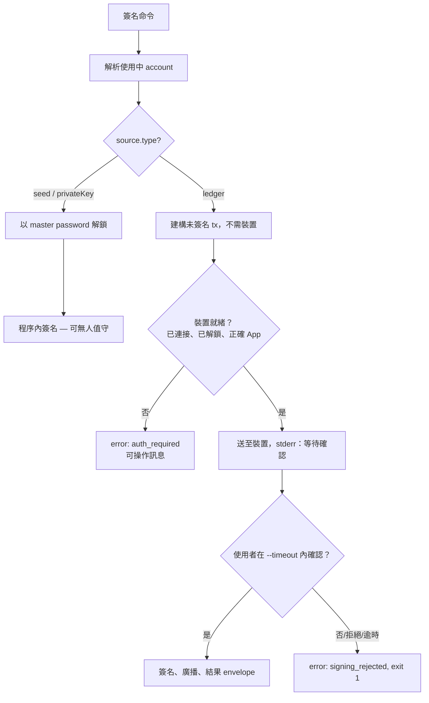
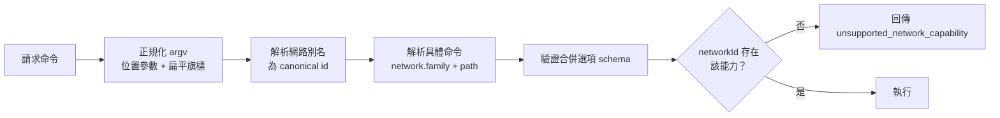
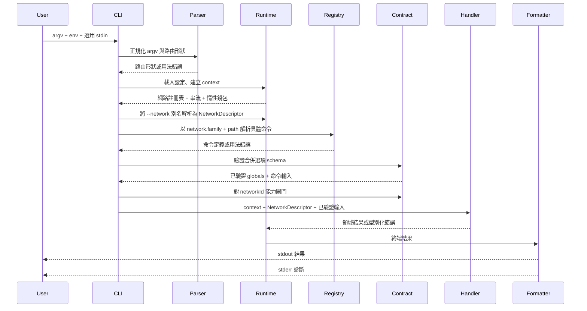
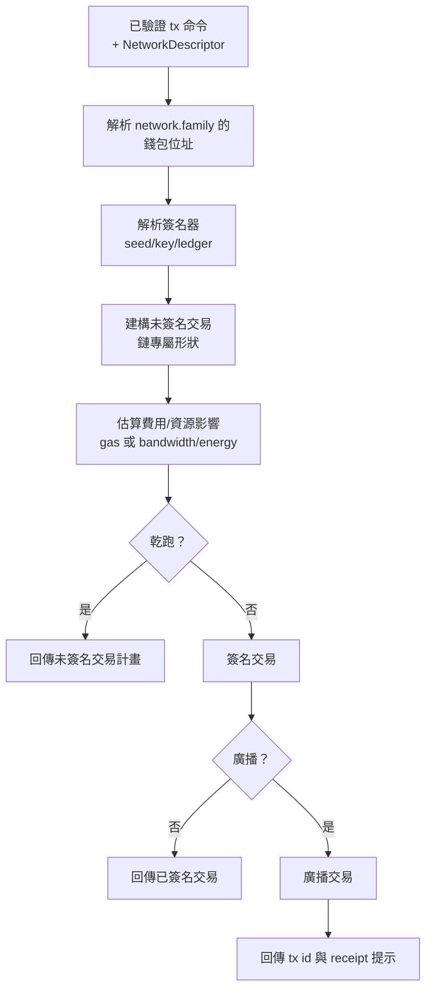

# TypeScript Wallet CLI 架構規劃 — V2（繁體中文版）

> 本文件為 `typescript-wallet-cli-architecture-plan.md` 的重組版本。決策與內容相同，
> 重新整理為六個章節：**(1) 目標 → (2) 分層架構圖 → (3) 各層職責與偽程式碼 → (4) Flag Classification → (5) Planned Command Groups → (6) 設計決策與細節拆解。**
> 範圍為 **TRON + EVM**（Solana 不在範圍內）。已鎖定的決策標記為 **[決策]**。

---

## 1. 目標

本專案要達成的成果：

**產品**

- 以 **TypeScript** 重新實作 `wallet-cli`。
- 作為區塊鏈的 **對人友善且對 AI 友善** 的入口。
- **僅標準 CLI — 無 REPL、無互動式 stdin 提示。** 每條命令皆由 argv、環境變數、stdin 旗標或設定檔完整指定，且只執行一次。
- 多鏈支援 **TRON 與 EVM 鏈（Base、Optimism 等）**，不假裝兩者行為相同。

**工程原則**

- **預設為 AI 可讀。** JSON 模式輸出固定 envelope 與可預測欄位；文字模式供人類閱讀，且絕非唯一語意來源。
- **嚴格的串流紀律。** `stdout` = 結果，`stderr` = 診斷資訊，`stdin` = 僅限明確宣告的旗標。
- **穩定的輸出契約。** 可新增欄位，未經版本化變更不得重新命名或移除欄位。
- **確定性的結束碼**（`0/1/2`），詳細原因在 `error.code`。
- **與順序無關的旗標。** 使用者感知為單一扁平旗標命名空間 — 全域與命令選項可出現在位置參數命令路徑之前、之間或之後。全域/命令的劃分僅為內部實作。
- **共享基礎設施，而非共享領域。** 各鏈共享*函式庫*（keystore、衍生、輸出、解析、設定），而非強制統一的領域介面。每條鏈擁有完整命令面。
- **可組合的內部流程。** 解析 → 驗證 → 規劃 → 簽名 → 廣播 → 格式化為獨立、可測試的階段。

**明確非目標**

- 無互動式 REPL；執行期間無隱藏提示。
- 無抹平鏈差異的通用區塊鏈抽象。
- 無將日誌/警告/資料混在同一串流的輸出。
- **與 Java keystore 版面不相容**（`Wallet/`、`Mnemonic/`、`Ledger/`）。**[決策：乾淨切斷。]**
- Solana 及其他非 EVM/非 TRON 鏈。

**為何採此形狀（來自 Java Standard CLI 的教訓）**

- Java Standard CLI 有 **116 條命令**（約 70 條唯讀、約 44 條需簽名）。
- **約 40+ 條為 TRON 專屬且無 EVM 對應**（freeze/unfreeze、delegate-resource、vote-witness、提案、TRC10、Bancor、GasFree、資源查詢等）。
- 真正共享的面僅約 **15–20%**（原生餘額、原生/代幣轉帳、區塊/交易查詢、合約呼叫/部署、錢包管理）。
- → 若強制兩鏈共用同一 provider 介面，只能服務那 15–20%，其餘塞進逃生艙。因此：按鏈命名空間，僅共享基礎設施。

**自 Java 保留的契約概念**：全域與命令區域選項分離；結構化成功/錯誤 envelope；結束碼區分成功/執行/用法；明確的 env/stdin 驗證（`MASTER_PASSWORD`）；每條命令恰好一個終端結果；`--quiet`/`--verbose` 僅影響診斷。

**第一個里程碑（窄而完整）** — 在高風險簽名之前驗證架構：

- TS 腳手架，僅 Standard CLI；`--output text|json`、`--quiet`、`--verbose`、`--help`、`--version`。
- 穩定 JSON envelope、`0/1/2` 結束碼契約。
- 以 master password 解鎖的 seed/vault keystore；`wallet create/import/list/set-active`。
- `chains list`、`capabilities --network <id|alias>`。
- `account balance --network nile` 與 `account balance --network base` **來自同一共享錢包身分**。
- Golden 測試驗證 stdout/stderr 行為與 keystore 往返。

---

## 2. 分層架構（由左至右）

資料由左向右流動，一層餵給下一層。鏈模組消費共享基礎設施函式庫，而非實作共享領域介面。

```mermaid
flowchart LR
    %% =========================
    %% Styles
    %% =========================
    classDef input fill:#E8F0FE,stroke:#4C78A8,color:#1F2D3D,stroke-width:1.5px;
    classDef cli fill:#EAF7EA,stroke:#59A14F,color:#1F2D3D,stroke-width:1.5px;
    classDef contract fill:#FFF4E5,stroke:#F28E2B,color:#1F2D3D,stroke-width:1.5px;
    classDef runtime fill:#F3E8FF,stroke:#9C6ADE,color:#1F2D3D,stroke-width:1.5px;
    classDef chain fill:#E6F7F5,stroke:#2CB1A1,color:#1F2D3D,stroke-width:1.5px;
    classDef infra fill:#FDEBEC,stroke:#E15759,color:#1F2D3D,stroke-width:1.5px;
    classDef output fill:#F5F5F5,stroke:#7F7F7F,color:#1F2D3D,stroke-width:1.5px;
    classDef sink fill:#FFF1F2,stroke:#D37295,color:#1F2D3D,stroke-width:1.5px;

    %% =========================
    %% Layers
    %% =========================
    subgraph L1["① Input"]
        direction TB
        IN["argv<br/>env<br/>stdin"]
    end

    subgraph L2["② CLI Layer"]
        direction TB
        GP["argv normalizer<br/>(positionals + flat flags)"]
        RT["route shape resolver"]
        RG["concrete command registry"]
    end

    subgraph L3["③ Contract Layer"]
        direction TB
        SCH["schema validation<br/>(zod)"]
        CAP["capability gate"]
    end

    subgraph L4["④ Runtime Layer"]
        direction TB
        CTX["execution context"]
        CFG["config loader"]
        NREG["network registry<br/>alias resolver"]
        BCFG["built-in defaults"]
        UCFG["~/.wallet-cli/config.yaml"]
        OVR["env vars<br/>CLI flags"]
    end

    subgraph L5["⑤ Chain Modules"]
        direction TB
        TRON["TRON module<br/>(~100 cmds)"]
        EVM["EVM module<br/>(~20 cmds)"]
    end

    subgraph L6["⑥ Infra Libraries (shared)"]
        direction TB
        KS["keystore"]
        DV["derivation"]
        RPC["RPC clients"]
        SGN["signer / ledger"]
    end

    subgraph L7["⑦ Output Layer"]
        direction TB
        FMT["json / text formatter"]
    end

    subgraph L8["⑧ Stream Manager"]
        direction TB
        SM["stream manager<br/>(stdout/stderr/stdin discipline)"]
    end

    subgraph L9["⑨ Sinks"]
        direction TB
        OUT["stdout<br/>result envelope"]
        ERR["stderr<br/>diagnostics"]
    end

    %% =========================
    %% Main Flow
    %% =========================
    IN --> GP --> RT
    RT -- 路由形狀 + 全域旗標 --> CTX
    CTX --> NREG
    NREG -- network.family + path --> RG
    RG --> SCH --> CAP
    CAP --> TRON
    CAP --> EVM

    %% Module -> Shared Infra
    TRON --> KS
    TRON --> DV
    TRON --> RPC
    TRON --> SGN

    EVM --> KS
    EVM --> DV
    EVM --> RPC
    EVM --> SGN

    %% Module -> Output
    TRON --> FMT
    EVM --> FMT

    %% Runtime Support
    BCFG -.-> CFG
    UCFG -.-> CFG
    OVR -.-> CFG
    CFG -. injects .-> CTX
    CFG -. builds .-> NREG
    CTX -. configures .-> SM

    %% Output -> Stream Manager -> Sinks
    FMT --> SM
    SM --> OUT
    SM --> ERR

    %% =========================
    %% Class Mapping
    %% =========================
    class IN input;
    class GP,RT,RG cli;
    class SCH,CAP contract;
    class CTX,CFG,NREG,BCFG,UCFG,OVR runtime;
    class TRON,EVM chain;
    class KS,DV,RPC,SGN infra;
    class FMT output;
    class SM runtime;
    class OUT,ERR sink;
```



各鏈模組（⑤）註冊其實際支援的命令，並使用共享函式庫（⑥）。**沒有** `AccountProvider` / `TransactionProvider` / `TokenProvider` /
`SigningProvider` 供兩鏈共同實作 — 這是相對初版規劃的關鍵反轉。

---

## 3. 各層職責

以下各層列出 **職責**、**核心偽程式碼** 草圖與 **設計備註**。
若某層對 Ledger（簽名）有特殊行為，會連結至 [§6](#6-設計決策與細節拆解)。

摘要表：

| Layer | Module(s) | Responsibility |
| --- | --- | --- |
| ② CLI | `cli/` | 正規化 argv、解析需網路或頂層命令、執行單一命令、回傳 exit code。 |
| ③ Contract | `contract/` | 輸入、輸出、錯誤、capabilities 的穩定 schema。 |
| ④ Runtime | `runtime/` | 由 config/env/flags 建立 `ExecutionContext`；解析 network registry 與程序資源。 |
| ⑤ Chain Modules | `chains/<family>/` | 實作該鏈完整 command surface、codec、RPC client、signer、address format。 |
| ⑤ Chain core | `chains/core/` | 定義 `ChainModule` 介面與 capability registry，僅此而已。 |
| ⑥ Keystore | `keystore/` | 與鏈無關的 seed、key、wallet identity 儲存；以 master password 解鎖。 |
| ⑥ Derivation | `derivation/` | BIP39/BIP32 derivation、各鏈 coin type。 |
| ⑦ Output | `output/` | 將 outcome 轉為 JSON 或 text，不改變 command 行為。 |
| ⑧ Stream Manager | `runtime/stream-manager.ts` | 強制 stdout/stderr/stdin discipline 與 quiet/verbose 行為。 |
| ⑨ Sinks | process streams | 最終目的地：`stdout` 為結果、`stderr` 為 diagnostics。 |
| — Errors | `errors/` | 正規化 usage、execution、transport、鏈專屬失敗。 |
| — Top-level cmds | `commands/` | 鏈中立命令：`chains`、`capabilities`、`config`、`wallet`。 |

完整套件配置：

```text
src/
  cli/        main.ts  global-options.ts  command-router.ts  command-registry.ts  help-renderer.ts  exit-codes.ts
  contract/   output-envelope.ts  error-codes.ts  command-schema.ts  capabilities.ts
  runtime/    execution-context.ts  stream-manager.ts  config-loader.ts  logger.ts
  keystore/   store.ts  vault.ts  key.ts  crypto.ts  unlock.ts  wallet.ts         # 共享、與鏈無關
  derivation/ bip39.ts  bip32.ts  coin-types.ts                                    # tron=195, evm=60
  chains/
    core/  chain-module.ts  network-descriptor.ts  capability-registry.ts
    tron/  tron-module.ts  tron-commands/  tron-rpc-client.ts  tron-signer.ts  tron-address.ts   # Base58Check, tronweb
    evm/   evm-module.ts   evm-commands/   evm-rpc-client.ts   evm-signer.ts   evm-address.ts     # 0x/EIP-55, viem
  commands/   chains.ts  capabilities.ts  config.ts  wallet.ts   # create/import/list/set-active/export-address
  output/     json-formatter.ts  text-formatter.ts  diagnostic-writer.ts
  errors/     cli-error.ts  usage-error.ts  execution-error.ts  chain-error.ts
  tests/
```

### ② CLI Layer（`cli/`）

**職責：** 將 argv 正規化為命令路徑 + 扁平旗標集，必要時解析網路別名，解析具體命令，依解析結果驗證旗標，恰好執行一條命令，回傳結束碼。

**[決策：與順序無關的旗標。]** 使用者感知為單一扁平旗標命名空間 — 沒有可見的全域 vs 命令區分。位置 token（非 `--`）構成命令路徑；旗標可出現在**任何位置**（前、中、後），與位置無關地收集。
`wallet account balance --network nile --address T... --output json` 與
`wallet --output json account --address T... balance --network nile` 等價。

```ts
function main(argv): exitCode {
  // pass 1 — 在 parser 子命令語意之前自訂正規化
  const { positionals, flags } = splitArgv(argv)     // positionals = 命令路徑；flags = 每個 --x
  const route = registry.resolveRouteShape(positionals) // 頂層或需網路的命令形狀
  if (!route) return EXIT.USAGE                         // 2

  // pass 2 — 僅解析解析執行期與網路所需的全域/元旗標
  const globals = GLOBAL_OPTIONS.parse(flags.pickGlobalAndMeta())
  const ctx = buildExecutionContext(globals)             // 載入設定、串流、惰性錢包
  const network = route.network === "required"
    ? resolveNetworkAlias(globals.network, ctx.config)   // 例："bsc" -> "evm:56"
    : undefined

  // pass 3 — 解析具體命令並驗證合併後的選項 schema
  const cmd = registry.resolveConcrete(route, network?.family) // 例：evm + tx.send-native
  if (!cmd) return EXIT.USAGE
  const schema = mergeSchema(GLOBAL_OPTIONS, cmd.input)
  const parsed = schema.parse(flags)                  // 未知/重複旗標 → usage_error
  try {
    checkCapability(cmd, network)                                  // 需知網路的閘門
    const out = await cmd.run(ctx, pick(parsed, cmd.input))         // → 契約層（zod）
    formatter.success(cmd.id, chainMeta(cmd, network), out)         // → 輸出層
    return EXIT.OK                                                   // 0
  } catch (e) {
    formatter.error(normalizeError(e))                              // 型別化 → envelope
    return e.isUsage ? EXIT.USAGE : EXIT.EXEC                        // 2 或 1
  }
}
```

**備註：**
- 全域/命令劃分為**內部**關注（旗標路由到哪個 struct），非使用者必須遵守的語法。合併命名空間內旗標名稱必須唯一；全域與命令旗標碰撞為註冊期錯誤，非執行期。
- 位置參數順序*確實*重要（即命令路徑）；旗標順序永遠不重要。
- 未知旗標在命令解析**之後**才拒絕，因命令專屬旗標可能出現在命令路徑之前。勿依賴傳統子命令 parser 將「命令前」當全域、「命令後」當區域。
- 需網路的命令路徑透過 `--network` 解析：別名解析器回傳 canonical 網路 id 與 family，註冊表再解析 `family + 命令路徑` 為具體命令 id。
- 不需網路的頂層命令（`wallet`、`chains`、`config`）不要求 `--network`。
- 每次執行恰好一個終端結果；絕不將 raw 例外拋到主控台。

#### Option Taxonomy

使用者看到扁平 option 命名空間，開發者須依 owner 與 sensitivity 分類。
此分類決定哪一層處理 option、是否可持久化、值是否可出現在日誌或輸出。使用者面向的 flag 分表見 [§4 Flag Classification](#4-flag-classification)。

| 類別 | 擁有層 | 值來源 | 可記錄日誌？ | 可存入設定？ | 範例 | 用途 |
| --- | --- | --- | --- | --- | --- | --- |
| 全域執行期選項 | Runtime | argv / env / config | 是（若非秘密） | 是（網路預設除外） | `--output`、`--network`、`--wallet`、`--timeout`、`--quiet`、`--verbose` | 塑造執行上下文。 |
| 命令選項 | Command / 鏈模組 | argv | 是（若非秘密） | 否 | `--address`、`--to`、`--amount-sun`、`--token`、`--contract`、`--method` | 單一命令的業務輸入。 |
| 端點覆寫選項 | Runtime config-loader | argv / env / config | 是（已消毒） | 是 | `--grpc-endpoint`、`--rpc-url` | 覆寫解析後的網路端點。 |
| 含秘密選項 | Runtime secret resolver | stdin / env / 加密檔 | 否 | 否 | `--password-stdin`、`--private-key-stdin`、`--mnemonic-stdin`、`--tx-stdin` | 從秘密來源讀取，不把值放在 argv/設定/日誌。 |
| 元選項 | CLI | argv | 是 | 否 | `--help`、`-h`、`--version` | 短路正常命令執行。 |

規則：

- 含秘密旗標仍是選項，但其**值不是一般解析後的旗標值**。旗標僅授權執行期從秘密來源讀取。
- 不支援在 argv 放 raw 秘密值，例如 `--private-key <value>`、`--mnemonic <words>`、`--password <value>`。會洩漏到 shell 歷史、程序列表與日誌。
- `--password-stdin` 可解鎖加密 vault/key 檔。`--private-key-stdin` 與 `--mnemonic-stdin` 僅為匯入用秘密來源。`--tx-stdin` 用於明確的交易輸入，非一般業務 stdin。
- 端點覆寫選項即使文件寫在鏈命令附近，仍屬執行期選項；會覆寫 `~/.wallet-cli/config.yaml` 單次執行。
- 網路定義與別名在設定中，但沒有預設網路選擇。需網路的命令必須明確帶 `--network`。

### ③ 契約層（`contract/`）

**職責：** 擁有穩定的輸入/輸出/錯誤/能力 schema。此處驗證為說明文字、JSON-schema 匯出與 agent 內省的單一真相來源。

```ts
type CommandDefinition<I, O> = {
  id: string                  // "tron.account.balance"
  path: string[]              // ["account", "balance"] 或 ["wallet", "list"]
  summary: string
  family?: string             // 需網路的具體命令："tron" | "evm"
  network: "none" | "required"
  capability?: string         // 對鏈能力註冊表閘門
  wallet: "none" | "optional" | "required"
  auth: "none" | "optional" | "required"
  fields: z.ZodObject<any>    // 逐欄 schema；供互動式前端即時驗證
  input: z.ZodType<I>         // = fields.superRefine(...)；整體形狀 + 跨欄，供一次性 parse
  examples: CommandExample[]
  run(ctx: ExecutionContext, input: I): Promise<O>
}
```

**備註：** `zod` 為骨幹 — 單一 schema 驅動驗證、說明與 agent JSON-schema。
必填/選填/預設與跨欄位驗證在 `input` schema 內，而非獨立的 `required[]`、`optional[]` 或 `validateOptions()`。
`network` 描述是否需要解析後的網路描述符；`wallet` 描述是否需要錢包身分/位址；`auth` 描述是否需要秘密解鎖或硬體簽名。
能力閘門在 Runtime 解析目標 network 後、command 執行任何鏈操作前拒絕不支援的命令（見 §6 capability flow）。

條件式選項需求也用 `zod` 表達：

```ts
const sendNativeFields = z.object({
  to: evmAddressSchema,
  amountWei: uintStringSchema.optional(),
  amountEth: z.string().optional(),
  gasPrice: uintStringSchema.optional(),
  maxFee: uintStringSchema.optional(),
  maxPriorityFee: uintStringSchema.optional(),
  dryRun: z.boolean().default(false),
})
const sendNativeInput = sendNativeFields.superRefine((v, ctx) => {
  if (!v.amountWei && !v.amountEth) {
    ctx.addIssue({ code: z.ZodIssueCode.custom, path: ["amountWei"], message: "Provide an amount" })
  }
  if (v.amountWei && v.amountEth) {
    ctx.addIssue({ code: z.ZodIssueCode.custom, path: ["amountWei"], message: "Use only one amount unit" })
  }
  if (v.gasPrice && (v.maxFee || v.maxPriorityFee)) {
    ctx.addIssue({ code: z.ZodIssueCode.custom, path: ["gasPrice"], message: "Use legacy or EIP-1559 fees, not both" })
  }
})
```

Schema 驗證檢查形狀與跨欄位規則。能力/網路驗證檢查解析後的網路是否支援該命令或費用模型（例如 BSC legacy gas vs Base EIP-1559）。

**[決策：互動式前端復用逐欄 schema。]** standard 模式無互動 prompt（見 §1 設計約束）。但若日後要在 CLI 層之上另外提供互動式前端（逐欄詢問使用者，類比 Java 版 REPL），不可另寫一套驗證——否則規則會與 schema 漂移。改為復用契約層的逐欄子 schema。

zod 規則天生分兩類，最早可驗時機不同：

| 規則種類 | 例子 | 最早能驗的時間 |
| --- | --- | --- |
| 單欄形狀 | `to` 是否合法位址、`amountWei` 是否 uint | 使用者輸入該欄**當下** |
| 跨欄關係（`superRefine`） | 金額單位擇一、fee 模型互斥 | 收齊相關欄位**之後**（邏輯上不可能更早） |

因此命令定義同時暴露 `fields`（逐欄）與 `input`（= `fields.superRefine(...)`，整體 + 跨欄）：

- **Standard（非互動）路徑**：照舊 `input.parse(flags)` 一次驗完。
- **互動路徑（住在 CLI 層 ②，非契約層 ③）**：先解析 network → 解析 concrete command → 取 `fields.shape` → 逐欄 prompt，每個答案立即以 `fields.shape[key].safeParse(answer)` 當場驗、錯則重問同一題 → 全部收齊後再 `input.parse(collected)` 補上跨欄規則。

如此地址打錯立即回錯（單欄子 schema），金額單位互斥之類於最後統一檢查（跨欄本就無法更早）；互動與 standard 共用同一批欄位 schema，不會漂移。互動只改變「input 物件如何湊出」，湊出後走同一條 `cmd.run(ctx, input)` 管線。互動模式同樣須先確定網路，才能取得對應 `network.family` 的 `fields`——這與 §2 的 pass2→pass3 順序一致，互動只是把「逐欄 prompt + 即時驗」插在 `resolveConcrete` 之後、最終 `input.parse` 之前。

### ④ 執行期層（`runtime/`）

**職責：** 由分層 config、env 與 flags 組裝 `ExecutionContext`；建立 network registry 並設定 streams、timeout 等程序資源。

```ts
function buildExecutionContext(globals): ExecutionContext {
  const config = loadConfig(globals)                  // built-ins < ~/.wallet-cli/config.yaml < env < flags
  const networkRegistry = buildNetworkRegistry(config) // canonical ids + alias index
  const streams = new StreamManager(globals.output, globals.quiet)  // configured I/O controller
  const resolveWallet = () => resolveActiveWallet(globals) // lazy; many read/config cmds need none
  return { config, networkRegistry, streams, resolveWallet, output: globals.output }
}
```

**備註：** secrets 永不放在 context 可序列化表面。wallet resolution 為 lazy，使無 wallet 命令（`chains list`、`capabilities`、`config get`）在無 wallet 時不會失敗。
`config-loader` 擁有 endpoint resolution，含使用者對 built-in networks 的覆寫與 custom network 定義。

#### 網路註冊表與別名

系統的 canonical 網路身分為 `{family}:{chainId}`。使用者輸入可用別名，
但執行期、設定合併、能力檢查、快取與輸出契約使用 canonical id。

```ts
type ChainFamily = "tron" | "evm"
type NetworkId = `${ChainFamily}:${string}` // 例："tron:nile", "evm:56"

type NetworkDescriptor = {
  id: NetworkId
  family: ChainFamily
  chainId: string                 // EVM 數字 chain id 字串；TRON 網路 id/名稱
  aliases: string[]               // --network 接受的使用者名稱
  rpcUrl?: string                  // EVM JSON-RPC
  grpcEndpoint?: string            // TRON gRPC
  solidityGrpcEndpoint?: string    // TRON solidity 節點，選用
  feeModel?: "legacy" | "eip1559" | "tron-resource"
  capabilities: string[]
}
```

範例：

```text
tron      -> tron:mainnet
nile      -> tron:nile
shasta    -> tron:shasta
eth       -> evm:1
bsc       -> evm:56
sepolia   -> evm:11155111
base      -> evm:8453
optimism  -> evm:10
```

規則：

- `--network` 接受 canonical id（`evm:56`）或全域唯一別名（`bsc`）。
- 別名解析僅在 CLI/執行期邊界。鏈模組收到 `NetworkDescriptor`，非原始使用者別名。
- 別名必須全域唯一。若使用者設定造成歧義別名，命令以 `ambiguous_network_alias` 失敗。
- 需網路的命令必須帶 `--network`；觸及鏈的命令沒有預設網路，避免誤讀或誤簽錯鏈。
- 不需網路的命令（`wallet list`、`wallet import`、`chains list`、`config get`）不要求 `--network`。

### ⑤ 鏈模組（`chains/`）

**職責：** 每條鏈實作其**完整**命令面。唯一契約為：

```ts
// chains/core/chain-module.ts  — [決策：無通用 provider 介面]
interface ChainModule {
  family: string                                        // "tron" | "evm"
  networks(): NetworkDescriptor[]
  capabilities(): CapabilityDescriptor[]
  registerCommands(registry: CommandRegistry, ctx: RuntimeContext): void
}

// chains/tron/tron-module.ts
const TronModule: ChainModule = {
  family: "tron",
  networks: () => [NILE, SHASTA, MAINNET],
  capabilities: () => [...account, ...tx, ...resources, ...governance],   // 含 TRON 專屬鍵
  registerCommands(reg) {
    reg.add(tronAccountBalance)
    reg.add(tronFreeze)            // TRON 專屬，無 EVM 對應
    reg.add(tronVoteWitness)       // TRON 專屬
    // …按 family 分組約 ~100 條命令
  },
}
```

**備註：**
- **何時共享命令：** 自下而上，*三次法則*。共享 helper（例如 `balance` 工廠）僅在**兩**鏈有相同意圖*且*輸入形狀時出現。即使如此資料仍保持鏈形狀（TRON 餘額含 bandwidth/energy；EVM 含 gas）。
- 位址編碼、codec、RPC 客戶端、簽名器為鏈本地（`tron-*` vs `evm-*`）。

### ⑥ 基礎設施函式庫 — Keystore / 衍生 / RPC / 簽名器（`keystore/`、`derivation/`）

**職責：** 各鏈消費的與鏈無關儲存與金鑰處理。簽名器依使用中錢包的 `source.type` 與命令的鏈 family 決定如何簽名。

```ts
// derivation/paths.ts — coin type 寫死在專案，路徑由模板 + account index 算出
const COIN_TYPE = { tron: 195, evm: 60 }
const derivationPath = (family, account) => `m/44'/${COIN_TYPE[family]}'/${account}'/0/0`

// keystore/store.ts — 註冊表為明文；秘密為獨立加密檔。定址單位為 account（index）
function resolveAddress(wallet, accountIndex, chainFamily): string {
  const address = wallet.addresses[accountIndex ?? ""]?.[chainFamily]
  if (!address) throw new WalletError("missing_wallet_address")
  return address
}

function resolveSigner(wallet, accountIndex, chainFamily, ctx): Signer {
  switch (wallet.source.type) {
    case "privateKey":                                          // 非 HD：無路徑、無 index
      return softwareSigner(decryptKey(wallet.source.keyId, masterPassword()))
    case "seed": {
      const path = derivationPath(chainFamily, accountIndex)    // 模板 + index，不存字串
      return softwareSigner(deriveKey(decryptVault(wallet.source.vaultId), path))
    }
    case "ledger": {
      const path = derivationPath(chainFamily, accountIndex)
      return ledgerSigner(wallet.source.deviceId, path)  // ⚠ 見 §6 Ledger
    }
  }
}
```

**備註：**
- 儲存單位為**由 seed、raw key 或 Ledger 註冊支撐的錢包**；其下的定址單位是 **account**（HD 錢包可有多個）。非單鏈位址 — 一個 account 同時暴露 TRON 與 EVM 位址。
- 錢包 metadata 為明文（`wallet list` 不需密碼）；僅 seed/key 加密。
- **Ledger 與所有 software source 行為不同** — 不持有 secret 且會阻塞等待硬體確認。完整行為、流程與 watch-only 模型見 [§6 → Ledger](#ledger-model--active-wallet-driven-signing)。本層僅路由到 `ledgerSigner`，不對 caller 特殊處理。

### ⑦ Output Layer（`output/`）

**職責：** 將 domain outcome（成功或 typed error）轉為 result 與 diagnostic frames，不改變 command 行為。負責格式化內容；實際寫入 process streams 由 Stream Manager 負責。

```ts
function emit(outcome, ctx) {
  if (ctx.output === "json") {
    ctx.streams.result(JSON.stringify(envelope(outcome, ctx)))   // exactly one stdout frame
  } else {
    if (outcome.ok) ctx.streams.result(renderText(outcome))
    else            ctx.streams.diagnostic(concise(outcome.error))
  }
  for (const w of outcome.warnings) ctx.streams.diagnostic(w)  // stderr / meta.warnings
}
```

**備註：** JSON 模式產生恰好一個 result frame；Stream Manager 將該 frame 送到 stdout、所有 diagnostics 送到 stderr。空 `data` 為 `{}` 而非 `null`；大額為字串；binary 需宣告 encoding。

### ⑧ Stream Manager（`runtime/stream-manager.ts`）

**職責：** 強制 terminal I/O discipline。由 Runtime 擁有，但位於 Output formatter 與 process streams 之間。

```ts
class StreamManager {
  result(bytes: string): void        // stdout, final command result only
  diagnostic(msg: Diagnostic): void  // stderr, warnings/progress/debug/human errors
  readSecretOnce(kind: SecretKind): Promise<string>
}
```

**備註：**
- `stdout` 保留給 command results。JSON 模式恰好接收一個 result envelope。
- `stderr` 接收 diagnostics、warnings、progress、text-mode errors、Ledger 等待訊息與 verbose debug。
- 預設關閉 business input 的 `stdin`。僅 explicit stdin flags 可讀取，且每次 read 會 memoize，避免多個 consumer 卡住 process。
- 第三方 library 輸出不得污染 JSON stdout；wrapper 應透過此 manager 路由或抑制 noisy dependency output。

---

## 4. Flag Classification

本章定義 CLI 的 flag surface，刻意與 command grouping 分開：開發者應先知道要加的是哪一類 flag、哪一層擁有它、以及是否可持久化或記錄日誌。

**產品形狀**

```text
wallet <resource> <action> --network <id|alias> [options...]
wallet <command> [options...]
```

**positional path**（`<resource> <action>` 或頂層 `<command>`）對順序敏感，識別 command shape。network-bound commands 必須帶 `--network`，解析為 canonical `NetworkDescriptor`；描述符的 `family` 再選擇具體 chain command implementation（`tron.*` 或 `evm.*`）。

**flags 與位置無關**（§3 [決策](#②-cli-layercli)）。global options 與 command options 在使用者眼中為單一扁平命名空間 — 任何 `--flag` 可出現在 positionals 前、中、後。下方表格依 ownership 與 handling 分類，而非規定使用者必須在哪裡輸入。

### 4.1 Global Runtime Flags

| Flag | 說明 |
| --- | --- |
| `--output text\|json` | 輸出格式；`json` 走固定 envelope。 |
| `--network <id\|alias>` | 選具體 network，可用 canonical id（`evm:56`）或 alias（`bsc`、`nile`）。network-bound commands 必帶。 |
| `--account <ref\|label>` | tx/sign 的主選擇器，精確到 account（`wlt_x.0` 或唯一 label）；未指定時使用 `activeAccount`。 |
| `--wallet <id\|label>` | 選整個錢包 → 用其 active/預設 account（如 index 0）。便利用途；高風險操作建議用 `--account`。 |
| `--quiet` | 抑制非必要 diagnostics（不影響 command data）。 |
| `--verbose` | 輸出 debug 級 diagnostics 到 stderr。 |
| `--timeout <ms>` | 操作逾時（含 Ledger 等待確認）。 |
| `--no-device-wait` | Ledger 簽名時不等待，立即失敗（供自動化用）。 |
| `--help` / `-h` | 顯示說明。 |
| `--version` | 顯示版本。 |

### 4.2 Endpoint Override Flags

| Flag | 說明 |
| --- | --- |
| `--grpc-endpoint <host:port>` | 覆寫本次 TRON command 的 resolved gRPC endpoint。 |
| `--rpc-url <url>` | 覆寫本次 EVM-compatible command 的 resolved JSON-RPC endpoint。 |

Endpoint override flags 為 Runtime flags，由 `config-loader` 擁有。會覆寫 built-ins 與 `~/.wallet-cli/config.yaml` 單次執行，但不是 command business input。

### 4.3 Secret-Bearing Flags

| Flag | 說明 |
| --- | --- |
| `--password-stdin` | 從 stdin 讀 master password 以解鎖 vault/key；可覆寫 `MASTER_PASSWORD` env。 |
| `--private-key-stdin` | `wallet import --type privateKey` 從 stdin 讀 raw private key。 |
| `--mnemonic-stdin` | `wallet import --type seed` 從 stdin 讀 BIP39 mnemonic。 |
| `--tx-stdin` | 從 stdin 讀明確指定的 transaction payload。 |

Secret-bearing stdin flags 為 explicit opt-in，且 stdin 恰好讀取一次（見 §6 Stream management）。

### 4.4 Common Command-Input Flag Families

Command input flags 由各 command 的 `zod` schema 定義。下方表格僅供描述；required/optional/default/conditional 行為來自 concrete command 的 schema（由 `network.family + path` 解析）。

| Flag family | Examples | Owner | Notes |
| --- | --- | --- | --- |
| Target address | `--address`, `--to`, `--receiver` | Chain command | 依 resolved network family 的 address codec 驗證。 |
| Amount | `--amount`, `--amount-sun`, `--amount-wei` | Chain command | 大數為字串；單位依 command 而定。 |
| Token / contract | `--token`, `--contract`, `--method`, `--params` | Chain command | TRON 與 EVM 在意圖相同時共享名稱，codec 不同。 |
| Fee/resource | `--fee-limit`, `--gas-price`, `--max-fee`, `--max-priority-fee`, `--resource` | Chain command + capability gate | schema 處理形狀；capability/network gate 處理 fee model 支援。 |
| Execution mode | `--dry-run`, `--broadcast` | Chain command | pipeline 控制回傳 plan、signed tx 或 broadcast result。 |
| Wallet management | `--type`, `--label`, `--account`, `--chain` | Top-level `wallet` command | 用於本地 wallet/account 管理，非鏈上執行。路徑由 account index + 寫死模板算出，故無 `--path-*`。 |

---

## 5. Planned Command Groups

> 僅代表性分組。完整 command surface 將於後續對照 Java Standard CLI inventory 與 EVM-compatible 增補列舉。Commands 依 user intent 分組，而非依 flag category。

Network-bound commands 使用：

```text
wallet <resource> <action> --network <id|alias> [options...]
```

Top-level local commands 使用：

```text
wallet <command> [options...]
```

### 5.1 Local Wallet And Config

| Group | Representative commands | Network required? | Purpose |
| --- | --- | --- | --- |
| Wallet identity | `wallet create`, `wallet import`, `wallet list`, `wallet set-active`, `wallet export-address` | No | 管理本地 wallet identities、encrypted secrets 與 derived addresses。 |
| Config | `config get`, `config set` | No | 讀寫非 secret 使用者設定（endpoints、network aliases 等）。 |
| Chains / networks | `chains list`, `chains networks` | No | 列出支援的 chain families、canonical network ids、aliases 與 endpoint metadata。 |
| Capabilities | `capabilities --network <id\|alias>` | Yes | 顯示 resolved network 的 machine-readable capabilities。 |

### 5.2 Account And Query

| Group | Representative commands | Network required? | Notes |
| --- | --- | --- | --- |
| Account | `account balance`, `account info`, `account resources` | Yes | 共享名稱、chain-shaped data。TRON 可含 bandwidth/energy；EVM 可含 nonce/gas-relevant account data。 |
| Blocks / transactions | `get-block`, `tx status`, `tx receipt` | Yes | 唯讀鏈查詢。 |
| Tokens | `token balance`, `token info`, `token allowance` | Yes | TRC20/ERC-20 共享 intent，address 與 ABI/codec 為鏈專屬。 |

### 5.3 Transaction And Contract

| Group | Representative commands | Network required? | Notes |
| --- | --- | --- | --- |
| Native transfer | `tx send-native` | Yes | 依 `network.family` 解析為 TRON 或 EVM implementation。 |
| Token transfer | `tx send-token` | Yes | TRC20/ERC-20 transfer；schema 與 codec 為鏈專屬。 |
| Transaction pipeline | `tx build`, `tx sign`, `tx broadcast` | Yes | 規劃中的 dry-run、offline signing 與 agent workflow 階段。 |
| Contract | `contract call`, `contract send`, `contract deploy`, `contract trigger` | Yes | 共享 command intent；TVM/EVM encoding 仍為鏈專屬。 |

### 5.4 TRON-Specific Resource And Governance

| Group | Representative commands | Network required? | Notes |
| --- | --- | --- | --- |
| Resources / staking | `freeze`, `unfreeze`, `delegate-resource`, `undelegate-resource` | Yes | TRON-only capabilities，由 `networkId` gate。 |
| Governance | `vote-witness`, `witness list`, `proposal create`, `proposal approve`, `proposal delete` | Yes | 來自 Java CLI surface 的 TRON-only command groups。 |
| TRC10 / exchange / gasfree | `asset-issue`, `participate`, `exchange`, `market-order`, `gasfree` | Yes | TRON-only 領域保留為 first-class commands，不藏在 EVM abstraction 後。 |

### 5.5 EVM-Compatible Specifics

| Group | Representative commands | Network required? | Notes |
| --- | --- | --- | --- |
| Fee controls | `tx send-native` with `--gas-price` or EIP-1559 fee flags | Yes | `NetworkDescriptor` 控制 `legacy` vs `eip1559` capability。 |
| Message signing | `message sign`, typed-data signing | Yes | EVM signing formats 與 TRON message/TIP-712 行為分離。 |
| Contract deployment | `contract deploy` | Yes | EVM bytecode/ABI flow；TRON deployment 仍為鏈專屬。 |

---

## 6. 設計決策與細節拆解

上述大架構下的細節拆解。不屬 §1–§5 的內容皆在此。

### Keystore 與金鑰管理

日後最難改動的部分，故具體規格化。**[決策：以 seed/vault 為中心的儲存；單一 master password；與 Java 版面乾淨切斷。]**

**為何以錢包為中心，而非以位址為中心。** BIP39 seed 本質上為多鏈：同一 seed 經 coin type 195 衍生 TRON 帳戶、經 coin type 60 衍生 EVM 帳戶。
raw secp256k1 private key 也可同時呈現為 EVM 與 TRON 位址。Java 格式將 mnemonic 綁定單一 TRON 位址，無法表達多鏈。
此處**使用者可見的儲存單位為錢包身分**，由一個 seed vault、raw private key 或 Ledger 註冊支撐。
位址為 `addresses[chain]` 下的衍生視圖，非分開儲存的秘密。

匯入軟體秘密時**不**詢問使用者這是「TRON 金鑰」還是「EVM 金鑰」。秘密與鏈無關。
CLI 衍生並記錄該錢包支援的位址視圖：TRON 為 Base58Check `T...`，EVM 為 EIP-55 `0x...`。
秘密與錢包 metadata **分離**：錢包列表為明文，`wallet list` 無需解鎖；僅 seed 與 raw key 加密。

**磁碟版面：**

根目錄預設為 `~/.wallet-cli/`，可由環境變數 `WALLET_CLI_HOME` 覆寫為任意路徑（測試/CI 隔離、無 `$HOME` 的沙箱、多 profile）。覆寫的是**整棵樹**：`config.yaml`、`wallets.json`、`vaults/`、`keys/`、`ledger/` 一起搬，因為 `wallets.json` 的錢包項目經 `source` 指向同樹下的 `vaults/`、`keys/`，四者必須同住。`WALLET_CLI_HOME` 只改位置，不改加密——秘密在新位置一樣加密。

```text
$WALLET_CLI_HOME/ 或 ~/.wallet-cli/   # 後者為預設；前者覆寫整棵樹
  config.yaml              # 明文使用者設定 — 無秘密
  wallets.json             # 明文註冊表 — 無秘密
  vaults/<vaultId>.json    # 加密的 BIP39 seed/entropy
  keys/<keyId>.json        # 加密的 raw private key
  ledger/<deviceId>.json   # 唯讀：裝置 + 已註冊路徑（無秘密）
```

**`wallets.json`：**

```json
{
  "version": 1,
  "activeAccount": "wlt_x.0",
  "wallets": [
    {
      "id": "wlt_x",
      "source": { "type": "seed", "vaultId": "vlt_9f3a", "accounts": [0, 1] },
      "addresses": {
        "0": { "tron": "T...", "evm": "0x..." },
        "1": { "tron": "T...", "evm": "0x..." }
      }
    },
    {
      "id": "wlt_k",
      "source": { "type": "privateKey", "keyId": "key_7b2c" },
      "addresses": { "": { "tron": "T...", "evm": "0x..." } }
    },
    {
      "id": "wlt_l",
      "source": { "type": "ledger", "deviceId": "led_a1", "accounts": [0] },
      "addresses": { "0": { "tron": "T...", "evm": "0x..." } }
    }
  ],
  "labels": {
    "wlt_x":   "main-seed",
    "wlt_x.0": "main",
    "wlt_x.1": "savings",
    "wlt_k":   "hot",
    "wlt_l":   "ledger"
  }
}
```

規則：

- **定址單位是 account，不是錢包。** 一個錢包(`wlt_x`)= 一個秘密來源(vault/key/ledger)。seed 與 ledger 為 HD，`accounts` 陣列列出已知的 BIP44 account 索引(`[0, 1]`)；每個 index = 一個 account，各有自己的 tron+evm 位址。`wlt_k`(raw private key)非 HD，無 `accounts`、無 index、單一 account。
- **account reference** 為貫穿全結構的定址單位：`wlt_x.<index>`(HD)或 `wlt_x`(privateKey)。它同時是 `activeAccount` 指的東西、`labels` 的 key、`--account` 選的東西、`addresses` cache 的 key。
- **路徑不存字串，由模板算出。** `m/44'/{coinType}'/{account}'/0/0`，其中 coin type(tron=195、evm=60)與 `purpose/change/address_index` 寫死在專案；只存 `accounts` 的 index。`add-account` 對 seed/ledger append 下一個 index（privateKey **無**此命令）。
- `addresses` 為衍生公開識別的 cache，**按 account index 鍵**(privateKey 用 `""`)。明文儲存以利秒列 `wallet list` 與唯讀命令；解鎖秘密或查詢裝置後可重算。
- `activeAccount` 指一個 account ref(`wlt_x.0`)，**而非整個錢包**——因為簽名/發交易的單位是 account。TRON 命令用該 account 的 `addresses[index].tron`，EVM 用 `.evm`；缺該鏈視圖則 `missing_wallet_address`。
- 秘密（seed 或 raw secp256k1 key）與鏈無關；**鏈歸屬由 account 下存在哪些位址視圖表達**，而非秘密檔本身。

**身分與顯示名：`id`、account ref、`labels`** — 身分(機器參照)與顯示名(人類取的)分離儲存：

| 欄位 | 角色 | 特性 |
| --- | --- | --- |
| `id`（`wlt_3f9k2p7q`） | 錢包層穩定鍵 | 系統生成、不可變、不可重用、opaque |
| account ref（`wlt_x.0`／`wlt_k`） | 定址單位 | 由 `id` + account index 組成；privateKey 無 index |
| `labels[ref]`（`"main"`） | 人類顯示名 | 使用者取、**唯一**、可改名；存在 **root `labels` map** |

- **`id` 生成**：格式 `wlt_` + Crockford base32（來自 CSPRNG 亂數，如 `randomBytes(5)`，40 bits）。**不用時間當 seed**（同毫秒會撞、可預測）；唯一性靠「生成後比對註冊表現有 id，撞到就重生」。`id` **絕不由秘密衍生**，以免在明文 `wallets.json` 留下與私鑰相關的指紋。`vaultId`/`keyId` 採同一「隨機、不重用」原則（範例的 `vlt_9f3a`、`key_7b2c` 為示意；實際為隨機）。
- **`labels` 移到 root，key 為 account ref。** wallet 記錄因此維持「純粹有哪些 key/account」，label 是獨立展示層。key 可為錢包層(`wlt_x`，純分組)或 account 層(`wlt_x.0`，簽名實際選的就是這個)，故同一張 map 能同時命名整個錢包與個別 account。
  - **唯一性橫跨整張 `labels` map**(wallet 層 + account 層為**同一命名空間**)，`--account main` 才能反查唯一命中；`import`/`rename` 以 trim + 大小寫不敏感比對，撞名即拒絕。保留前綴：label 不得以 `wlt_` 開頭，否則與 ref 混淆。
  - **刪除要顯式清孤兒**：刪 account/wallet 時，對應的 `labels[ref]` 不會自動消失(分離結構非內嵌)，必須主動清。
- **為何 label 已唯一仍保留 id/ref**：唯一 label 只在「某一時刻」唯一，**不跨時間**——使用者可刪掉 `main` 再建一個同名 `main`（不同私鑰）。若用 label 當引用，腳本會在刪除+重建後**靜默改指到另一把鑰匙**。`id`/ref 不可變且不重用，使釘死的引用「要嘛精確命中、要嘛報錯」，永不靜默改指；rename 也只動 `labels` map，`activeAccount` 與外部引用不受影響。
- **選取解析**：
  - `--account <ref | label>` — tx/sign 的**主選擇器**，精確到 account。value 以 `wlt_` 開頭 → 當 **ref**（精確命中或 not-found）；否則當 **label** → 剛好 1 個用它、0 個 not-found、**2 個以上為歧義硬報錯**（列出候選 ref + address，要求改用 ref），**簽名/發交易等高風險路徑絕不替使用者猜**。
  - `--wallet <id | label>` — 選**整個錢包** → 用其 active/預設 account（如 index 0）。便利用途；高風險操作建議用 `--account` 精確指定。
  - 歧義分支為防呆：寫入時的唯一性已使其正常不會發生，但檔案被手動編輯時仍硬擋。
- **import 分工**：使用者提供秘密（`--private-key-stdin`/`--mnemonic-stdin`）與選填 `--label`；CLI 自動生成 `id`、建 account 0、衍生 `addresses`、寫加密 vault/key 並回填 `vaultId`/`keyId`、在 root `labels` 寫入該 ref 的顯示名。`--label` 省略時給預設（如 `wallet-N`）。重複 import 的去重比對 `addresses` 而非 id。改名用 `wallet rename --account <ref|label> --label <new>`（或 `--wallet <id|label>`），僅動 `labels` map。

**加密 envelope** — 每個 `vaults/*.json` 與 `keys/*.json` 為獨立加密 blob，採標準 Web3 風格 envelope（選用因其密碼學品質，非為相容）：

```json
{
  "id": "vlt_1",
  "type": "bip39-seed",          // keys/*.json 為 "raw-privkey"
  "version": 1,
  "crypto": {
    "cipher": "aes-128-ctr",
    "ciphertext": "…",
    "cipherparams": { "iv": "…" },
    "kdf": "scrypt",
    "kdfparams": { "n": 262144, "r": 8, "p": 1, "dklen": 32, "salt": "…" },
    "mac": "keccak256(dk[16:32] || ciphertext)"
  }
}
```

- 每個秘密檔自帶 `salt`，故**單一 master password** 對每檔衍生不同金鑰。單檔洩漏仍個別加密。
- Master password 由 `MASTER_PASSWORD` env 或 `--password-stdin` 解析。秘密永不記錄且不出現在任何 JSON envelope。
- 明文為 BIP39 entropy（vault）或 32-byte private key（key）。

**匯入方式。** `wallet import` 支援：raw private key、BIP39 mnemonic（成為 vault）、Ledger 錢包註冊（成為唯讀錢包身分）。
軟體匯入預設所有支援的鏈視圖（`tron` 與 `evm`），除非未來進階旗標縮小集合。
**刻意不提供**舊 Java 目錄格式的匯入器。

### Ledger Model & Active-Wallet-Driven Signing

**[決策：Ledger 錢包為唯讀註冊項目 — 磁碟上無秘密。]**
`ledger/<deviceId>.json` 記錄裝置與已註冊的 account 索引；`wallets.json` 中每個 Ledger 錢包引用 `{ deviceId, accounts }`（路徑由 index + 寫死模板算出，不存字串）。
所有簽名在命令執行時委派給裝置。Ledger 與 seed 同套 HD/account 模型，只差秘密住在硬體、在裝置內簽。

註冊 Ledger 錢包為一次性**人工**操作（裝置連接、App 開啟）。僅快取公開位址 — **不**快取任何簽名能力。
註冊後裝置可拔除；唯讀與 tx 建構命令仍可用，但每次簽名仍需要裝置與實體按鍵。

**使用中錢包驅動行為。** 簽名行為非每命令旗標 — 由執行期**使用中錢包的 `source.type`** 決定（§3 ⑥ 的 `resolveSigner` switch）。
使用中 account 為 `wallet set-active` 最後選擇者（`activeAccount`），或明確 `--account`/`--wallet` 覆寫。
同一命令（`tx send-native --network nile …`）依使用中錢包不同而行為不同，參數不變：



這符合一般錢包 UX：**「哪個錢包使用中」決定「是否需要裝置」**。軟體金鑰可無人值守簽名；Ledger 錢包使同一命令阻塞等待硬體確認。

**仍完全非互動。** Ledger 裝置確認**不是** CLI 互動。CLI 永不顯示 stdin 提示、永不進入 REPL、不讀額外輸入 — 僅**阻塞於外部硬體 I/O**，
如同阻塞於慢速 RPC。命令仍由旗標 upfront 完整指定且只執行一次。故 Ledger 不違反非互動設計；
唯一固有事實是硬體錢包按鍵無法由任何旗標預先授權。

**具體 Ledger 簽名流程：**

1. 使用中 account = 某 Ledger 錢包的一個 account（先前 `wallet set-active` 或 `--account`/`--wallet`）。
2. 執行 `wallet tx send-native --network nile …`（所有旗標 upfront，單次執行）。
3. 建構未簽名 tx 並估算費用 — 這些階段**不需裝置**。
4. 檢查裝置：未連接/鎖定/錯誤 App 時回傳 `auth_required` 與可操作訊息（例：「連接 Ledger 並開啟 TRON App」）。
5. 裝置就緒 → 送至裝置簽名；阻塞至多 `--timeout`；將 `waiting for device confirmation…` 印到 **stderr**（JSON 模式亦在 `meta.warnings: [{ "code": "awaiting_device_confirmation" }]` 呈現）。stdout 保持沉默。
6. 使用者在裝置確認 → 簽名 → 廣播 → 將結果 envelope 輸出到 stdout。
7. 拒絕或 `--timeout` 屆滿 → `error.code: signing_rejected`，exit `1`。

**人類與 agent 自然浮現 — 無 session 嗅探。** 人類與 agent 在**同一路徑**執行**同一命令**；CLI 不偵測或特殊化呼叫者（無 TTY 嗅探 — 那會使行為依隱藏狀態而非旗標）。
差異自然浮現：

- **人類：** 有人按裝置按鍵 → 阻塞解除，簽名成功。
- **Agent：** 無人按鍵 → 阻塞至 `--timeout` 後回傳錯誤。

若 agent 應快速失敗而非等逾時，以**明確旗標**（`--no-device-wait`）表達，保持行為由旗標驅動且確定。
建構與簽名為分離管線階段，使無需裝置的工作在需要裝置前完成並驗證 — 注定失敗的交易永遠不要求使用者插上 Ledger。

#### Ledger 整合研究（Node CLI）

| 需求 | 套件 | 備註 |
| --- | --- | --- |
| Transport | `@ledgerhq/hw-transport-node-hid` | Node HID 經 `node-hid`/`usb`。**WebHID 僅瀏覽器且需 click-context UI 事件 — CLI 的硬性阻擋**，故非選項。 |
| Transport（CLI 重用） | `@ledgerhq/hw-transport-node-hid-singleton` | 管理單一重用連線；適合一次一裝置的 CLI。 |
| TRON app | `@ledgerhq/hw-app-trx` | `getAddress(path)`、`signTransaction(path, rawTxHex, tokenSignatures, …)`、`signTransactionHash(path, hash)`、`signPersonalMessage`、`signTIP712HashedMessage`、`getAppConfiguration()`。 |
| EVM app | `@ledgerhq/hw-app-eth` | `getAddress(path)`、`signTransaction`、`signPersonalMessage`、`signEIP712Message`。 |

保持 transport 與 app 模組版本對齊 — 已知一類 `undefined` 回應 bug（例如 `signPersonalMessage` 讀 `response[0]`）由版本漂移引起。
Ledger 亦朝新版 `@ledgerhq/device-management-kit` 演進；值得評估，但 `hw-transport-node-hid` + `hw-app-*` 堆疊為今日實證路徑。

**Ledger 如何對應 keystore 模型：**

- **註冊**（`wallet import` Ledger）：開啟相關裝置 App，對 account 0 的每條鏈呼叫 `app.getAddress(derivationPath(family, 0))`，將 `{ deviceId, accounts: [0] }` 存入 `ledger/<deviceId>.json`，並在 `wallets.json` 建立 `source: { type: "ledger", deviceId, accounts: [0] }` 與按 index 鍵的衍生 `addresses` 的錢包項目，再於 root `labels` 寫入顯示名。**不寫入秘密。** `add-account` 向裝置要新 index 的公鑰並 append。
- **簽名**（交易管線，`source.type === "ledger"`）：建構未簽名 tx，以 `derivationPath(chainFamily, accountIndex)` 算路徑，TRON 呼叫 `signTransaction(path, rawTxHex, …)`（或依 app 設定 `signTransactionHash`）；EVM 呼叫 `signTransaction`。附加回傳簽名。私鑰永不離開裝置。

`deviceId`：Ledger HID 不便暴露穩定序號。Java CLI 以 canonical 預設路徑上的位址識別裝置。該技巧與鏈耦合，多鏈設計下較乾淨的選項為**使用者提供的 label** 加上參考路徑位址作為健全性檢查。
（開放設計點 — 實作時決定。）

裝置前置條件（已解鎖、正確 App、交易所需 blind-signing/contract-data 等）應經 `getAppConfiguration()` 檢查並回傳可操作錯誤，而非不透明傳輸失敗。

_來源：_ [@ledgerhq/hw-app-trx (npm)](https://www.npmjs.com/package/@ledgerhq/hw-app-trx) ·
[Node HID integration — Ledger Developer Portal](https://developers.ledger.com/docs/device-interaction/ledgerjs/integration/desktop-application/node-electron-hid) ·
[@ledgerhq/hw-transport-node-hid (npm)](https://www.npmjs.com/package/@ledgerhq/hw-transport-node-hid) ·
[Transports — Ledger Developer Portal](https://developers.ledger.com/docs/device-interaction/integration/how_to/transports)

### 能力優先設計

每條鏈發布機器可讀能力，使人類、腳本與 agent 在呼叫命令前可發現支援內容。

```text
account.balance.native    account.balance.token
tx.native.transfer        tx.token.transfer
tx.estimate  tx.sign  tx.broadcast  message.sign
contract.call  contract.deploy
resources.energy  resources.bandwidth      # 僅 TRON
staking.freeze  staking.delegate            # 僅 TRON
governance.vote  governance.proposal        # 僅 TRON
fee.eip1559                                   # 僅 EVM
```



### 命令面：共享 vs 鏈專屬

| Family | TRON | EVM | 共享命令名？ |
| --- | --- | --- | --- |
| `account balance`（原生） | ✅ | ✅ | 是（helper，鏈形狀資料） |
| `account info` | ✅ | ✅ | 是 |
| `tx send-native` | ✅ | ✅ | 是 |
| `tx send-token`（TRC20/ERC-20） | ✅ | ✅ | 是 |
| `tx build / sign / broadcast / status` | ✅ | ✅ | 是（下方管線） |
| `contract call / deploy` | ✅（TVM） | ✅（EVM） | 名稱共享，codec 不共享 |
| `freeze / unfreeze / delegate-resource` | ✅ | ✗ | 僅 TRON 命名空間 |
| `vote-witness / witness / brokerage` | ✅ | ✗ | 僅 TRON 命名空間 |
| `proposal create/approve/delete` | ✅ | ✗ | 僅 TRON 命名空間 |
| TRC10 `asset-issue / participate` | ✅ | ✗ | 僅 TRON 命名空間 |
| Bancor `exchange / market-order` | ✅ | ✗ | 僅 TRON 命名空間 |
| `gasfree` | ✅ | ✗ | 僅 TRON 命名空間 |
| EIP-1559 費用控制 | ✗ | ✅ | 僅 EVM 命名空間 |

### 輸出契約

JSON 輸出始終向 `stdout` 恰好輸出一個物件。

成功：

```json
{
  "schema": "wallet-cli.result.v1",
  "success": true,
  "command": "tron.account.balance",
  "chain": { "family": "tron", "networkId": "tron:nile", "network": "nile", "chainId": "nile" },
  "data": {},
  "meta": { "durationMs": 123, "warnings": [] }
}
```

錯誤：

```json
{
  "schema": "wallet-cli.result.v1",
  "success": false,
  "command": "evm.tx.send-native",
  "chain": { "family": "evm", "networkId": "evm:8453", "network": "base", "chainId": "8453" },
  "error": { "code": "insufficient_funds", "message": "…", "details": {} },
  "meta": { "durationMs": 98, "warnings": [] }
}
```

規則：

- JSON 模式僅將最終結果 envelope 寫入 `stdout`；診斷僅 `stderr`。
- 文字模式可將人類格式輸出寫入 `stdout`；文字模式錯誤將簡短訊息寫入 `stderr`。
- 一次命令執行恰好一個終端結果。
- 空資料為 `{}`，永不 `null`。
- 金額在精度可能超出 JavaScript 安全整數時為**字串**（wei/sun 恆為真）。
- 二進位資料宣告編碼（`hex`、`base64` 或鏈原生位址格式）。
- `chain.networkId` 為穩定 canonical 網路身分。`chain.network` 為請求所用別名或描述符主要別名，僅供可讀性。

### 結束碼

**[決策：僅保留 0/1/2。]** 詳細失敗原因在 `error.code`，那才是自動化的真契約。額外數字碼對 shell 腳本收益甚微。

| 碼 | 意義 |
| --- | --- |
| `0` | 成功 |
| `1` | 執行錯誤（RPC 失敗、簽名失敗、餘額不足、交易拒絕、驗證/秘密錯誤） |
| `2` | 用法錯誤（旗標格式錯誤、缺少必填選項、命令形狀無效） |

### 錯誤碼分類

```text
usage_error  unknown_command  invalid_option  missing_option  invalid_value
missing_network  unsupported_chain  unsupported_network  ambiguous_network_alias
unsupported_capability  unsupported_network_capability
auth_required  auth_failed  secret_source_error
rpc_error  rate_limited  timeout
insufficient_funds  transaction_rejected  signing_rejected
invalid_address  missing_wallet_address  invalid_amount  encoding_error
execution_error  internal_error
```

### 串流與輸入管理



規則：

- 預設禁用 `stdin` 作為業務輸入。
- `--password-stdin`、`--private-key-stdin`、`--mnemonic-stdin`、`--tx-stdin` 為明確 opt-in 旗標。
- 任何消費 stdin 的旗標讀取 stdin 一次並在執行期 secret/input resolver 中 memoize。
- 命令 handler 不得直接讀 `process.stdin`；它們收到已驗證命令輸入並透過執行期 helper 請求秘密材料。
- 秘密不得記錄或包含在 JSON envelope。
- 警告在 JSON 下結構化於 `meta.warnings`，文字模式印到 `stderr`。
- JSON 模式下進度輸出禁用，除非明確送到 `stderr`。

### 設定模型

使用者設定位於 `<根目錄>/config.yaml`，根目錄預設 `~/.wallet-cli/`，可由 `WALLET_CLI_HOME` 覆寫（見上方磁碟版面）。明文，用於非秘密的使用者級預設：偏好輸出模式、RPC 端點、逾時、網路別名與自訂網路。
可覆寫內建端點（如 TRON Nile 或 BSC）而無需在每條命令傳端點旗標。

**根目錄解析早於 config 分層。** `WALLET_CLI_HOME` 是 bootstrap 輸入，不屬於下方的 config 值分層——必須先知道根目錄在哪，才找得到 `config.yaml`。因此它在 `buildExecutionContext` 最開頭、`loadConfig` 之前就解析，不參與後續的值覆蓋計算。

分層優先順序，後者覆蓋前者：

1. 內建預設 → 2. `~/.wallet-cli/config.yaml` → 3. 專案設定檔（若明確啟用）→
4. 環境變數 → 5. 全域 CLI 選項 → 6. 命令區域選項。

範例 `~/.wallet-cli/config.yaml`：

```yaml
defaultOutput: text
timeoutMs: 30000
networks:
  "tron:mainnet":
    family: tron
    chainId: mainnet
    aliases: [tron]
    grpcEndpoint: grpc.trongrid.io:50051

  "tron:nile":
    family: tron
    chainId: nile
    aliases: [nile]
    grpcEndpoint: grpc.xxx.example:50051
    solidityGrpcEndpoint: grpc-solidity.xxx.example:50051

  "tron:shasta":
    family: tron
    chainId: shasta
    aliases: [shasta]
    grpcEndpoint: grpc.shasta.trongrid.io:50051

  "evm:1":
    family: evm
    chainId: "1"
    aliases: [eth, ethereum]
    rpcUrl: https://ethereum-rpc.example
    feeModel: eip1559

  "evm:56":
    family: evm
    chainId: "56"
    aliases: [bsc, bnb]
    rpcUrl: https://bsc-dataseed.binance.org
    feeModel: legacy

  "evm:11155111":
    family: evm
    chainId: "11155111"
    aliases: [sepolia]
    rpcUrl: https://sepolia-rpc.example
    feeModel: eip1559
```

解析規則：

- `--network nile` 將別名 `nile` 解析為 canonical id `tron:nile`；若使用者設定定義 `networks.tron:nile.grpcEndpoint`，覆寫內建 Nile 端點。
- `--network bsc` 將別名 `bsc` 解析為 `evm:56`；若使用者設定定義 `networks.evm:56.rpcUrl`，覆寫內建 BSC 端點。
- `--network evm:56` 跳過別名查詢，直接解析 canonical id。
- 端點旗標（`--grpc-endpoint`、`--rpc-url`）對該次執行覆寫內建預設與設定。
- 自訂網路在採用 canonical id 鍵且包含該 family 所需欄位時有效（TRON 需 `grpcEndpoint`，EVM 需 `rpcUrl` + `chainId`）。
- 別名僅面向使用者。執行期、鏈模組、能力檢查、快取與輸出使用 canonical 網路 id。
- 設定不得含 private key、mnemonic、master password、API secret 或 bearer token。秘密留在加密 vault/key、環境變數或明確 stdin 旗標。

### 交易管線

交易命令經明確階段而非從旗標直接廣播。



效益：agent 可 dry-run；人類可檢視計畫；日後可離線簽名；
鏈專屬費用/資源模型保持可見（TRON bandwidth/energy vs EVM gas/EIP-1559）。

### 需保留的多鏈差異

| 關注點 | TRON | EVM 相容網路 |
| --- | --- | --- |
| 原生單位 | SUN/TRX | wei/ETH |
| 位址格式 | Base58Check `T...` | hex `0x...`（EIP-55） |
| 費用模型 | bandwidth/energy/TRX | gas、EIP-1559 |
| 代幣模型 | TRC-10 / TRC-20 | ERC-20 / ERC-721 |
| 交易形狀 | protobuf 衍生 | EIP-155 / EIP-1559 typed tx |
| 治理 | SR / 提案 | CLI 範圍內 n/a |
| 合約呼叫 | TVM、TRON 位址編碼 | EVM ABI |
| BIP44 coin type | 195 | 60 |

僅在使用者意圖真正共享時使用共享命令名（原生餘額、原生轉帳）。
共享語意會誤導時使用鏈專屬名稱。

### 建議的 TypeScript 函式庫

| 需求 | 候選 |
| --- | --- |
| CLI 解析 | 自訂 argv 正規化 + `zod`；可選 `commander`/`clipanion` 僅用於正規化後的說明或分派 |
| 執行期 schema 驗證 | `zod` |
| EVM RPC/簽名 | `viem` |
| TRON 支援 | `tronweb` 加上必要處的自訂 codec/簽名 |
| Keystore 密碼學 | `@noble/hashes`（scrypt、keccak）、`@noble/ciphers`（aes-ctr） |
| BIP39/BIP32 | `@scure/bip39`、`@scure/bip32` |
| Ledger | `@ledgerhq/hw-transport-node-hid` + 鏈 app 模組（見上文研究） |
| 設定解析 | `yaml` |
| 測試 | `vitest` |
| Golden CLI 測試 | spawn 程序測試 + JSON snapshot fixture |
| 打包 | 開發用 `tsx`，建置用 `tsup`/`esbuild` |

`zod` 為骨幹：命令輸入 schema 同時作為說明、agent JSON-schema 匯出與執行期驗證。

### 測試策略

1. **解析/路由測試** — 扁平選項、說明/元選項、需網路命令缺少 `--network`、別名到 canonical id、歧義別名。
2. **Schema 測試** — 命令輸入驗證、條件式 `zod` 規則、穩定輸出 envelope。
3. **Keystore 測試** — 加解密往返、單一 vault 多鏈衍生、錢包註冊表完整性、master password 失敗路徑。
4. **Golden CLI 測試** — spawn 編譯後 CLI，比對成功與錯誤的 JSON envelope。
5. **雜訊依賴測試** — 確保 JSON 模式下 tronweb/viem 日誌不污染 `stdout`。
6. **精度測試** — 大整數金額保持字串。
7. **鏈整合測試** — opt-in、網路標記、與單元測試隔離。

### 遷移 / 建置順序

1. 定義輸出契約、命令定義模型、網路描述符模型與 keystore schema。
2. 建核心 CLI 執行期：argv 正規化、設定載入、網路別名解析。
3. 實作 seed/vault keystore + `wallet` 命令（create、import、list、set-active、export-address）。
4. 加入 `chains list`、`capabilities --network`、說明/schema 匯出。
5. 實作 TRON 唯讀命令。
6. 實作 TRON 簽名命令（先轉帳，再資源/治理/TRC10）。
7. 加入 EVM 模組（Base、Optimism）：先唯讀，再簽名。
8. 按鏈加入 build/sign/broadcast 管線。
9. 在 transport 研究定案後加入 Ledger 簽名。

---

> **對照：** 英文原版見 [`typescript-wallet-cli-architecture-plan-v2.md`](./typescript-wallet-cli-architecture-plan-v2.md)
