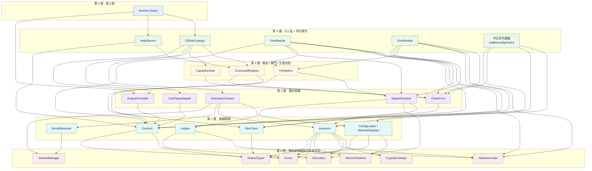

# TypeScript Wallet CLI — 模組分層開發計劃(依依賴關係分層)

> 本文件以**模組(Object / Class)為單位**描述 TypeScript Wallet CLI 的設計,
> 並依**模組間的依賴關係**做嚴格分層,讓「先開發什麼、什麼能獨立測、加東西動到誰」一目了然。
>
> **需求基線**:Standard CLI only、JSON envelope、0/1/2 exit code、彈性 flag 位置、
> wallet-centric keystore、strict stream discipline、TRON+EVM、Ledger watch-only。
>
> **本文件為唯一開發 source of truth。** 架構與分層看 §1–§6;磁碟結構、`wallets.json`/`config.yaml`
> 範例與規則、加密 envelope、輸出契約、error code、capability 鍵、flag 分類、命令清單、多鏈差異、
> Ledger 套件、函式庫/測試/里程碑等實作規格集中在 [§7 開發參考資料](#7-開發參考資料具體規格)。

---

## 鎖定的決策(讀之前先看)

| 決策 | 內容 |
| --- | --- |
| **命令文法 = B(family-positional)** | 綁鏈命令:`wallet-cli <family> <resource> <action> --network <net> [flags]`;`family` ∈ `{tron, evm}`。命令身分由 positional 決定。 |
| **flag 位置 = kubectl 式** | global flag 兩邊都收(command 前後皆可);command 專屬 flag 放 command 後(**非完全位置無關**)。 |
| **CLI 框架 = yargs** | **yargs 管殼**(tokenize、路由、help 骨架、completion、interspersed flag);**zod 管契約**(驗證/型別/預設/跨欄/agent JSON-schema);**自寫 Output/Stream/Errors 管輸出與 exit**。必關掉 yargs 自帶 I/O 與 exit。 |

**命令樹(頂層 positional 只有一組固定保留字):**

```text
wallet-cli
├─ tron   <resource> <action> --network <tron-net>   # 綁鏈(需 --network)
├─ evm    <resource> <action> --network <evm-net>    # 綁鏈(需 --network)
├─ wallet  create | import-mnemonic | import-private-key | import-ledger | import-watch
│          | list | set-active | export-address | rename | add-account
├─ config  get | set
└─ chains  list
```

- `tron` / `evm` = **鏈家族群組**(綁鏈命令,要 `--network`,且 `--network` 的 family 必須與此一致,否則 `network_family_mismatch`)。
- `wallet` / `config` / `chains` = **中立群組**(不屬任何鏈、不帶 `--network`)。
- **Ledger / 匯入屬中立群組**:一把 seed / 私鑰 / Ledger **同時衍生 tron(195)+ evm(60)地址**,匯入不是「對某條鏈」的操作,放 `wallet`。匯入按來源拆成四條獨立 action(必填 discriminator 在 grammar B 下拆成 action 比 `--type` 乾淨,且各自必填 flag 與 `auth` 需求無條件化;見 §7.14.3):
  ```text
  wallet-cli wallet import-ledger --app tron --index 0     # 註冊 Ledger(watch-only,兩鏈地址都快取)
  wallet-cli wallet import-watch --address T...            # 註冊觀察錢包(無秘密;與 seed/私鑰/ledger 同級 Source,僅缺秘密)
  wallet-cli wallet set-active --account ledger-main
  wallet-cli tron send-native --network nile --to T..      # 簽名才回鏈命令;是不是 ledger 由 SignerResolver 自己判斷
  ```

---

## 1. 怎麼讀這份文件

**分層規則(invariant):**

1. **依賴只能往下指。** 上層可以依賴下層,**下層永遠不依賴上層**。
2. **同一層的模組彼此不依賴。**
3. **最底層 = 零內部依賴的函式庫/型別**,集中寫在一起([§3 第 0 層](#第-0-層零內部依賴函式庫與型別))。

> **「依賴」的定義(重要)**:這裡的箭頭只算 **runtime/value 依賴**——「A import 並呼叫/實例化 B」。
> **type-only 參照不算依賴。** 所有跨層共用的**型別與介面**集中放在最底層 `SharedTypes`(L0),
> **實作**放在各自功能層。這樣任何模組都能拿到型別、可獨立 type-check 與測試,而箭頭只反映真正的執行期耦合。
> (例:`Contract` 的 `run(ctx: ExecutionContext)` 只是 type 參照;`ExecutionContext` 的**實作**在 L2,
> Contract 不 import 它,所以 Contract 仍在 L1。)

開發順序 = **由下往上**;閱讀順序 = **由上(進入點)往下(葉子)**。每個模組三段:**職責 / 依賴 / 物件**。

---

## 2. 依賴分層總覽



> **第 4 層的 `CliShell` 與 `TronModule`/`EvmModule`/中立群組同層,但彼此不依賴**:`CliShell` 透過
> `CommandRegistry` + `Contract` 介面在 runtime 拿到 `cmd` 並呼叫 `cmd.run`,**編譯期不 import 任何命令模組**;
> 命令模組只是 `registry.add()` 把自己插進去。這是依賴反轉——殼是 host、命令是 plugin,在 registry 交會。

**速查表**

| 層 | 模組 | 一句話 |
| --- | --- | --- |
| 5 | `Runner` | 攔 meta flag → HelpService;否則組 yargs、parse、收斂 error、回 exit code。 |
| 4 | `CliShell` `HelpService` `TronModule` `EvmModule` `中立群組` | CLI 殼、說明、各鏈完整命令面、錢包/設定等中立命令。 |
| 3 | `CommandRegistry` `CapabilityGate` `TxPipeline` | 具體命令解析、能力閘門、交易流程(含 Ledger 等待舞步)。 |
| 2 | `ExecutionContext` `SignerResolver` `ChainCore` `OutputFormatter` `ZodYargsAdapter` | 把第 1 層組起來的整合服務。 |
| 1 | `Contract` `Keystore` `ConfigLoader/NetworkRegistry` `SecretResolver` `RpcClient` `Ledger` | 只依賴第 0 層,彼此獨立。 |
| 0 | `SharedTypes` `Errors` `CryptoEnvelope` `Derivation` `AddressCodec` `AtomicFileStore` `StreamManager` | 零內部依賴,最先寫、可獨立測。 |

---

## 3. 模組逐一說明(由上而下)

### 第 5 層 · 進入點

#### `Runner`

**職責**:先攔 `--help`/`--version`/`--json-schema` 等 meta flag,短路給 `HelpService`;否則組 yargs CLI、`parseAsync`,把結果或 typed error 收斂成**一次執行只有一個終局輸出**,回 `0/1/2`。
**依賴**:`CliShell(yargs)`、`HelpService`、`OutputFormatter`、`Errors`。

```ts
async function main(argv: string[]): Promise<ExitCode> {
  const tokens = hideBin(argv)
  if (hasMeta(tokens)) return help.handleMeta(tokens)   // --help/--version/--json-schema 短路(保 JSON 乾淨)
  const cli = buildCli(registry)
  try {
    await cli.parseAsync(tokens)                          // yargs 只解析 + dispatch;不輸出、不 exit
    return EXIT.OK                                        // dispatch 內已寫出 result envelope
  } catch (e) {
    const err = normalizeError(e)                         // yargs .fail()/handler 拋出的都在此收斂
    formatter.error(err)
    return err.exitCode()                                 // 2=usage / 1=execution
  }
}
```

---

### 第 4 層 · CLI 殼 + 命令實作

#### `CliShell (yargs)`

**職責**:把 `CommandRegistry` 的命令樹註冊進 yargs(`tron`/`evm` family 群組 + 中立群組),宣告全域 flag(global-by-default = kubectl 式),**關掉 yargs 自帶 I/O 與 exit**,並提供 `dispatch`:解析具體命令 → 建 ctx → 解析網路(含 family 一致性檢查)→ zod 驗 → 能力閘門 → `cmd.run`。token 切分、flag 收集、help 排版一律交給 yargs。
**依賴**:`CommandRegistry`、`CapabilityGate`、`ExecutionContext`、`ZodYargsAdapter`、`OutputFormatter`、外部 `yargs`。

```ts
function buildCli(reg: CommandRegistry) {
  const cli = yargs()
    .exitProcess(false).help(false).version(false)        // exit/help 自己接,保 JSON stdout 乾淨
    .fail((msg, err) => { throw err ?? new UsageError("invalid_option", msg) })
    .options(GLOBAL_OPTS)                                  // yargs option 預設 global → kubectl 式

  for (const fam of reg.families())                        // ["tron","evm"];加鏈就多一圈
    cli.command(`${fam} [group] [verb]`, `${fam} commands`,        // positional 變數名用 group/verb,見 ⚠
      y => ZodYargsAdapter.applyArity(y, reg.flagsOf(fam)),
      argv => dispatch(reg, fam, argv))

  for (const ns of ["wallet", "config", "chains", "capabilities"])  // 中立群組
    cli.command(`${ns} [verb]`, `${ns}`, y => y, argv => dispatch(reg, ns, argv))
  return cli
}

async function dispatch(reg: CommandRegistry, ns: string, argv) {
  const family = (ns === "tron" || ns === "evm") ? ns as ChainFamily : undefined
  const path = [argv.group, argv.verb].filter(Boolean)             // chain:[group,verb] / neutral:[verb]
  const cmd = reg.resolveConcrete(ns, path)
  if (!cmd) throw new UsageError("unknown_command")

  const ctx = buildExecutionContext(pickGlobals(argv))
  let net: NetworkDescriptor | undefined
  if (cmd.network !== "none") {                                   // none=中立命令不碰網路
    net = argv.network
      ? ctx.networkRegistry.resolve(argv.network)                 // 顯式:歧義→ambiguous_network_alias
      : cmd.network === "required"
        ? (() => { throw new UsageError("missing_network") })()   // req(動鏈)缺值→missing_network
        : ctx.networkRegistry.resolveDefault(family!)             // opt(讀類/離線簽名)缺值→family 預設(內建 mainnet,config 可覆寫)
    if (family && net.family !== family)                          // ★ 守門(對顯式與 config 預設都跑):tron --network bsc → 擋
      throw new UsageError("network_family_mismatch", `${family} 不支援網路 ${net.id}`)
  }
  const input = cmd.input.parse(argv)                             // ★ zod 才是真正驗證(yargs 只切對 token)
  capabilities.check(cmd, net)                                    // 同 family 跨網路能力差異
  const data = await cmd.run(ctx, net, input)
  ctx.streams.result(formatter.success(cmd, net, data))          // 恰好一個 stdout frame
}
```

> 必須 `.exitProcess(false)` + 自訂 `.fail()` + `.help(false)`,否則 yargs 會自己印 help/錯誤到 stdout、自己 exit,破壞 JSON 契約與 0/1/2。
>
> ⚠ **positional 變數名不可與任何命令 flag 同名**:文法 B 對使用者仍是 `<family> <resource> <action>`,但 yargs 把 positional 寫進 `argv` 的具名鍵。若 positional 取名 `resource`,會與 `resource freeze/unfreeze` 的 `--resource energy|bandwidth` flag 撞名(positional 值「resource」覆蓋 flag 值,enum 永遠驗不過)。故 yargs 的 positional 一律取中性名 `group`/`verb`,dispatch 由 `argv.group`/`argv.verb` 讀路徑,使 `--resource` 等命令 flag 不被 shadow。另:**命令 flag 名不可用 JS 物件原型保留字**(如 `constructor`——`argv.constructor` 會回 `Object` 建構函式且令 yargs 內部 `conflicting[key].forEach` 崩潰);constructor 簽名 flag 取名 `--constructor-sig`。

#### `HelpService`

**職責**:`--help` / `--version` / `--json-schema`。**第一版即做完整 zod-driven help**——每 flag 的說明(zod `.describe()`)、必填/選填/預設、範例、以及 agent 用 JSON-schema 全部由命令的 zod `fields`/`input` 產;yargs 只負責排版骨架(群組列表、`Usage:`、`did you mean`)。一份 zod = 驗證 + 型別 + help + agent schema,永不漂移。
**依賴**:`CommandRegistry`、`Contract`(+ 外部 `zod-to-json-schema`)。

```ts
class HelpService {
  handleMeta(tokens: string[]): ExitCode   // 解析 positionals → 該命令/群組 → render 或 jsonSchema
  render(path: string[]): string           // 走訪 cmd.fields:欄名→--kebab、.describe()→說明、optional/default 標註 + examples
  jsonSchema(path: string[]): object       // zodToJsonSchema(cmd.input),agent 自省
}
```

> family 在 positional(`tron get-balance --help`),命令身分一看就定:不必先給 `--network` 就能解析 help 與自省。

#### `TronModule` / `EvmModule`

**職責**:每條鏈實作**自己完整的命令面**(無 universal provider,只共用 infra)。TRON ~100 命令、EVM ~20 命令。命令註冊到 `CommandRegistry`,自動掛在對應 yargs 群組。簽名類命令在 `run()` 裡呼叫 `TxPipeline`;讀類命令用 `ctx.resolveAddress(family)` 取地址、用 `net.rpc` 查詢。
**依賴**:`ChainCore`(實作 `ChainModule`)、`Contract`、`AddressCodec`、`RpcClient`、`TxPipeline`、`SignerResolver`(message sign 等不走 pipeline 的簽名)。

```ts
const tronSendNative: CommandDefinition = {
  id: "tron.tx.send-native", path: ["tx", "send-native"], family: "tron",
  network: "required", wallet: "required", auth: "required", capability: "tx.native.transfer",
  fields: tronSendNativeFields, input: tronSendNativeInput, examples: [...],
  run: (ctx, net, input) => txPipeline.run({
    ctx, net: net!, account: ctx.activeAccount,
    build:    (from) => tronBuildTransfer(net!.rpc!, from, input.to, input.amountSun),  // 鏈專屬
    estimate: (tx)   => tronEstimateBandwidth(net!.rpc!, tx),                           // 鏈專屬
    ...txMode(input),   // 預設廣播;--dry-run / --sign-only 退讓
  }),
}
// TronModule.registerCommands(reg) { reg.add(tronSendNative); reg.add(tronFreeze); … }
```

> **rule of three**:兩鏈相同 intent + 相同 input shape 才抽共用 factory;即便共用,回傳資料仍各自 chain-shaped。

#### 中立命令群組(`commands/`)

**職責**:不綁鏈的命令:`wallet`(含 create/import-* 四條/list/set-active/rename/add-account)、`config`、`chains`。直接用 `Keystore` / `ConfigLoader`,不走 `TxPipeline`。
**依賴**:`Keystore`、`ConfigLoader/NetworkRegistry`、`Contract`、`Ledger`(`import-ledger` 時)。

```ts
// 匯入按來源拆四條獨立命令(1:1 對映 Keystore 方法;auth/必填 flag 無條件化,不再靠 --type 分支)。
const walletImportMnemonic: CommandDefinition = {                          // BIP39 助記詞 → seed;要密碼加密
  id: "wallet.import-mnemonic", path: ["import-mnemonic"], network: "none", wallet: "none", auth: "required",
  // 一期不開 BIP39 passphrase:不帶 → keystore 用預設(無 passphrase)標準衍生;系統層仍保留 passphrase plumbing(見 §7.14.3 註)。
  run: async (ctx, _net, input) =>
    keystore.import({ type: "seed", secret: ctx.secrets.read("mnemonic"), label: input.label }),
}

const walletImportPrivateKey: CommandDefinition = {                        // 私鑰 → privateKey;要密碼加密
  id: "wallet.import-private-key", path: ["import-private-key"], network: "none", wallet: "none", auth: "required",
  run: async (ctx, _net, input) =>
    keystore.import({ type: "privateKey", secret: ctx.secrets.read("privateKey"), label: input.label }),
}

const walletImportLedger: CommandDefinition = {                            // 登記 Ledger;無秘密 → auth: none
  id: "wallet.import-ledger", path: ["import-ledger"], network: "none", wallet: "none", auth: "none",
  run: async (ctx, _net, input) => {
    const family = input.app === "ethereum" ? "evm" : "tron"               // --app tron|ethereum → family
    const path = await resolveLedgerPath(ledger, family, input)            // --index|--path|--address 三擇一(反查見 §7.14.1)
    ctx.emit({ type: "awaiting_device", reason: "verify_address" })        // 進度經 ctx.emit → stderr,Ledger 模組不印
    const address = await ledger.getAddress(family, path, { display: false })
    return keystore.registerLedger({ family, path, address, label: input.label })
  },
}

const walletImportWatch: CommandDefinition = {                             // 登記觀察地址;無秘密 → auth: none
  id: "wallet.import-watch", path: ["import-watch"], network: "none", wallet: "none", auth: "none",
  run: async (_ctx, _net, input) => {
    const family = detectFamily(input.address)                             // T...→tron / 0x...→evm;不合法→invalid_option
    return keystore.registerWatch({ family, address: input.address, label: input.label })
  },
}
```

---

### 第 3 層 · 路由 / 閘門 / 交易流程

#### `CommandRegistry`

**職責**:持有所有 `CommandDefinition`;`resolveConcrete(ns, path)` → 具體命令(`ns` = family 或中立群組名);提供 metadata 給 `CliShell` 建 yargs 樹、給 `HelpService` 產說明。切 token/收 flag/排 help 交給 yargs。
**依賴**:`Contract`、`ChainCore`。

```ts
class CommandRegistry {
  add(cmd: CommandDefinition): void
  families(): ChainFamily[]                                       // 給 CliShell 建 family 群組
  flagsOf(family: ChainFamily): FlagArityHints                    // 給 CliShell 餵 yargs arity
  resolveConcrete(ns: string, path: string[]): CommandDefinition | null   // "tron"+["account","balance"] → tron.account.balance
  tree(): CommandTreeMeta                                         // 給 HelpService
}
```

#### `CapabilityGate`

**職責**:只做**同一 family 內、跨網路的能力差異**檢查(Base 有 `fee.eip1559`、BSC 只有 legacy)。跨 family 的「命令不存在」由 `CommandRegistry` 處理(`unknown_command`),`family↔network` 不符由 `CliShell` 擋(`network_family_mismatch`)。
**依賴**:`ChainCore`(CapabilityRegistry)。

```ts
class CapabilityGate {
  check(cmd: CommandDefinition, net?: NetworkDescriptor): void {
    if (!cmd.capability || !net) return
    if (!this.caps.supports(net.id, cmd.capability))             // 能力以「每網路」為準(見 ChainCore)
      throw new UsageError("unsupported_network_capability", `${net.id} 不支援 ${cmd.capability}`)
  }
}
```

#### `TxPipeline`

**職責**:所有簽名命令共用的流程:resolve signer → build unsigned → estimate → (dry-run?) → sign → (broadcast?)。**Ledger「印等待字 + timeout + abort」的舞步集中在此,不在各命令複製。** chain 專屬的 build/estimate 由 callback 傳入。
**依賴**:`SignerResolver`、`RpcClient`(經 `net.rpc`)。

```ts
class TxPipeline {
  async run(p: {
    ctx: ExecutionContext; net: NetworkDescriptor; account: AccountRef
    build: (signerAddr: string) => Promise<UnsignedTx>
    estimate: (tx: UnsignedTx) => Promise<FeeReport>
    dryRun: boolean; broadcast: boolean
  }): Promise<TxOutcome> {
    const { streams, timeoutMs } = p.ctx
    const signer = this.signers.resolve(p.account, p.net.family)   // 回 Signer(含 kind + address)
    const tx = await p.build(signer.address)                       // build/estimate 完全不碰裝置
    const fee = await p.estimate(tx)
    if (p.dryRun) return { stage: "plan", tx, fee }

    let signed: SignedTx
    if (signer.kind === "device") {
      await signer.precheck!()                                     // 沒連/鎖住/開錯 app → auth_required
      streams.diagnostic("warn", "等待裝置確認簽名…")              // ← stderr / meta.warnings
      const ac = new AbortController()
      signed = await withTimeout(signer.sign(tx, { signal: ac.signal }), timeoutMs, () => ac.abort())
    } else {
      signed = await signer.sign(tx, {})                           // software:in-process,無人值守 OK
    }
    if (!p.broadcast) return { stage: "signed", signed, fee }
    return { stage: "broadcast", ...(await p.net.rpc!.broadcast(signed)) }
  }
}
```

> `signer.kind` 決定要不要等裝置;印字在 `TxPipeline`(持有 `ctx.streams`)而非 `LedgerSigner`,維持 stream 紀律。
> 先 build/estimate 再 sign:**會失敗的交易絕不會要使用者去插 Ledger**。

---

### 第 2 層 · 整合服務

> 五個模組彼此不依賴,可平行開發。

#### `ExecutionContext`

**職責**:由 config/env/flags 組裝執行上下文;持有 config、networkRegistry、streams、secrets、output、timeout、`activeAccount`。**選取是 account-level**:`activeAccount` 由 `--account` 全域旗標或 `wallets.json.activeAccount` **惰性**解析;`resolveAddress(family)` 取該帳戶在某鏈的快取地址。**build 期無副作用**;秘密不入可序列化表面。
**依賴**:`ConfigLoader/NetworkRegistry`、`Keystore`(經 DI)、`SecretResolver`、`StreamManager`。型別 `ExecutionContext` 在 `SharedTypes`。

```ts
function buildExecutionContext(globals: Globals, deps: RuntimeDeps): ExecutionContext
// deps 提供 resolveAccount(globals) → AccountRef(Keystore 介面),達成依賴反轉
// 回傳物件實作 SharedTypes 的 ExecutionContext 介面:
//   { config, networkRegistry, streams, secrets, output, timeoutMs,
//     get activeAccount(): AccountRef,           // lazy
//     resolveAddress(family): string }           // = walletAddress(keystore.resolveAccount(activeAccount).wallet, family, index)
```

#### `SignerResolver`

**職責**:把「`AccountRef` + family」變成 `Signer`(含已快取 `address`)。依 `source.type` 決定 software / ledger:active account 是否需要硬體確認在此判定。software 簽章不再 `if family` 分支:`SoftwareSigner` 持有注入的 `FAMILIES`/`ADAPTERS[family].sign`(`SignStrategy`)並委派(§7.12.1)。
**依賴**:`Keystore`、`Derivation`、`Ledger`、注入的 `SignStrategy`(per-family)。

```ts
class SignerResolver {
  resolve(ref: AccountRef, family: ChainFamily): Signer {
    const { wallet, index } = this.keystore.resolveAccount(ref)        // index 僅 seed 用;privateKey/ledger 無 index
    const address = walletAddress(wallet, family, index)              // ledger: source.address(family 不符回 undefined)
    if (!address) throw new WalletError("missing_wallet_address")     // 含 ledger family-match 失敗
    switch (wallet.source.type) {
      case "privateKey":
        return new SoftwareSigner(this.keystore.decryptKey(wallet.source.keyId), address)
      case "seed": {
        const kp = Derivation.derive(this.keystore.decryptSeed(wallet.source.vaultId),
                                     Derivation.path(family, index))
        return new SoftwareSigner(kp.privateKey, address)
      }
      case "ledger":
        return new LedgerSigner(this.ledger, wallet.source.family, wallet.source.path, address)  // path+address 自 source;無 deviceId
      case "watch":
        throw new WalletError("watch_only_no_signer")   // 觀察錢包無秘密,不能簽名;讀類命令仍可用 cache address
    }
  }
}
```

#### `ChainCore`

**職責**:`CapabilityRegistry`(能力以**每網路**為準:同 family 不同網路能力可不同,如 EIP-1559)。`ChainModule` 介面定義在 `SharedTypes`(讓鏈模組與 registry 都能參照)。
**依賴**:`Contract`(型別參照,實際只用 SharedTypes 的介面)。

```ts
class CapabilityRegistry {
  register(networkId: NetworkId, caps: string[]): void    // 由各 NetworkDescriptor.capabilities 灌入
  supports(networkId: NetworkId, capability: string): boolean
}
// interface ChainModule 見 SharedTypes:family / networks() / capabilities() / registerCommands(reg)
```

#### `OutputFormatter`(human/json 雙實作 + factory)

**職責**:把 outcome 轉成終局 frame、把中間事件轉成進度 frame,**不改變行為**。JSON 恰好一個終局 envelope;空資料 `{}`;大數字串化。中立命令省略 `chain` 欄位。
不在單一類別裡灑 `if (output === "json")`,而是拆成介面 + `HumanOutputFormatter` / `JsonOutputFormatter` 兩實作,由 `createOutputFormatter(output)` 依 `--output` 選一個;`dispatch` / `TxPipeline` / `Runner` 全程只持有介面、永不分支。職責切分:formatter 純算字串,`StreamManager` 管寫入與 stream 選擇——寫入不塞進 formatter。
**依賴**:`Contract`(envelope 型別,實為 SharedTypes)。

```ts
interface OutputFormatter {
  success(cmd: CommandDefinition, net: NetworkDescriptor | undefined, data: unknown): string  // 終局 frame
  error(err: CliError): void                    // json→stdout envelope;text→stderr 簡訊(維持原契約)
  event(e: ProgressEvent): string | null        // ★新增:中間進度 frame;null = 此模式不顯示該事件
}
class HumanOutputFormatter implements OutputFormatter {}   // 人讀文字行(無 spinner/TTY)、人讀錯誤
class JsonOutputFormatter  implements OutputFormatter {}   // success/error envelope、NDJSON 事件物件字串
function createOutputFormatter(output: "text" | "json"): OutputFormatter   // 由 Runner/ctx 依 --output 建一次
```

> 終局資料流不變(handler 回 data → `formatter.success` → `streams.result` 一個 frame)。新增的 `event()` 只服務 `TxPipeline` / Ledger 等待這類長流程的**中間進度**(見 `StreamManager` 兩段式事件 + §7.7)。`ProgressEvent`(discriminated union,如 `awaiting_device`/`signed`/`broadcasting`)型別放 `SharedTypes`。

#### `ZodYargsAdapter`

**職責**:從命令的 zod `fields` 推導 yargs 需要的**最小 arity 提示**(boolean→switch、其餘→吃值),套進 yargs builder。**驗證/型別/預設/跨欄仍只在 zod**,不在 yargs DSL,維持單一事實來源。
**依賴**:`Contract`(+ 外部 `yargs` 型別)。

```ts
class ZodYargsAdapter { static applyArity(y: Argv, fields: ZodObject): Argv }
```

---

### 第 1 層 · 基礎服務

> 六個模組彼此不依賴,可平行開發、各自單測。

#### `Contract`

**職責**:擁有「**怎麼定義一條 command**」的機制:共用 zod 原語(`Schemas.*`)、`OutputEnvelope` builder。逐 command schema 隨各 chain 命令寫。`CommandDefinition` 介面本身在 `SharedTypes`。
**依賴**:`SharedTypes`、`Errors`(+ 外部 `zod`)。

```ts
const Schemas = { evmAddress, base58Address, uintString, amount, feeFields }   // 共用原語(值)
const OutputEnvelope = {
  success(cmd, net, data, meta): ResultEnvelope,   // net=undefined → 省略 chain
  error(err: CliError): ErrorEnvelope,
}
```

> `fields`(逐欄)餵 `ZodYargsAdapter` 產 yargs arity、供 HelpService;`input`(`fields.superRefine`)在 dispatch 一次驗(含跨欄)。

#### `Keystore`

**職責**:wallet-centric 儲存。加密 envelope(scrypt + aes-128-ctr + keccak MAC,每檔自帶 salt)、vault/key 獨立加密檔、`wallets.json` 註冊表、root `labels`、選取解析(`--account`,含 ref/label/address)。寫入經 `AtomicFileStore`(原子替換 + lock)。import 支援 BIP39 passphrase。**全域 master password 不變量**(密碼哨兵,見 §7.4.1):所有加密 blob 共用單一 master password。資料形狀(`Wallet`/`Source`/`WalletsFile`/`AccountRef`)在 `SharedTypes`。
**依賴**:`CryptoEnvelope`、`Derivation`、`AddressCodec`、`AtomicFileStore`、`Errors`、`SharedTypes`。

```ts
class Keystore {
  generateId(prefix: "wlt"|"vlt"|"key"): string        // CSPRNG base32,撞庫重生;不含時間、不由秘密推導
  import(p: { secret; type: "seed"|"privateKey"; passphrase?: string; label?: string }): AccountRef
  registerLedger(p: { family: ChainFamily; path: string; address: string; label?: string }): AccountRef  // 單鏈單 path watch-only
  registerWatch(p: { family: ChainFamily; address: string; label?: string }): AccountRef  // 觀察錢包:無秘密、無檔;dedup by (family, address)
  addAccount(walletId: string): AccountRef             // 僅 seed:append 下一 index;ledger/watch 來源 → WalletError(改用 import)
  resolveAccount(refOrLabel: string): { wallet: Wallet; index: number }   // index 僅 seed 有意義(privateKey/ledger 無)
  resolveWallet(idOrLabel: string): Wallet
  rename(refOrLabel: string, label: string): void; setActive(ref: AccountRef): void
  list(): WalletView[]                                 // 明文,免解鎖
  delete(refOrWallet: string): void                    // 連帶清 labels 孤兒
  decryptSeed(vaultId: string): Bytes; decryptKey(keyId: string): Bytes
  // 全域 master password 不變量(見 §7.4.1):所有加密 blob 共用一把密碼。
  // 加密寫入前 createIfAbsent:true(首次建哨兵、之後驗);decrypt 前 createIfAbsent:false(只驗)。
  #assertPassword(opts: { createIfAbsent: boolean }): void   // 不符 → auth_failed;在 AtomicFileStore 交易內 check-or-create
}
```

> 磁碟結構、`WALLET_CLI_HOME` 整棵搬移、`wallets.json` 範例、加密 envelope、id/ref/label 三者分離與選取規則:
> 詳見 [§7.2–§7.4](#72-磁碟版面與-wallet_cli_home)。
> **Ledger 等待提醒由中立命令印**(見上),Keystore/Ledger 不印。

#### `ConfigLoader / NetworkRegistry`

**職責**:先解析根目錄(`WALLET_CLI_HOME ?? ~/.wallet-cli`,bootstrap);分層合併 config(builtins < file < env < flags);建 network registry;`alias → canonical`,歧義→`ambiguous_network_alias`。`resolve` 時把對應的 `RpcClient` 實例掛上 `NetworkDescriptor.rpc`。只擁有 `config.yaml`。
**依賴**:`AtomicFileStore`(`config set` 也原子)、`RpcClient`(建實例掛上 descriptor)、`SharedTypes`、`Errors`(+ 外部 `yaml`)。

```ts
class ConfigLoader { static resolveRoot(env): Path; load(globals): Config }
class NetworkRegistry {
  constructor(config: Config, rpcFactory: (d: NetworkDescriptor) => RpcClient)   // rpcFactory = (d) => ADAPTERS[d.family].makeRpc(d),由 runner 注入(§7.12.1)
  resolve(idOrAlias: string): NetworkDescriptor        // 顯式;缺值→missing_network;回傳已掛 .rpc 的 descriptor
  resolveDefault(family: ChainFamily): NetworkDescriptor  // net=opt 省略時:config.defaults.network[family] ?? FAMILIES[family].defaultNetwork
  all(): NetworkDescriptor[]
}
```

#### `SecretResolver`

**職責**:集中讀秘密,**每來源只讀一次並 memoize**。handler 不得直接讀 `process.stdin`。秘密不入 log/envelope。
**依賴**:`StreamManager`。

**秘密來源(§7.13.1)**:每個 `SecretKind` 綁一個來源 `--<kind>-stdin`(讀 fd 0)。stdin 一次只能餵一個值,故**一次調用至多一個秘密占用 fd 0**;需要第二個秘密的命令改走互動式(見 §7.13.1)。**所有秘密一律走此通道;不提供任何 env 來源**(無 `MASTER_PASSWORD`,避免裸放 env / process table / shell history)。已移除 `--<kind>-file`/`/dev/fd/N` 多-fd 通道(雙秘密 import 改互動式後不再需要)。

```ts
type SecretSource = { kind: SecretKind; path: "-" }   // 僅 stdin(fd 0);無 env 來源
class SecretResolver { masterPassword(): string; read(kind: SecretKind): string }  // 依 kind 綁定的來源解析,每來源 memoize
```

#### `RpcClient`

**職責**:對節點發請求的薄包裝(TRON gRPC / EVM JSON-RPC),可對 mock 測。第三方 client 雜散輸出不得污染 stdout。**介面 `RpcClient` 在 `SharedTypes`**,此處只放實作。
**依賴**:`SharedTypes`(+ 外部 `tronweb`/`viem`)。

```ts
class TronRpcClient implements RpcClient { constructor(grpcEndpoint, solidityEndpoint?) }
class EvmRpcClient  implements RpcClient { constructor(rpcUrl) }
```

#### `Ledger`

**職責**:HID transport + 各鏈 app 封裝 + `LedgerSigner`。watch-only,簽名時 block 在硬體按鍵。前置條件經 `appConfig()` 檢查回 actionable error。**本模組不印任何提醒**(由呼叫者經 StreamManager 印);需精準時機可收 `onWait` callback。`Signer`/`LedgerSigner` 介面在 `SharedTypes`。
**依賴**:`AddressCodec`、`Derivation`(+ 外部 `@ledgerhq/*`)。

```ts
class Ledger {
  getAddress(family, path, opts?: { display?: boolean; onWait?: () => void }): Promise<string>  // display:false=靜默(import 反查 / precheck 用)
  signTransaction(family, path, tx, signal?): Promise<Signature>
  appConfig(family): Promise<AppConfig>
}
class LedgerSigner implements Signer {           // kind="device";address 建構時帶入
  precheck(): Promise<void>                        // ① appConfig 未 ready → auth_required
                                                   // ② getAddress(display:false) 比對 cache address,不符 → wrong_device_seed
  sign(tx, { signal }): Promise<SignedTx>          // 委派 Ledger;拒絕/abort → signing_rejected
}
class SoftwareSigner implements Signer {         // kind="software";constructor(privateKey, address, sign: SignStrategy);忽略 signal
}                                                // family 無關:sign/signMessage 委派注入的 SignStrategy(§7.12.1)
```

---

### 第 0 層 · 零內部依賴函式庫與型別

> 只依賴 npm 外部套件,彼此不依賴,最先寫、最容易測。

#### `SharedTypes`(純型別 / 介面 — 全系統共用)

**所有跨層型別與介面的唯一家**,讓上層只依賴介面、可獨立 type-check。無執行碼。

```ts
// 識別與網路
type ChainFamily = "tron" | "evm"
type NetworkId = string                              // "evm:56" / "tron:nile"
type AccountRef = string                             // "wlt_x.0"(HD) / "wlt_k"(privateKey)
interface NetworkDescriptor { id: NetworkId; family: ChainFamily; chainId: string; aliases: string[]
  rpcUrl?: string; grpcEndpoint?: string; solidityGrpcEndpoint?: string
  feeModel?: "legacy"|"eip1559"|"tron-resource"; capabilities: string[]; rpc?: RpcClient }
interface CapabilityDescriptor { key: string; summary: string }
interface Config { defaultOutput: "text"|"json"; timeoutMs: number; networks: Record<NetworkId, NetworkDescriptor> }

// 錢包資料形狀
type ChainAddresses = { tron: string; evm: string }   // 一把秘密兩鏈皆派生 → 兩格恆有(非 optional)
type Source = { type:"seed";       vaultId:string; addresses: Record<string, ChainAddresses> }  // index(字串)→ 兩鏈;已知 index = Object.keys(addresses)
            | { type:"privateKey"; keyId:string;   addresses: ChainAddresses }                  // 無 index,兩鏈攤平
            | { type:"ledger";     family:ChainFamily; path:string; address:string }            // 單鏈單 path;address 同住、無 deviceId
            | { type:"watch";      family:ChainFamily; address:string }                          // 觀察錢包:單鏈單地址,無秘密、無 path、無檔(= ledger 去掉 path)
interface Wallet { id: string; source: Source }   // 所有 address cache 收進 source,無頂層 addresses 欄位
// 讀地址一律經 helper:walletAddress(wallet, family, index?) — seed→addresses[index][family]、privateKey→addresses[family]、ledger/watch→family 符回 address 否則 undefined
// 已知 index:accountIndices(source) = seed 取 Object.keys(addresses).map(Number).sort();privateKey/ledger/watch 無 index
interface WalletsFile { version:number; activeAccount: AccountRef; wallets: Wallet[]; labels: Record<AccountRef,string> }
type KeystoreBlob = { id:string; type:"bip39-seed"|"raw-privkey"|"verifier"; version:number; crypto: CryptoParams }  // verifier = 密碼哨兵,見 §7.4.1

// 簽名 / 交易 / RPC 介面(實作在上層)
type Bytes = Uint8Array; type KeyPair = { privateKey: Bytes; publicKey: Bytes }
interface Signer { kind:"software"|"device"; address:string; precheck?(): Promise<void>
  sign(tx: UnsignedTx, opts:{ signal?: AbortSignal }): Promise<SignedTx> }
interface RpcClient { call(method:string, params:unknown): Promise<unknown>; broadcast(s: SignedTx): Promise<BroadcastResult> }
type UnsignedTx = unknown; type SignedTx = unknown; type FeeReport = object; type TxOutcome = object

// 執行上下文 / 命令 / 鏈模組介面(實作在上層)
interface ExecutionContext { config: Config; networkRegistry: NetworkRegistry; streams: StreamManager
  secrets: SecretResolver; output:"text"|"json"; timeoutMs:number
  activeAccount: AccountRef; resolveAddress(family: ChainFamily): string }
interface CommandDefinition<I=any,O=any> { id:string; path:string[]; family?: ChainFamily
  network:"none"|"optional"|"required"; wallet:"none"|"optional"; auth:"none"|"required"
  capability?: string; fields: ZodObject; input: ZodType<I>; examples: Example[]
  run(ctx: ExecutionContext, net: NetworkDescriptor|undefined, input: I): Promise<O> }
interface ChainModule { family: ChainFamily; networks(): NetworkDescriptor[]
  capabilities(): CapabilityDescriptor[]; registerCommands(reg: CommandRegistry): void }

// 輸出契約
type ResultEnvelope = { schema:string; success:true; command:string; chain?: ChainView; data:unknown; meta: Meta }
type ErrorEnvelope  = { schema:string; success:false; command:string; chain?: ChainView
  error:{ code:string; message:string; details?:object }; meta: Meta }

// 中間進度事件(長流程:Ledger 等待 / 簽名 / 廣播);走 StreamManager.event,非終局;帶 type 與終局 envelope 區分
type ProgressEvent =
  | { type:"awaiting_device"; reason:"sign"|"verify_address"|"open_app"|"unlock" }
  | { type:"pre-verify-address"; address:string }
  | { type:"signed" } | { type:"broadcasting" } | { type:"dry-run" }
```

#### `Errors`(純)— classify ↔ render 雙層

把「**把任意底層 throw 收斂成 canonical 錯誤**」(classify)與「**canonical 錯誤 → message / exitCode / JSON code**」(render)徹底分開,讓 §7.8 的 error code 表成為**唯一事實**:同一個 `CliError` 同時決定 exit code、JSON `error.code`、human 訊息,三者永不漂移。

```ts
abstract class CliError { code:string; message:string; details?:object; abstract kind:"usage"|"execution"
  exitCode(){ return this.kind==="usage"?2:1 }                                            // render①:0/1/2
  toEnvelope(){ return { code:this.code, message:this.message, details:this.details } } } // render②:JSON code/訊息
class UsageError extends CliError { kind="usage" as const }       // exit 2 (含 network_family_mismatch)
class ExecutionError extends CliError { kind="execution" as const } // exit 1
class TransportError extends ExecutionError {}; class ChainError extends ExecutionError {}; class WalletError extends ExecutionError {}

// classify:純函式、零 I/O,把 tronweb / viem / Ledger / RPC 的雜散 throw 比對成 canonical CliError。
// 只靠 error 形狀(instanceof / 屬性 / SW code)比對,不 import 上層模組 → 維持 L0(外部 lib 依賴可,如 @ledgerhq/errors)。
type ClassifyContext = { command?: string; expected?: string; rejected?: "sign"|"verify_address"|"open_app" }
function normalizeError(raw: unknown): CliError                          // 通用入口(已存在)
function classifyError(raw: unknown, ctx?: ClassifyContext): CliError    // table-driven 擴充版(RPC/鏈錯誤)
function classifyDeviceError(raw: unknown, ctx?: ClassifyContext): CliError  // Ledger 專屬:鎖機/拒簽/開錯 app/逾時/未安裝
```

> 呼叫端(`TxPipeline`、`Ledger`、`RpcClient`)在 catch 時帶 `ctx`(如 `expected:"Tron app"`、`rejected:"sign"`)交給 `classify*`,得到帶正確 `code` 的 `CliError`;`Runner` 只負責 render(`formatter.error` + `exitCode()`)。新增 code 一律**先進 §7.8 表**,再讓 classify 對應、render 自動跟上。

#### `CryptoEnvelope`(純)
```ts
class CryptoEnvelope {
  static encrypt(plaintext: Bytes, password: string): KeystoreBlob   // scrypt → aes-128-ctr → keccak MAC
  static decrypt(blob: KeystoreBlob, password: string): Bytes        // MAC 不符 → auth_failed
}
```
外部:`@noble/hashes`、`@noble/ciphers`。

#### `Derivation`(純)
```ts
const COIN_TYPE = { tron: 195, evm: 60 }   // 收斂進 Family Registry 的 FAMILIES[f].coinType(見 §7.12.1)
class Derivation {
  static mnemonicToSeed(mnemonic: string, passphrase?: string): Bytes   // 選填 BIP39 passphrase
  static derive(seed: Bytes, path: string): KeyPair
  static path(family: ChainFamily, account: number): string            // m/44'/{coin}'/{account}'/0/0
}
```
外部:`@scure/bip39`、`@scure/bip32`。

#### `AddressCodec`(純)
```ts
interface AddressCodec { family: ChainFamily; fromPublicKey(pub: Bytes): string; validate(addr: string): boolean }
class TronAddress implements AddressCodec {}   // Base58Check
class EvmAddress  implements AddressCodec {}   // EIP-55
```

#### `Family Registry`(純,L0)— §7.12.1

**職責**:把散落的 `family === "tron" ? … : …` 二元分支收斂成單一事實表 + port 宣告;具體 adapter 在 composition root 注入(見 §7.5/SignerResolver)。設計細節見 `docs/superpowers/specs/2026-06-22-family-registry-design.md`。

```ts
// core/family —— 純事實(下層 derivation/address/config 皆讀此;COIN_TYPE/ADDRESS_CODECS 收斂於此)
interface FamilyMeta { family: ChainFamily; namespace: string; nativeUnit: string
                       coinType: number; codec: AddressCodec; defaultNetwork: NetworkId }
const FAMILIES: Record<ChainFamily, FamilyMeta>
const CHAIN_FAMILIES: ChainFamily[]                          // = Object.keys(FAMILIES);取代所有 ["tron","evm"]
function familyOf(addr: string): ChainFamily | undefined     // 用各 codec.validate 偵測;取代 detectWatchFamily
function isChainFamily(ns: string): ns is ChainFamily        // 取代 CHAIN_NS / ns==="tron"||"evm"

// port(只有型別;具體實作在上層,於 runner 組裝後注入):
interface SignStrategy   { sign(pkHex, tx): Promise<SignedTx>; signMessage(pkHex, msg): Promise<string> }
interface FamilyAdapter  { family: ChainFamily; makeRpc(d: NetworkDescriptor): RpcClient; sign: SignStrategy }
```

**為何兩張表**:事實(`FAMILIES`)必須在 L0 給下層讀;行為(`makeRpc`/`sign`,需具體 `TronRpcClient` 等 class)只能在 runner 建,組成 `ADAPTERS: Record<ChainFamily, FamilyAdapter>` 再注入 `NetworkRegistry`/`SignerResolver`。合一就得讓 L0 import runner → 往上依賴,破壞分層;分開正是 clean architecture「entities/資料 vs `main()` wiring」。

#### `AtomicFileStore`(零內部依賴,有副作用)
tmp 檔 + `rename()` 原子替換 + 選擇性 lockfile,避免平行 process 互蓋。
```ts
class AtomicFileStore { readJson<T>(p): T|null; writeJson(p, v): void; withLock<T>(p, fn): T }
```

#### `StreamManager`(零內部依賴,有副作用)— 兩段式事件

明確區分**中間事件**(長流程進度:等待裝置、已簽名、廣播中)與**終局 frame**(整個執行唯一一次的 result/error)。中間事件讓監看的 agent 能在最終結果前就 react(例:Ledger 等待簽名)。

```ts
class StreamManager {
  constructor(output:"text"|"json", quiet:boolean, verbose:boolean)
  result(text: string): void                                   // 終局 → stdout,整個執行僅一次
  event(frame: string | null): void                            // ★新增:中間事件 frame(plain 逐行);null 跳過
  diagnostic(level:"info"|"debug"|"warn", msg: string): void   // → stderr,受 quiet/verbose gate
  readStdinOnce(): string                                      // 第二次拋錯
}
```

> **stream 政策(定案 A,集中於此)**:中間事件 **`event()` 一律 plain 逐行寫 stderr**(`stderr.write(line + "\n")`),**無 spinner / 無 TTY 偵測**——本專案是 Standard CLI / agent-first,動畫零價值且徒增分支;event 內容由 `formatter.event(e)` 決定(text 回人讀一行、json 回一行 NDJSON 帶 `type`)。
> - **stdout 永遠恰好一個終局 envelope**(`result()`),保住 §7.7 鎖定不變式;agent 要看即時進度就 streaming 讀 stderr,buffered 抓 stdout 一行 parse 即可。
> 命令 / pipeline 只丟 `ProgressEvent` 給 `formatter.event()` → `streams.event()`,選 stream 的政策不外洩。

---

## 4. 關鍵設計決策

| # | 設計考量 | 決策 | 落點 |
| --- | --- | --- | --- |
| ① | argv 切分需要 flag arity 資訊 | yargs + B 文法(身分在 positional);arity 由 `ZodYargsAdapter` 從 zod 餵 | `CliShell`/`ZodYargsAdapter` |
| ② | 命令身分若取決於 `--network`,help/自省會無解 | B 文法把 family 放 positional 自然消解 | (文法決策) |
| ③ | `wallets.json`/`config.yaml` 需並發保護 | `AtomicFileStore`(原子替換+lock) | `AtomicFileStore` |
| ④ | 存在性、family↔network、能力差異須分屬不同關卡 | 三分:存在性→`CommandRegistry`;family↔network→`CliShell`;同 family 跨網路能力→`CapabilityGate` | 三者 |
| ⑤ | 支援 BIP39 passphrase | `Derivation`/`Keystore.import` 帶 `passphrase?`(**系統層保留;一期命令層不開放 `--passphrase`,見 §7.14.3**) | `Derivation`/`Keystore` |
| ⑥ | 中立命令不應帶 `chain` 欄位 | `chain?` optional,中立命令省略 | `Contract`/`SharedTypes` |
| ⑦ | 觀察錢包應與 seed/privateKey/ledger 同級、僅缺秘密 | `Source` 加 `type:"watch"`(family/address,無檔);走獨立 `import-watch`;`SignerResolver` 擋簽名(`watch_only_no_signer`) | `SharedTypes`/`Keystore`/`SignerResolver` |
| ⑧ | 讀類/離線簽名不該被迫帶 `--network` | `CommandDefinition.network` 增 `optional`(對齊 wallet/auth 三態);省略時 `NetworkRegistry.resolveDefault(family)` 取 family 預設網路(內建 mainnet,config `defaults.network` 可覆寫);動鏈命令維持 `required`。family 一律由 positional 決定,故無需依 source type 分支 | `SharedTypes`/`NetworkRegistry`/`CliShell` |

> **取捨**:flag 位置採 **kubectl 式**(非完全位置無關)以換取套用 yargs。
> **固定約束**:aes-128-ctr + keccak MAC、clean break、0/1/2、**動鏈命令(`net=required`)須 `--network`;讀類/離線簽名(`net=optional`)省略時用 family 預設網路(內建 mainnet,config `defaults.network` 可覆寫)**、per-chain namespace。

---

## 5. 兩個擴展場景

**新增一條命令** → 只動該 chain module:寫 `CommandDefinition` + `registerCommands` 加一行(自動掛 yargs 群組、ZodYargsAdapter 自動納入新 flag)。CLI 殼、`Contract`、`OutputFormatter`、`StreamManager` 全不動。

**新增一條鏈**(已有 tron/evm 加 solana) → 收斂為**兩個明確註冊點**,不再有散落的 `family === …` 二元分支(見 §7.12.1 Family Registry):
1. **真實作**:`SolanaRpcClient`(`infra/rpc`)、solana `AddressCodec`(`core/address`)、`SolanaSignStrategy`(`runtime/signer`)——一條新鏈本來就需要這些。
2. **`FAMILIES` 加一條事實**(`core/family`:nativeUnit/coinType/codec/defaultNetwork)+ **runner `ADAPTERS` 加一條 adapter**(`makeRpc`/`sign`)+ `ChainFamily` union 加 `"solana"`。

`CHAIN_FAMILIES`/`FAMILIES` 一改,所有迴圈(config 預設、keystore 衍生、CliShell family 群組、help namespace)自動納入新鏈;`CliShell`/`OutputFormatter`/框架層不動。

---

## 6. 分層決策的理由

分層嚴格依 runtime 依賴拓樸;以下記錄每個落點的理由:

1. **`TxPipeline` 在 L3**(鏈模組之下)——它被鏈模組呼叫,不能在其上。
2. **`CliShell` 在 L4、`CommandRegistry`/`CapabilityGate` 在 L3**——避免 `CliShell → CommandRegistry` 的同層依賴;鏈模組與殼同在 L4 但靠依賴反轉互不 import。
3. **`SharedTypes` 是「全系統型別/介面之家」**——`ExecutionContext`/`Signer`/`RpcClient`/`CommandDefinition`/`ChainModule`/`Wallet` 等介面放 L0,實作留上層;確立「依賴 = runtime/value 依賴,type-only 不算」。
4. **`CliShell.dispatch` 設 `network_family_mismatch` 守門**——`tron … --network bsc` 被擋。
5. **`Runner` 攔 meta flag 短路 HelpService**——`.help(false)` 後 `--help` 由此路由。
6. **`ExecutionContext` 為 account-level**(`activeAccount` + `resolveAddress`)——對齊「簽名是 account 粒度」。
7. **`Signer.address` 對所有 kind 都帶入**(SignerResolver 從快取取)——build 階段才有地址可用。
8. **Ledger 註冊的等待提醒由中立命令印、Ledger 模組不印**——與簽名一致的 stream 紀律。
9. **能力以「每網路」為準**——`CapabilityRegistry` 由各 `NetworkDescriptor.capabilities` 灌入。
10. **`OutputFormatter` 為 human/json 雙實作 + factory**——避免單一類別內 `if (json)` 分支;formatter 只算字串,寫入留 `StreamManager`。
11. **`Errors` 拆 classify ↔ render 雙層**——§7.8 error code 表為唯一事實,exit / JSON code / 訊息不漂移;`classifyDeviceError` 收 Ledger 雜散 throw。
12. **`StreamManager` 採兩段式事件**——中間事件**一律 plain 逐行走 stderr(無 spinner/TTY)**,stdout 永遠一個終局 frame。
13. **Family Registry 兩張表分屬 L0 與 composition root**(§7.12.1)——純事實 `FAMILIES` 在 L0 給下層讀;具體行為 adapter(`makeRpc`/`sign`,需 `TronRpcClient` 等 L1 class)只能在 runner 組裝後注入。port 放 L0、adapter 在 `main()`,即 clean architecture 依賴反轉;消滅散落的 `family === …` 二元分支。

---

## 7. 開發參考資料(具體規格)

> 此節為**實作要直接照抄/對照的具體規格**。架構面看 §1–§6,資料/格式面看這裡。

### 7.1 第一個里程碑(窄而完整)

在高風險簽名之前驗證架構:

- TS 腳手架,僅 Standard CLI;`--output text|json`、`--quiet`、`--verbose`、`--help`、`--version`。
- 穩定 JSON envelope、`0/1/2` 結束碼契約。
- 以 master password 解鎖的 seed/vault keystore;`wallet create/import-mnemonic/import-private-key/list/set-active`。
- `chains list`。
- `tron account balance --network nile` 與 `evm account balance --network base` **來自同一共享錢包身分**。
- Golden 測試驗證 stdout/stderr 行為與 keystore 往返。

### 7.2 磁碟版面與 `WALLET_CLI_HOME`

根目錄預設 `~/.wallet-cli/`,可由 `WALLET_CLI_HOME` 覆寫為任意路徑(測試/CI 隔離、無 `$HOME` 沙箱、多 profile)。覆寫的是**整棵樹**(`wallets.json` 的 `source` 指向同樹下 `vaults/`/`keys/`,必須同住);只改位置不改加密。

```text
$WALLET_CLI_HOME/ 或 ~/.wallet-cli/   # 後者為預設;前者覆寫整棵樹
  config.yaml              # 明文使用者設定 — 無秘密
  wallets.json             # 明文註冊表 — 無秘密
  tokens.json              # 明文代幣地址簿(使用者層,per network+account)— 無秘密(見 §7.17)
  vaults/<vaultId>.json    # 加密的 BIP39 seed/entropy
  keys/<keyId>.json        # 加密的 raw private key
  # ledger / watch 無獨立檔:條目全存 wallets.json 的 source —— ledger=(family/path/address)、watch=(family/address);皆無秘密、無 deviceId
```

> 根目錄解析是 bootstrap,**早於** config 分層(必須先知道根在哪才找得到 `config.yaml`)。對應模組:`ConfigLoader.resolveRoot`。

### 7.3 `wallets.json` — 結構、範例、規則

```json
{
  "version": 1,
  "activeAccount": "wlt_x.0",
  "wallets": [
    {
      "id": "wlt_x",
      "source": {
        "type": "seed", "vaultId": "vlt_9f3a",
        "addresses": {
          "0": { "tron": "T...", "evm": "0x..." },
          "1": { "tron": "T...", "evm": "0x..." }
        }
      }
    },
    {
      "id": "wlt_k",
      "source": { "type": "privateKey", "keyId": "key_7b2c", "addresses": { "tron": "T...", "evm": "0x..." } }
    },
    {
      "id": "wlt_lt",
      "source": { "type": "ledger", "family": "tron", "path": "m/44'/195'/0'/0/0", "address": "T..." }
    },
    {
      "id": "wlt_le",
      "source": { "type": "ledger", "family": "evm", "path": "m/44'/60'/0'/0/0", "address": "0x..." }
    },
    {
      "id": "wlt_w",
      "source": { "type": "watch", "family": "tron", "address": "T..." }
    }
  ],
  "labels": {
    "wlt_x":   "main-seed",
    "wlt_x.0": "main",
    "wlt_x.1": "savings",
    "wlt_k":   "hot",
    "wlt_lt":  "ledger-tron",
    "wlt_le":  "ledger-eth",
    "wlt_w":   "team-vault-watch"
  }
}
```

規則:

- **定址單位是 account,不是錢包。** 一個錢包(`wlt_x`)= 一個秘密來源。seed 為 HD,**已知 index = `source.addresses` 的 keys**(不再另存 `accounts`);privateKey 非 HD,`source.addresses` 兩鏈攤平、無 index;ledger 單鏈單 path(見 §7.14.1);watch 單鏈單地址、無秘密(見 §7.14.2)。
- **account ref** 貫穿全結構:`wlt_x.<index>`(seed HD)/ `wlt_k`(privateKey)/ `wlt_lt`(ledger)。同時是 `activeAccount`、`labels` 的 key、`--account` 選的。
- **seed/privateKey 路徑不存字串**,由模板 `m/44'/{coinType}'/{account}'/0/0` 算出(coin type tron=195/evm=60,purpose/change/address_index 寫死);已知 index 由 `source.addresses` keys 表示。**ledger 例外:path 字串直接存 `source.path`**(見 §7.14.1)。
- `source.addresses` 為衍生公開識別的明文 cache(seed 按 index 鍵 `Record<index, {tron,evm}>`、privateKey 兩鏈攤平 `{tron,evm}`、ledger 為單一 `address`),利秒列 `wallet list`;解鎖或查裝置後可重算。
- `activeAccount` 指 account ref 而非整個錢包(簽名單位是 account)。缺該鏈視圖 → `missing_wallet_address`。

**身分 / 顯示名(`id`、account ref、`labels`)**

| 欄位 | 角色 | 特性 |
| --- | --- | --- |
| `id`(`wlt_3f9k2p7q`) | 錢包層穩定鍵 | 系統生成、不可變、不可重用、opaque |
| account ref(`wlt_x.0`/`wlt_k`) | 定址單位 | `id` + index;privateKey 無 index |
| `labels[ref]`(`"main"`) | 人類顯示名 | 使用者取、**唯一**、可改名;住 root `labels` map |

- **`id` 生成**:`wlt_` + Crockford base32(CSPRNG,如 `randomBytes(5)`)。**不用時間當 seed**;唯一性靠「生成後比對註冊表、撞到重生」;**絕不由秘密衍生**(免在明文留指紋)。`vaultId`/`keyId` 同原則。
- **`labels` 唯一性橫跨整張 map**(wallet 層 + account 層同命名空間),`--account main` 才能反查唯一;trim + 大小寫不敏感比對撞名即拒絕;label 不得以 `wlt_` 開頭。刪 account/wallet 要**主動清** `labels[ref]` 孤兒。
- **為何 label 已唯一仍保留 id/ref**:唯一只在某時刻成立,不跨時間(刪 `main` 再建同名 `main` 是不同私鑰);用 ref 釘死才能「精確命中或報錯」,不靜默改指。
- **選取解析**:`--account <accountId|label|address>` 為**唯一選擇器**(取代舊 `--wallet`),覆寫 active、所有命令可用。形狀自動判:`wlt_` 開頭當 accountId;合法地址(`T...`/`0x...`)比對各錢包 `source.addresses` cache(唯一,無歧義);否則當 label(0=not-found、1=用它、**≥2 歧義硬報錯**,簽名路徑絕不替使用者猜)。解析到多帳戶 seed 的 wallet 層 → 報錯要求指定 account;單帳戶錢包(privateKey/ledger/watch)wallet==account 直接用其唯一 account。
- **import 分工**:使用者給秘密(助記詞/私鑰類走互動式隱藏輸入,連同 master password;見 §7.13.1)+ 選填 `--label`;CLI 自動生 `id`、建 account 0、衍生 `addresses`、寫加密檔回填 `vaultId`/`keyId`、寫 root `labels`;`--label` 省略給預設(`wallet-N`);重複 import 比對 `addresses` 去重。
- **Ledger(單鏈單 path)**:每個 `(family, path, address)` 為**獨立條目**,ref 同 privateKey 用 `wlt_id`(無 index);address 存 `source`、**不填 `addresses` map**。tron/ethereum、不同 index 一律各自條目;去重以 `(family, path)` 為準。**ledger 失去跨鏈共享身分**(software 維持)。`add-account` 不適用 ledger(用 import 增 path)。選取時命令 family 須等於 `source.family`,否則 `missing_wallet_address`(訊息點明 family 不符)。匯入規則見 [§7.14.1](#7141-ledger-import-模型唯一進入點ledger-無-deriveadd-account)。
- **Watch(單鏈單地址)**:與 ledger 同級的 `Source`,差別在**無秘密、無 path、無檔**——`(family, address)` 全存 `wallets.json` 的 `source`。ref 同 privateKey/ledger 用 `wlt_id`(無 index);address 存 `source`、不填 `addresses` map;去重以 `(family, address)` 為準;family 由地址格式自動判(`T...`→tron、`0x...`→evm)。讀類命令(餘額/資源/歷史)照常用 cache address;**簽名類命令 → `SignerResolver` 回 `watch_only_no_signer`**。`add-account` 不適用(用 import 增地址)。匯入規則見 §7.14.2。

### 7.4 加密 envelope(`vaults/*.json`、`keys/*.json`)

每檔為獨立加密 blob,標準 Web3 風格(選用因密碼學品質,非為相容);每檔自帶 `salt`,單一 master password 對每檔衍生不同金鑰。

```json
{
  "id": "vlt_1",
  "type": "bip39-seed",          // keys/*.json 為 "raw-privkey"
  "version": 1,
  "crypto": {
    "cipher": "aes-128-ctr",
    "ciphertext": "…",
    "cipherparams": { "iv": "…" },
    "kdf": "scrypt",
    "kdfparams": { "n": 262144, "r": 8, "p": 1, "dklen": 32, "salt": "…" },
    "mac": "keccak256(dk[16:32] || ciphertext)"
  }
}
```

- Master password 由 `--password-stdin`(非互動命令)或互動式輸入(`import-*`/`backup`)解析;**不支援 `MASTER_PASSWORD` env**。秘密永不記錄、不入任何 JSON envelope。stdin 至多一個秘密占用,需第二個秘密者走互動式,見 §7.13.1。
- 明文為 BIP39 entropy(vault)或 32-byte private key(key)。seed 衍生時可帶選填 BIP39 passphrase。

### 7.4.1 全域 master password 不變量(密碼哨兵)

**問題**:CLI stateless,每次呼叫獨立讀 master password,而每個 blob 各自帶 salt、各自驗 MAC——**無任何不變量**保證「所有 wallet 同一把密碼」。先用密碼 alice `import-mnemonic`、再用密碼 bob `import-private-key` 會產生兩個不同密碼的 wallet,且要到實際 decrypt 某個 wallet 才 `auth_failed`,錯誤太晚、無法一致管理。

**對策**:存**一個** keystore 級「密碼哨兵」(verifier),把 master password 變成 keystore **全域事實**而非 per-blob。哨兵 = 用 master password 加密一段隨機 32-byte token 的 `KeystoreBlob`(reuse `CryptoEnvelope`,`type:"verifier"`);只靠 decrypt 的 MAC pass/fail 判斷,不需明文語意。存於 keystore root(獨立檔 `verifier.json` 或 `wallets.json` 一欄位)。

**何時建立(lazy,無獨立 init 命令)**:綁在**第一個會產生加密 blob 的寫入**:

| 命令 | 建/驗哨兵 | 原因 |
| --- | --- | --- |
| `wallet create` / `import-mnemonic` / `import-private-key`(`auth=req`) | 哨兵不存在 → **建**(此密碼定為 master);已存在 → **驗**,不符 `auth_failed` 並拒絕寫入 | 會加密 blob |
| `import-ledger` / `import-watch`(`auth=—`) | **不碰** | 無秘密、無加密 blob |
| `list` / `set-active` / `rename` / `delete` | **不碰** | 不解鎖、不加密 |
| `backup` / 簽名(decrypt 路徑) | **只驗**(`createIfAbsent:false`) | 解密既有 blob |

- **只有 watch/ledger 的 keystore 沒有 master password**——正確:無秘密可保護,直到第一個加密寫入才確立。
- **check-or-create 必須與 blob 寫入同一個 `AtomicFileStore` 交易(lock 內)**,否則兩個並行「首次 import」會 race 出兩個哨兵。
- **decrypt 只驗不建**:遇「有加密 blob 但無哨兵」(舊資料/遷移)走一次性 backfill——用當下密碼成功 decrypt 一個既有 blob 後補建哨兵;否則 `auth_failed`。一期 clean break 通常碰不到。
- **未來 `wallet change-password`(二期)**:重加密所有 blob + 重寫哨兵,哨兵讓「改密碼」有單一權威來源。

### 7.5 `config.yaml` — 範例與解析規則

明文,僅供非秘密的使用者級預設(輸出模式、RPC 端點、逾時、網路別名、自訂網路)。**不得含**任何秘密。

分層優先(後者覆蓋前者):**1. 內建預設 → 2. `config.yaml` → 3. 專案設定檔(若啟用)→ 4. 環境變數 → 5. 全域 CLI 選項 → 6. 命令區域選項。**

```yaml
defaultOutput: text
timeoutMs: 30000
defaults:
  network:                 # net=opt 命令(讀類/離線簽名)省略 --network 時的回退;省略此鍵則用內建 mainnet
    tron: nile             # 內建為 tron:mainnet
    evm: sepolia           # 內建為 evm:1
price:                     # account portfolio 的 USD 估值來源(best-effort;省略=內建 CoinGecko)
  provider: coingecko      # coingecko | none
  # baseUrl: https://api.coingecko.com/api/v3   # 自訂/Pro 端點(選填)
  # apiKey: <cg-pro-key>                          # 選填,送 x-cg-pro-api-key 標頭
networks:
  "tron:mainnet":
    family: tron
    chainId: mainnet
    aliases: [tron]
    grpcEndpoint: grpc.trongrid.io:50051

  "tron:nile":
    family: tron
    chainId: nile
    aliases: [nile]
    grpcEndpoint: grpc.xxx.example:50051
    solidityGrpcEndpoint: grpc-solidity.xxx.example:50051

  "tron:shasta":
    family: tron
    chainId: shasta
    aliases: [shasta]
    grpcEndpoint: grpc.shasta.trongrid.io:50051

  "evm:1":
    family: evm
    chainId: "1"
    aliases: [eth, ethereum]
    rpcUrl: https://ethereum-rpc.example
    feeModel: eip1559

  "evm:56":
    family: evm
    chainId: "56"
    aliases: [bsc, bnb]
    rpcUrl: https://bsc-dataseed.binance.org
    feeModel: legacy

  "evm:11155111":
    family: evm
    chainId: "11155111"
    aliases: [sepolia]
    rpcUrl: https://sepolia-rpc.example
    feeModel: eip1559
```

解析規則:

- `--network nile` → canonical `tron:nile`;config 定義的 `grpcEndpoint` 覆寫內建。`--network bsc` → `evm:56`;`--network evm:56` 跳過別名直接解析。
- `defaults.network.{tron,evm}` 為 `net=opt` 命令(讀類/離線簽名)省略 `--network` 時的回退網路(`NetworkRegistry.resolveDefault(family)`);值經同一 alias→canonical 解析,且 family 須相符(設成跨 family → `network_family_mismatch`,啟動即擋)。省略此鍵則回退內建 mainnet(`tron:mainnet` / `evm:1`)。`net=required`(動鏈)命令不受此影響,仍須顯式 `--network`。
- `price.provider`(`coingecko`|`none`,預設 `coingecko`)決定 `account portfolio` 的估值來源;`baseUrl`/`apiKey` 選填覆寫端點/Pro 金鑰。**best-effort**:取價失敗不影響餘額查詢(架構 §7.17)。`apiKey` 為 public-data API 金鑰(非錢包秘密級),但仍不入 log/envelope。
- 端點旗標(`--grpc-endpoint`/`--rpc-url`)對該次執行覆寫內建與 config。
- 自訂網路需用 canonical id 當 key,並含該 family 必要欄位(TRON 需 `grpcEndpoint`;EVM 需 `rpcUrl` + `chainId`)。
- 別名僅面向使用者;執行期/鏈模組/能力檢查/快取/輸出一律用 canonical id。別名須全域唯一,否則 `ambiguous_network_alias`。

### 7.6 網路別名與 `NetworkDescriptor`

```text
tron      -> tron:mainnet      eth       -> evm:1
nile      -> tron:nile         bsc       -> evm:56
shasta    -> tron:shasta       sepolia   -> evm:11155111
                               base      -> evm:8453
                               optimism  -> evm:10
```

(`NetworkDescriptor` 型別定義見 §3 第 0 層 `SharedTypes`。)

### 7.7 輸出契約(envelope 範例與規則)

JSON 模式向 `stdout` 恰好輸出一個物件。

成功:
```json
{
  "schema": "wallet-cli.result.v1",
  "success": true,
  "command": "tron.account.balance",
  "chain": { "family": "tron", "networkId": "tron:nile", "network": "nile", "chainId": "nile" },
  "data": {},
  "meta": { "durationMs": 123, "warnings": [] }
}
```
錯誤:
```json
{
  "schema": "wallet-cli.result.v1",
  "success": false,
  "command": "evm.tx.send-native",
  "chain": { "family": "evm", "networkId": "evm:8453", "network": "base", "chainId": "8453" },
  "error": { "code": "insufficient_funds", "message": "…", "details": {} },
  "meta": { "durationMs": 98, "warnings": [] }
}
```

規則:

- JSON 模式只把最終 envelope 寫 `stdout`;診斷只進 `stderr`。文字模式錯誤寫簡短訊息到 `stderr`。
- 一次執行恰好一個終端結果。空資料為 `{}` 非 `null`。
- **中間事件(長流程進度,如 Ledger 等待簽名)**:**plain 逐行走 `stderr`(無 spinner/TTY)**——json 模式為 NDJSON 行(帶 `type` 與終局 envelope 的 `success` 區分),text 模式為人讀一行;**stdout 仍恰好一個終局 envelope**(不破上條)。見 `StreamManager` 兩段式事件。
- 金額在可能超出 JS 安全整數時為**字串**(wei/sun 恆為真)。binary 宣告編碼(`hex`/`base64`/鏈原生)。
- `chain.networkId` 為穩定 canonical 身分;`chain.network` 僅供可讀。中立命令(`wallet`/`config`/`chains`)省略 `chain` 欄位。
- 警告:JSON 下結構化於 `meta.warnings`,文字模式印 `stderr`。

### 7.8 結束碼與錯誤碼分類

| 碼 | 意義 |
| --- | --- |
| `0` | 成功 |
| `1` | 執行錯誤(RPC 失敗、簽名失敗、餘額不足、交易拒絕、驗證/秘密錯誤) |
| `2` | 用法錯誤(旗標格式錯誤、缺必填、命令形狀無效) |

詳細原因放 `error.code`:

```text
usage_error  unknown_command  invalid_option  missing_option  invalid_value
missing_network  unsupported_chain  unsupported_network  ambiguous_network_alias  network_family_mismatch
unsupported_capability  unsupported_network_capability
auth_required  auth_failed  secret_source_error  wrong_device_seed  ledger_address_not_found
rpc_error  rate_limited  timeout  indexer_not_configured
insufficient_funds  transaction_rejected  signing_rejected
invalid_address  missing_wallet_address  watch_only_no_signer  invalid_amount  encoding_error
execution_error  internal_error
```

> `network_family_mismatch` 為本設計特有(B 文法下 `tron … --network bsc` 被擋),屬 usage(exit 2)。
> 此表是 `Errors` 的 **classify ↔ render 雙層唯一事實**:`classifyError`/`classifyDeviceError` 把底層 throw 對到這些 `code`,`CliError.toEnvelope()`/`exitCode()` 由 `code`/`kind` 推出 JSON code 與 0/1/2。新增原因先擴此表。

### 7.9 能力鍵清單(capability keys)

```text
account.balance.native    account.balance.token
account.portfolio         account.tokenbook         # 地址簿 + 估值(TRON 一期;見 §7.17)
tx.native.transfer        tx.token.transfer
tx.estimate  tx.sign  tx.broadcast  message.sign
contract.call  contract.deploy
resources.energy  resources.bandwidth      # 僅 TRON
staking.freeze  staking.delegate            # 僅 TRON
governance.vote  governance.proposal        # 僅 TRON
fee.eip1559                                   # 僅 EVM
```

### 7.10 Flag 分類(使用者面向)

> B 文法:`wallet-cli <family> <resource> <action> --network <net> [flags]`;flag 位置為 **kubectl 式**(global 兩邊都收)。
> 開發者分類見下;`--account` 解析規則見 §7.3。

**Option taxonomy(誰擁有、能否記錄/持久化)**

| 類別 | 擁有層 | 值來源 | 可記日誌? | 可存設定? | 範例 |
| --- | --- | --- | --- | --- | --- |
| 全域執行期 | Runtime/CliShell | argv/env/config | 是(非秘密) | 是(網路預設除外) | `--output`、`--network`、`--account`、`--timeout`、`--quiet`、`--verbose` |
| 命令選項 | 鏈/中立命令 | argv | 是(非秘密) | 否 | `--to`、`--amount-sun`、`--token`、`--contract`、`--method` |
| 端點覆寫 | ConfigLoader | argv/env/config | 是(消毒) | 是 | `--grpc-endpoint`、`--rpc-url` |
| 含秘密 | SecretResolver | stdin(fd 0)/加密檔 | 否 | 否 | `--password-stdin`、`--tx-stdin`(`import-*`/`backup` 的秘密走互動式) |
| 元選項 | CLI | argv | 是 | 否 | `--help`、`-h`、`--version`、`--json-schema` |

**Global runtime flags**

| Flag | 說明 |
| --- | --- |
| `--output text\|json` | 輸出格式;`json` 走固定 envelope。 |
| `--network <id\|alias>` | 選網路(canonical 或 alias);動鏈命令(`net=required`)必帶、讀類/離線簽名(`net=optional`)省略時用 family 預設(§7.5 `defaults.network`),且 family 須與 positional 一致。 |
| `--account <accountId\|label\|address>` | 唯一選擇器(取代舊 `--wallet`),tx/sign 與查詢精確到 account,覆寫 active、所有命令可用;未指定用 `activeAccount`。形狀自動判:`wlt_`→accountId、合法地址→比對 cache(唯一)、其餘→label。解析到多帳戶 seed 的 wallet 層 → 報錯要求指定 account;單帳戶錢包(privateKey/ledger/watch)wallet==account 直接用。 |
| `--quiet` / `--verbose` | 抑制 / 增加 diagnostics(不影響 command data)。 |
| `--timeout <ms>` | 操作逾時(含 Ledger 等待確認;Ledger 等待的唯一上界,無人值守時逾時即 abort)。 |
| `--help` / `-h` / `--version` | 元選項。 |

**Endpoint override**:`--grpc-endpoint <host:port>`(TRON)、`--rpc-url <url>`(EVM)— 單次執行覆寫,非業務輸入。

**Secret-bearing**:`--password-stdin`(解鎖 vault/key,非互動命令)、`--tx-stdin`(明確交易輸入)— explicit opt-in,讀 fd 0 恰好一次;**無 env 來源**(不支援 `MASTER_PASSWORD`)。**fd 0 至多一個秘密占用**;`import-mnemonic`/`import-private-key`/`backup` 需要第二個秘密或讀出秘密,改走**互動式隱藏輸入**(見 §7.13.1),不再有 `--*-file`/`/dev/fd/N` 多-fd 通道。**不支援** argv raw 秘密值(`--private-key <v>` 等,會洩漏到 history/process list/log)。

**Command-input flag families**(由各命令 zod schema 定義):

| 家族 | 範例 | 備註 |
| --- | --- | --- |
| 目標地址 | `--address`、`--to`、`--receiver` | 依 resolved family address codec 驗。 |
| 金額 | `--amount`、`--amount-sun`、`--amount-wei` | 大數字串;單位依命令。 |
| 代幣/合約 | `--token`、`--contract`、`--method`、`--params` | 名稱共享、codec 不同。 |
| 費用/資源 | `--fee-limit`、`--gas-price`、`--max-fee`、`--max-priority-fee`、`--resource` | schema 管形狀;CapabilityGate 管 fee model 支援。 |
| 執行模式 | `--dry-run`、`--sign-only` | TxPipeline 控制回 plan / signed / broadcast(預設即廣播)。 |
| 錢包管理(software) | `--label`(秘密與 master password 走互動式) | `import-mnemonic`/`import-private-key`;**兩個秘密走互動式隱藏輸入**(見 §7.13.1);來源 discriminator 已是 action 名,無 `--type`;路徑由 index + 模板算出,故無 `--path-*`。 |
| Watch import | `--address <T...\|0x...>`、`--label` | `import-watch` 專屬;無秘密;family 由地址格式自動判。見 §7.14.2。 |
| Ledger import | `--app tron\|ethereum`、`--index`、`--path`、`--address`、`--scan-limit`(預設 20) | ledger 專屬;`--index`/`--path`/`--address` 三擇一互斥。見 §7.14.1。 |

### 7.11 命令清單(command inventory)

> B 文法下,綁鏈命令前綴 family:`tron account balance`、`evm tx send-native`;TRON-only 自然只在 `tron`。中立命令無 family、無 `--network`。完整命令面待對照 Java CLI inventory + EVM 增補逐一列舉;以下為代表分組。

**中立(無 `--network`)**:`wallet create|import-mnemonic|import-private-key|import-ledger|import-watch|list|set-active|export-address|rename|add-account`、`config get|set`、`chains list`。`add-account` 僅 seed;ledger 新增 path 走 `import-ledger`(`--index`/`--path`/`--address`,見 §7.14.1);觀察地址走 `import-watch --address`(見 §7.14.2)。

**Account / Query(綁鏈)**:`account balance|info|resources`(chain-shaped:TRON 含 bandwidth/energy、EVM 含 nonce)、`get-block`、`tx status|receipt`、`token balance|info|allowance`、`account add-token|list-tokens|remove-token|portfolio`(代幣地址簿 + best-effort 估值,TRON;見 §7.17)。

**Transaction / Contract(綁鏈)**:`tx send-native`、`tx send-token`、`tx build|sign|broadcast`(pipeline:dry-run/離線簽)、`contract call|send|deploy|trigger`。

> **一期命令面以 [`phase1-command-spec.zh-TW.md`](./phase1-command-spec.zh-TW.md) 為準**(本表為架構代表分組,非一期窮舉)。一期對命令面做收斂:`tx build|sign` 不另開命令,離線簽走 `tx send-* --sign-only` + `tx broadcast`;`contract trigger` 與 `get-contract`/`get-contract-info` 收成 `contract call|send` 與 `contract info`。儲存/能力模型不變,僅命令面表達不同。

**TRON-only**:`freeze|unfreeze|delegate-resource|undelegate-resource`、`vote-witness|witness list|proposal create|approve|delete`、TRC10 `asset-issue|participate`、Bancor `exchange|market-order`、`gasfree`。

**EVM-only**:`tx send-native` 的 `--gas-price` / EIP-1559 fee 旗標、`message sign`(typed-data)、`contract deploy`(bytecode/ABI)。

### 7.12 多鏈差異(需保留)

| 關注點 | TRON | EVM 相容 |
| --- | --- | --- |
| 原生單位 | SUN/TRX | wei/ETH |
| 位址格式 | Base58Check `T...` | hex `0x...`(EIP-55) |
| 費用模型 | bandwidth/energy/TRX | gas、EIP-1559 |
| 代幣模型 | TRC-10 / TRC-20 | ERC-20 / ERC-721 |
| 交易形狀 | protobuf 衍生 | EIP-155 / EIP-1559 typed tx |
| 治理 | SR / 提案 | CLI 範圍內 n/a |
| 合約呼叫 | TVM、TRON 位址編碼 | EVM ABI |
| BIP44 coin type | 195 | 60 |

### 7.13 stdin / 串流規則

- 預設禁用 `stdin` 作業務輸入;僅 `--password-stdin`/`--tx-stdin`/`--message-stdin` 為 opt-in(讀 fd 0,至多一個占用)。互動命令的秘密走 TTY 互動式輸入(見 §7.13.1)。
- 任何消費 stdin 的旗標讀一次並 memoize(`SecretResolver` + `StreamManager.readStdinOnce`);命令 handler **不得**直接讀 `process.stdin`。
- 秘密不得記錄或入 envelope。JSON 模式中間進度走 `stderr`(NDJSON 事件)。見 §7.7 與 `StreamManager` 兩段式事件。
- 第三方 library(tronweb/viem)輸出不得污染 JSON stdout,經 StreamManager 抑制/轉向。

#### 7.13.1 秘密輸入(stdin 至多一個;雙秘密走互動式)

**問題**:stdin 只有 fd 0 一條,但 `import-private-key`(私鑰 + master password)、`import-mnemonic`(助記詞 + master password)**單次調用要餵兩個秘密**。把兩者擠進同一條 stdin 需自訂協定、易錯。

**對策**:不另開多-fd 通道(原 `--<kind>-file`/`/dev/fd/N` 已移除)。改為——
- **單秘密命令**(`create`、software 簽名):master password 走 `--password-stdin`(fd 0);資料類非秘密輸入(`tx broadcast` 的交易、`message sign` 的訊息)走 inline argv 或各自的 `--<kind>-stdin`(與 `--password-stdin` 互斥於 fd 0)。
- **雙秘密 / 讀出秘密 / 危險確認命令**(`import-mnemonic`、`import-private-key`、`backup`、`delete`):改走**互動式隱藏輸入**——秘密在 TTY 直接輸入、不回顯、不入 argv/stdin pipe/shell history。

```bash
# 單秘密命令:password 走 stdin
echo "$PW" | wallet-cli wallet create --label main --password-stdin

# 雙秘密 import 改互動式(秘密與密碼皆 TTY 隱藏輸入)
wallet-cli wallet import-private-key --label hot
```

**規則**:
- 秘密來源只有 `--<kind>-stdin`(讀 fd 0);**每次調用至多一個秘密占用 fd 0**。
- 需要第二個秘密者一律走互動式,不提供 `--<kind>-file`/`/dev/fd/N` 多-fd 通道。
- master password 僅由 `--password-stdin`(非互動命令)或互動式輸入(互動命令)解析,**不支援 `MASTER_PASSWORD` env**(見 §7.4 / §7.4.1)。
- **過渡期**:互動式 prompt 子系統尚未實作;當前 code 暫以 `--<kind>-stdin` 餵互動命令的秘密並標 `TODO:interactive`,待 prompt 層落地後移除這些 flag。

### 7.14 Ledger 整合研究(Node CLI)

| 需求 | 套件 | 備註 |
| --- | --- | --- |
| Transport | `@ledgerhq/hw-transport-node-hid` | Node HID 經 `node-hid`/`usb`。**WebHID 僅瀏覽器、需 click-context,CLI 不可用。** |
| Transport(CLI 重用) | `@ledgerhq/hw-transport-node-hid-singleton` | 單一重用連線,適合一次一裝置。 |
| TRON app | `@ledgerhq/hw-app-trx` | `getAddress`、`signTransaction`、`signTransactionHash`、`signPersonalMessage`、`signTIP712HashedMessage`、`getAppConfiguration`。 |
| EVM app | `@ledgerhq/hw-app-eth` | `getAddress`、`signTransaction`、`signPersonalMessage`、`signEIP712Message`。 |

- 保持 transport 與 app 模組版本對齊(版本漂移會導致 `undefined` 回應類 bug)。
- **不存 `deviceId`**:HID 無穩定序號,且「簽名前 derive + 比對 address」比 deviceId 更強(連 passphrase / 換 seed 都擋)。路由 = 連當下插著的裝置 + address 比對,不符 → `wrong_device_seed`;同時插多台不自動挑(連第一台、比對、錯就報錯)。
- 前置條件(解鎖、正確 app、blind-signing)經 `getAppConfiguration()` 檢查,回可操作錯誤而非不透明傳輸失敗。

### 7.14.1 Ledger import 模型(唯一進入點 `wallet import-ledger`;ledger 無 derive/add-account)

- **`--app tron|ethereum`(必帶)**:決定派生模板 / codec。`ethereum → evm` family;EVM 一個地址通用所有 EVM 鏈(secp256k1 同 key、chainId 只在 tx)。裝置上請開對應 app。Ledger 無「EVM」app,evm 即 Ethereum app。
- **來源三擇一(強制互斥;帶 ≥2 個 → `invalid_option`, exit 2)**,全部解析成 path:
  - `--path m/44'/{coin}'/{i}'/0/0`:直接用;驗 coin_type 與 `--app` 一致,否則 `invalid_option`。
  - `--index N`:套 app 預設模板換 index(`m/44'/{coin}'/{N}'/0/0`)。
  - `--address <addr>`:**有界裝置反查**(見下)。
- **`--address` 反查(非 gap-limit)**:已知目標地址,做**有界線性搜尋**——先查 index 0(快路)→ 沒中掃 `0..--scan-limit`(**預設 20**)→ 找不到 → `ledger_address_not_found`。每個 index 一次 silent `getAddress`,需正確 app + 正確 seed/passphrase 啟用否則掃不到;**不用 gap-limit**(目標已知,gap-limit 只會更早停、更糟)。**error 訊息必含**:「前 N 個帳戶找不到此地址;可調 `--scan-limit <n>` 擴大範圍,或改用 `--index` / `--path` 直接指定」。
- **落地**:`registerLedger({ family, path, address, label? })` → 單鏈單 path 條目(address 存 `source`,不填 `addresses` map);dedup by `(family, path)`。
- **簽名前防呆(所有碰裝置的命令)**:`LedgerSigner.precheck` 先 `getAddress(family, path, display:false)` 比對 cache address,不符 → `wrong_device_seed`(裝置目前 seed/passphrase 與此帳戶不符)。讀類命令(餘額)用 cache、不碰裝置,無需比對。

### 7.14.2 Watch import 模型(觀察錢包;與 ledger 同級、僅缺秘密)

觀察錢包是 `Source` 的第四個變體 `{ type:"watch"; family; address }`,與 seed/privateKey/ledger **同級寫進 `wallets.json`**,差別只在**無秘密、無 path、無獨立加密檔**。和 ledger 一樣是「登記既有身分」,故走獨立 action `wallet import-watch`(與其餘三條 `import-*` 並列;見 §7.14.3)。

- **進入點**:`wallet import-watch --address <addr> [--label]`。**唯一必帶 `--address`**(無秘密、無 `--*-stdin`)。
- **family 自動判定**:由地址格式定 family(`T...` Base58Check → `tron`;`0x...` EIP-55 → `evm`);格式不合法 → `invalid_option`(exit 2)。**不接受跨 family 的歧義輸入**。
- **落地**:`registerWatch({ family, address, label? })` → 單鏈單地址條目(address 存 `source`,不填 `addresses` map);**dedup by `(family, address)`**。
- **能力邊界**:讀類命令(`account balance|resources|assets|history`、`token balance|info`、`tx status|info`、`contract call`)照常用 cache address 查詢;**任何簽名類命令**(`tx send-*`、`resource freeze|unfreeze`、`contract send`、`message sign`)→ `SignerResolver` 回 `watch_only_no_signer`(exit 1),訊息點明此為觀察錢包、需以有秘密的帳戶簽名。
- **不適用 `add-account`**(無 index/無秘密);要多一個觀察地址就再 `import-watch`。

### 7.14.3 匯入命令拆分(四條 action 取代單一 `--type`)

匯入照來源拆成四條獨立 action,取代舊的 `wallet import --type <…>` 單一命令。與一期命令規格(`phase1-command-spec.zh-TW.md` §2)一致。

| 命令 | Keystore 落點 | auth | 唯一/必填 flag | 秘密來源 |
| --- | --- | --- | --- | --- |
| `wallet import-mnemonic` | `import({ type:"seed" })` | req | `[--label]` | 助記詞 + master password 走互動式隱藏輸入(§7.13.1) |
| `wallet import-private-key` | `import({ type:"privateKey" })` | req | `[--label]` | 私鑰 + master password 走互動式隱藏輸入(§7.13.1) |
| `wallet import-ledger` | `registerLedger` | — | `--app*`、`--index\|--path\|--address`、`[--scan-limit]`、`[--label]` | (無;硬體) |
| `wallet import-watch` | `registerWatch` | — | `--address*`、`[--label]` | (無) |

- **為何拆**:grammar B 下必填 discriminator 拆成 action 比 `--type` flag 乾淨(對齊 `set-active`/`add-account` 命名);各命令**必填 flag 與 `auth` 需求無條件化**——助記詞/私鑰要密碼加密(`auth=req`)、ledger/watch 無秘密(`auth=—`),不再於單一 handler 內條件分支。
- **1:1 對映 Keystore**:三條落到 `import`/`registerLedger`/`registerWatch`,儲存模型與 §7.6.x 不變;只拆命令面。
- **`create` 不在此列**:`import-mnemonic` 匯入既有助記詞,`create` 產生新 HD 錢包(`--words 12|24`),兩者語義不同、各自獨立命令。
- **`import-mnemonic` → `type:"seed"` 是刻意的(命令名 ≠ 內層 type)**:三個軸各答不同問題,不追求「裡外一致」——
  - **輸入格式** `mnemonic`(`SecretKind`,`src/types`):使用者餵的是什麼。
  - **命令動詞** `import-mnemonic`:什麼 action + 什麼輸入。
  - **來源類別** `seed`(`Source.type`):這是哪種秘密來源、能否 HD 衍生。`seed` 承載「HD-ness」語義——`add-account` / index 衍生皆 gate 在 `type === "seed"`。
  故 `seed` 不是 1:1 對 mnemonic:**`create` 也落到 `type:"seed"`**(自生 entropy、無 mnemonic 輸入),且 vault 實存的是 BIP39 **entropy**(tag `bip39-seed`),mnemonic 只是其編碼。改叫 `type:"mnemonic"` 反而會讓 `create` 名不符實,故維持 `seed`。
- **BIP39 passphrase 一期不開放(系統層保留)**:`Keystore.import`/`encodeVault`/`decryptSeed` 已完整支援 `passphrase?`(plumbing + 持久化於加密 vault),屬系統層能力。但一期**命令層不暴露** `--passphrase`——`import-mnemonic` 不帶,keystore 以預設(無 passphrase)做標準衍生。理由:passphrase(第 25 個字)是 footgun,備份/還原須原樣再給一次、差一字地址即分岔且無提示;一期先不背此 UX 複雜度。二期要開只加一個 flag,儲存格式不變。

### 7.15 建議函式庫 / 測試策略 / 功能里程碑

**函式庫**

| 需求 | 候選 |
| --- | --- |
| CLI 殼 | `yargs`(見 §3 `CliShell`) |
| Schema 驗證 / 型別 / help / agent schema | `zod` + `zod-to-json-schema` |
| EVM RPC/簽名 | `viem` |
| TRON | `tronweb` + 必要處自訂 codec/簽名 |
| Keystore 密碼學 | `@noble/hashes`(scrypt/keccak)、`@noble/ciphers`(aes-ctr) |
| BIP39/BIP32 | `@scure/bip39`、`@scure/bip32` |
| Ledger | `@ledgerhq/hw-transport-node-hid` + 鏈 app(見 §7.14) |
| 設定解析 | `yaml` |
| 測試 | `vitest` |
| Golden CLI 測試 | spawn 程序 + JSON snapshot fixture |
| 打包 | 開發 `tsx`,建置 `tsup`/`esbuild` |

**測試策略**

1. 解析/路由:flag 兩邊都收(kubectl)、meta 選項、缺 `--network`、別名→canonical、歧義別名、`network_family_mismatch`。
2. Schema:命令輸入驗證、條件式 zod 規則、穩定輸出 envelope。
3. Keystore:加解密往返、單一 vault 多鏈衍生、註冊表完整性(含並發/原子寫)、master password 失敗路徑。
4. Golden CLI:spawn 編譯後 CLI,比對成功/錯誤 JSON envelope。
5. 雜訊依賴:tronweb/viem 日誌不污染 stdout。
6. 精度:大整數金額保持字串。
7. 鏈整合:opt-in、網路標記、與單元測試隔離。

**功能里程碑順序**(模組由下而上完成後,功能依此推進;與 §5 擴展場景互補):

1. 定義 §3 第 0–1 層契約:`SharedTypes`(envelope/error/CommandDefinition/NetworkDescriptor/Wallet)、`Contract`、`Errors`。
2. 核心 CLI 殼:`CliShell`(yargs)+ `ZodYargsAdapter` + `CommandRegistry` + meta/exit + `HelpService`。
3. 執行期基礎:`ConfigLoader/NetworkRegistry`、`StreamManager`、`SecretResolver`、`AtomicFileStore`、timeout。
4. 錢包儲存:`Keystore`(加密 vault/key)、`wallet create/import-mnemonic/import-private-key/import-ledger/import-watch/list/set-active/export-address`。
5. 內省:`chains list`、JSON-schema 匯出、help。
6. 共享垂直切片:`tron account balance --network nile` 與 `evm account balance --network base`,golden 測試。
7. `TxPipeline` + 兩鏈 native transfer(`tron/evm tx send-native`)。
8. token transfer、contract call/send(codec/fee/tx 形狀留各鏈模組)。
9. 擴 TRON-only:resources/staking、governance、TRC10、exchange、GasFree。
10. 擴 EVM:fee model、message/typed-data sign、deploy、BSC legacy gas 等。
11. `Ledger`(軟體簽名管線穩定後再加,作為 signer source 而非獨立命令模式)。

### 7.16 互動式輸入(opt-in,**如需要**才做)

> **狀態:可選、預設不做。** 本專案鎖定 Standard CLI / agent-first / 非互動;此節描述「**若日後想讓真人在終端機少打幾個 flag**」時,如何在**不破壞 agent 契約**下加一層互動 prompt。不影響任何既有命令與測試,未做也完全可運作。

**目標**:某些命令在缺 required option 時,於真終端機**逐欄 prompt 使用者輸入**,每輸入一個值就**只對那個 option 做一次契約驗證**(立即回饋),收齊後再走原本的整包驗證。

**架構為何天然支援**:`CommandDefinition` 已把契約拆成 `fields`(逐欄 zod)與 `input`(整包 + 跨欄 `superRefine`)。`fields.shape[key]` 就是單一 option 的契約,直接拿來逐欄驗。

**逐欄 verify 的邊界(重要)**:跨欄規則(如 `--amount` 與 `--amount-sun` 二擇一、`--dry-run` 與 `--sign-only` 互斥)住在 `input` 的 `superRefine`,**逐欄驗不到**。故流程必為:

```text
逐欄 prompt + fields.shape[key] 驗(即時回饋,缺的 required 才問)
  → 收齊全部值
  → 仍跑一次 cmd.input.parse(argv)（整包 + 跨欄,維持現狀不變）
  → run()
```

逐欄是「即時回饋層」,**不取代**最後那道整包驗證(`input === fields` 的命令,最後一道等同 no-op)。

**硬性 gating(維持 deterministic agent 契約)**:

| 條件 | 行為 |
| --- | --- |
| `output === "text"` 且 `stderr.isTTY` 且 `stdin.isTTY` | 才開 prompt |
| `--output json` / 非 TTY(pipe、CI、agent) | **一律不 prompt**,維持現狀:缺 required → `missing_option`(exit 2) |
| prompt 文字去向 | **stderr 或 `/dev/tty`,絕不 stdout**(stdout 仍只留單一終局 frame,§7.7 不破) |
| stdin 衝突 | 互動讀走 **`/dev/tty`**,不碰 fd0;若 stdin 被 pipe(`SecretResolver.readStdinOnce` 的秘密/資料通道)則**不 prompt** |

只要守住上表,**agent/非 TTY/JSON 行為與現在 100% 相同**;互動只在真人坐在終端機跑 text 模式時浮現。

**落點(如需要時)**:新增 L4 元件 `InteractivePrompter`,插在 `CliShell.dispatch` 的 `resolveConcrete` 之後、`parseInput` 之前:

```ts
const cmd = registry.resolveConcrete(ns, path)
// ...
if (interactiveAllowed(globals, streams))            // gating:text + 雙向 TTY
  argv = await prompter.fillMissing(cmd, argv)       // 逐欄 prompt + fields.shape[key] 驗,只補缺的 required
const input = parseInput(cmd, argv)                  // 整包 + 跨欄,完全不變
```

`parseInput` / `OutputFormatter` / `StreamManager` / 契約全不動;prompt 只是在進入既有驗證前把缺的洞補起來。`InteractivePrompter` 依賴:`Contract`(讀 `fields` introspection,沿用 `ZodYargsAdapter` 既有的逐欄走訪)、`StreamManager`(寫 prompt、判 TTY)。

### 7.17 代幣地址簿與行情(`TokenBook` / `PriceProvider`,一期 TRON)

> **狀態:一期納入(TRON-only)。** 支撐 `tron account add-token`/`list-tokens`/`remove-token`/`portfolio`(命令面見 [phase1 §3.1](./phase1-command-spec.zh-TW.md))。儲存與估值刻意拆成兩個 L1 薄元件,family-agnostic、可獨立測試;EVM 順帶時用同一套 factory 裝上,不改既有結構。

**設計核心 —— 兩層地址簿 + 原生隱含**

```text
effective(network, account) = OFFICIAL(network) ∪ USER(network, account)   # 官方優先、kind+id 去重、各列標 source
portfolio                   = 原生 TRX(永遠、隱含) + effective 的每個代幣
```

- **官方層**:內建於 code,**per-network**(`OFFICIAL_TOKENS: Record<networkId, TokenEntry[]>`)。`tron:mainnet → [USDT, USDC]`(已知 contract/symbol/decimals),`tron:nile`/`tron:shasta → []`。隨二進位出貨、不可被使用者改。
- **使用者層**:`tokens.json`(root 下、明文無秘密),key = `"<networkId>|<accountRef>"`,由 `add-token`/`remove-token` 寫。**範圍 = network + account**:同一帳戶在不同網路、或同網路不同帳戶,各有獨立清單。
- **原生 TRX 不入簿**:沒有 contract/asset-id,本質與 TRC20/TRC10 不同。`portfolio` 永遠首列原生(`getNativeBalance`,decimals 6)。如此 `add-token`/`remove-token` 嚴格只管「有 contract/asset 的代幣」,且未來 EVM 一致(原生 ETH/BNB + ERC20)。

**資料形狀**

```ts
interface TokenEntry { kind: "trc20" | "trc10"; id: string; symbol: string; decimals: number; name?: string }
// tokens.json: { version: 1, entries: { "<networkId>|<accountRef>": TokenEntry[] } }
```

- TRC20:`id` = 合約地址(base58),`decimals` 取自 `decimals()`。TRC10:`id` = 數字 assetId,TRON metadata 用 `abbr`(→symbol)+ `precision`(→decimals),正規化進同一形狀。

**`TokenBook`(L1)** —— `tokens.json` IO + 內建官方層(`infra/tokenbook/`):

| 方法 | 行為 |
| --- | --- |
| `official(networkId)` | 內建官方層(per network) |
| `user(networkId, ref)` | 使用者層(per network+account) |
| `effective(networkId, ref)` | 兩層聯集,官方優先、`kind+id` 去重,每列標 `source: "official"\|"user"` |
| `add(networkId, ref, entry)` | 目標已在官方 → `token_already_listed`;已在使用者層 → 冪等刷新 metadata;否則 append。回 `"added"\|"refreshed"` |
| `remove(networkId, ref, kind, id)` | 移官方 → `token_is_official`;不在使用者層 → `token_not_in_book`;否則刪 |

寫入沿用 `AtomicFileStore`(原子寫 + 鎖,同 `wallets.json`)。`add-token` 的 metadata 由 `RpcClient.getTokenInfo`(TRC20)/`getTrc10Info`(TRC10)抓;抓不到 symbol 或 decimals → `token_metadata_unavailable`(不寫簿)。

**`PriceProvider`(L1)** —— USD 估值薄 service(`infra/price/`),**不污染純 RPC 路徑**:

```ts
interface PriceProvider {
  nativeUsd(networkId): Promise<number | null>;
  tokenUsd(networkId, contracts: string[]): Promise<Map<string, number | null>>;
}
```

- 預設 `CoinGeckoPriceProvider`:原生 `/simple/price?ids=tron`、TRC20 `/simple/token_price/tron?contract_addresses=…`;**TRC10 無 by-asset 查詢 → null**。`NullPriceProvider`(`provider: none`)全回 null。`createPriceProvider(config)` 依 `config.price` 選實作。
- **best-effort 契約**:provider 內部吞錯回 `null`,**絕不向命令丟例外**;`portfolio` 據此回 `priceSource` + 選填 `priceError`,個別 `valueUsd=null`,`totalValueUsd` 對 null 安全求和。價格層掛掉,餘額查詢照常成立。
- 金鑰(`apiKey`)為 public-data API 級,非錢包秘密;送 `x-cg-pro-api-key` 標頭,不入 log/envelope。

**接線**:`Services` 增 `tokenBook`、`priceProvider`(沿用既有 DI bag,命令仍是 plugin、shell 不直接 import infra);`Runner` compose 時建兩者並注入;`accountCommands(services)` 把它們交給四個新命令。`Config` 增 `price?`,`ConfigLoader.load` 解析 `price:` 區段。`TronModule.capabilities()` 增 `account.portfolio`、`account.tokenbook`。四命令 `net=opt`(省略 `--network` 用 family 預設)、`wallet=opt`(scope 到 `ctx.activeAccount`,可 `--account` 覆寫)、`auth=—`(無秘密、無簽名;`add`/`remove` 寫的是明文簿)。

**測試**:`TokenBook`(add/remove/effective 去重/官方守衛)與 `PriceProvider`(stub fetch、best-effort 吞錯)走確定性單元測;`list-tokens`(mainnet 顯示官方層)與 `remove-token`(移官方 → `token_is_official`)走 golden(純本地、確定性)。`add-token`/`portfolio` 的 live RPC/行情路徑列 QA(對齊 live token-balance 不入 golden 的既有做法)。
