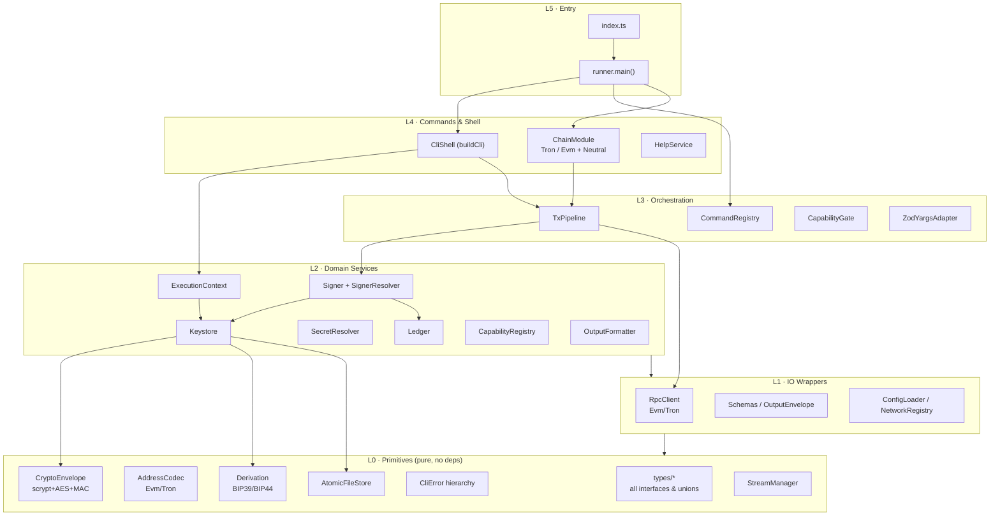
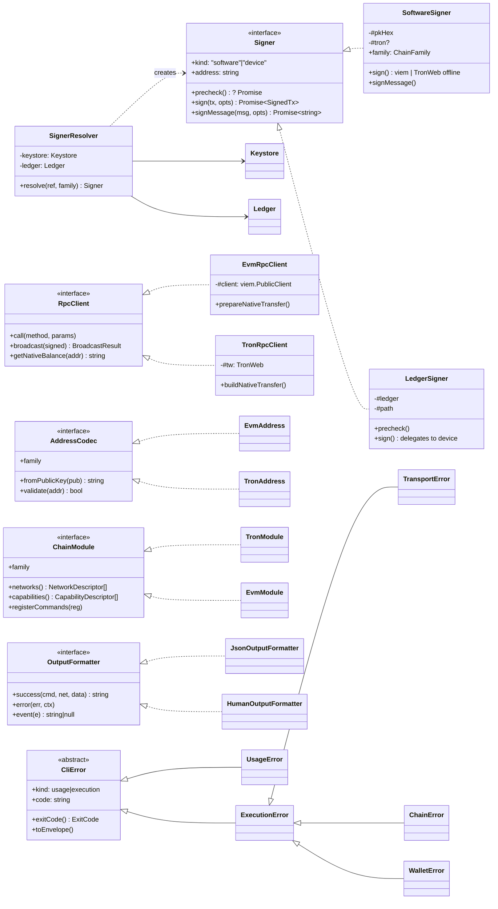
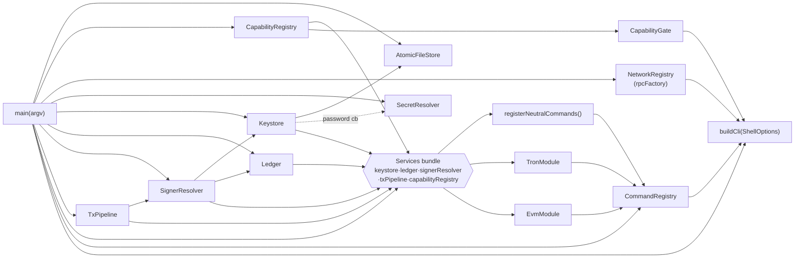
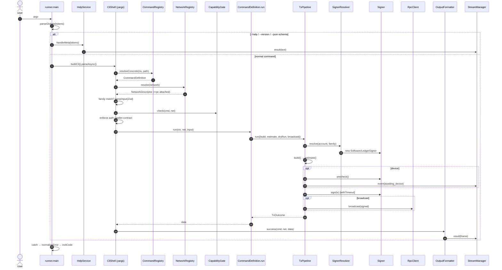
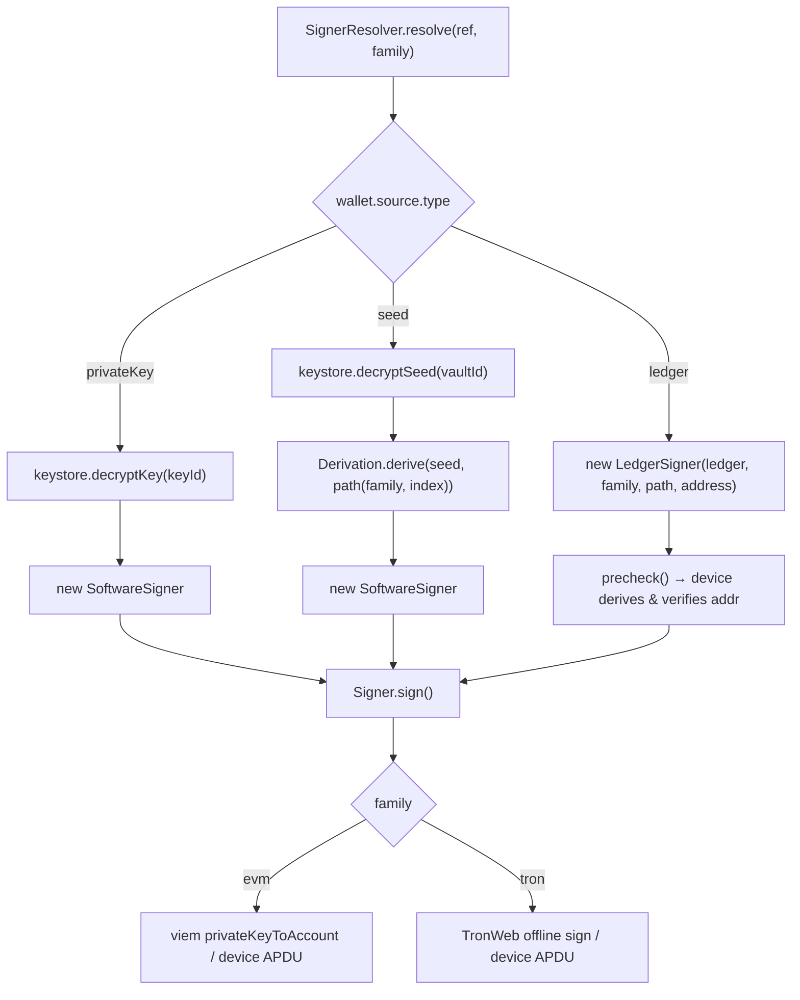

# TypeScript Wallet CLI — Object-Oriented Analysis

> A TRON + EVM standard CLI wallet. This document maps the runtime object model: the
> interfaces (contracts), the concrete classes that implement them, and how they
> collaborate from `argv` to a signed/broadcast transaction.

---

## 1. Layered Architecture (bird's-eye)



**Dependency rule:** arrows point downward only. L0 knows nothing about anything above
it. Everything above depends on the `types/*` contracts, not on concrete classes —
which is what makes the whole tree injectable and testable.

---

## 2. Core Class Diagram — Contracts & Implementations



---

## 3. Orchestration Object Graph (composition root)

`runner.main()` is the **composition root**: it news-up every concrete class once and
wires them by constructor injection. Nothing else calls `new` on a service.



**Services** is the DI container — an interface bundle (not a class) that each command
module closes over. This is how a `tron.tx.send-native` handler reaches the
`TxPipeline` and `SignerResolver` without global state.

---

## 4. Request → Execution Sequence



---

## 5. The Signing Strategy (heart of the design)



**Why it's clean:** `Signer` is a 4-member interface. The *source* of the key
(raw private key, HD seed, hardware device) and the *family* (TRON vs EVM signing
algorithm) are both absorbed behind it. The `TxPipeline` never branches on either —
it just calls `sign()`.

---

## 6. Design Patterns In Use

| Pattern | Where | Payoff |
|---|---|---|
| **Strategy** | `Signer`, `RpcClient`, `AddressCodec`, `OutputFormatter` | family/source/format variation behind one interface; callers stay branch-free |
| **Plugin / Module** | `ChainModule` (`TronModule`, `EvmModule`) | add a chain by adding a module + registering commands — no edits to the shell |
| **Factory** | `SignerResolver`, `balanceCommand()`, `messageSignCommand()`, `createOutputFormatter()` | concrete instances built from a discriminator (source type / family / output mode) |
| **Registry** | `CommandRegistry`, `NetworkRegistry`, `CapabilityRegistry`, `ADDRESS_CODECS` | keyed lookup; decouples producers from consumers |
| **Dependency Injection** | `Services`, `RuntimeDeps`, `ShellOptions` | one composition root (`main`); everything else takes deps via constructor |
| **Pipeline** | `TxPipeline.run()` | build → estimate → sign → broadcast, each `withTimeout`, dry-run/broadcast gates |
| **Adapter** | `ZodYargsAdapter` | Zod is the single source of truth; yargs only gets arity hints |
| **Envelope** | `OutputEnvelope`, `ResultEnvelope`/`ErrorEnvelope` | uniform `{success, command, data/error, meta}` JSON |
| **Template Method** | `BaseOutputFormatter` → Json/Human | shared `meta()`; subclasses fill `success/error/event` |
| **State guard** | `StreamManager` (`#resultWritten`, `#stdinRead`) | exactly one stdout result, one stdin read |
| **Discriminated union** | `Source`, `TxOutcome`, `ProgressEvent` | exhaustive, type-checked branching |

---

## 7. Key Architectural Observations

1. **`types/index.ts` is the keystone** — a pure contract layer (~28 interfaces, all
   the unions). Every concrete class implements an interface from here; nothing in L0
   imports upward. This is textbook Dependency Inversion.

2. **One composition root.** `runner.main()` is the *only* place `new` is called on a
   service. Swap any implementation (e.g. a mock `Ledger` in tests) by changing one
   line there.

3. **Family-symmetry by interface, not inheritance.** TRON and EVM never share a base
   class; they each implement `Signer` / `RpcClient` / `AddressCodec` / `ChainModule`.
   Shared *intent* (e.g. balance, message-sign) is factored into command **factories**
   (`shared.ts`), not into a class hierarchy.

4. **The `Services` bundle is the seam** between infrastructure and commands. Command
   modules are closures over `Services`; they can't reach anything not in the bundle.

5. **Capability gating is per-network, not per-family.** `CapabilityRegistry` tracks
   what each *network* supports (EIP-1559 on Base, legacy on BSC), and `CapabilityGate`
   enforces it after the registry has already confirmed the command exists.

6. **I/O discipline is centralized in `StreamManager`.** Formatters only produce
   strings; the stream manager owns stdout (exactly one result frame), stderr
   (diagnostics/events), and the single stdin read — which is what makes `--output json`
   reliably machine-parseable.

7. **Errors are a closed taxonomy.** Everything thrown anywhere (Zod, yargs, viem,
   tronweb, AbortController) is funneled through `classifyError()` into `UsageError`
   (exit 2) or `ExecutionError` (exit 1), with internal errors *redacted* to avoid
   leaking secrets.
```
