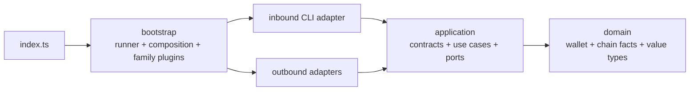

# wallet-cli

TypeScript implementation of the TRON wallet CLI. This project owns its source, dependencies,
tests and live-test artifacts independently.

The CLI contract is:

- stable `wallet-cli.result.v1` JSON envelopes;
- deterministic `0 / 1 / 2` exit codes;
- exactly one terminal stdout frame in JSON mode;
- encrypted local wallet storage;
- stdin/TTY secret handling without secret argv/env values;
- TRON mainnet, Nile and Shasta targets;
- software and Ledger signing;
- extensible family plugins without a universal-chain abstraction.

## Commands

```bash
npm ci
npm run typecheck
npm run depcruise
npm test
npm run build
```

The live Nile suite reads the test identity from `../ts/.private/.env.test`, uses an isolated
`WALLET_CLI_HOME`, and never copies or logs the private material:

```bash
npm run test:live:nile
```

Its raw output is written to
`docs/nile-full-command-test-2026-06-29-run2-rawlogs.md`.

## Architecture



Dependency direction is enforced by dependency-cruiser. Inbound and outbound adapters are peers
and may meet only in `bootstrap/composition.ts`. See the
[architecture source of truth](./docs/typescript-wallet-cli-architecture-source-of-truth.zh-TW.md)
for the complete contract; `docs/architecture.md` is its compact English overview.
