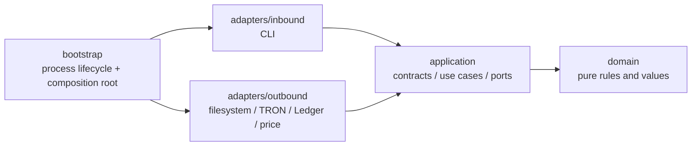
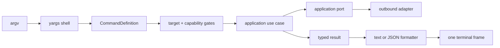
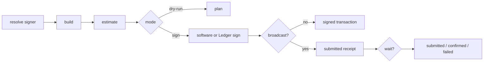

# wallet-cli architecture — English summary

This document is a non-normative English overview. The single, authoritative architecture and
behavior contract is
[typescript-wallet-cli-architecture-source-of-truth.zh-TW.md](./typescript-wallet-cli-architecture-source-of-truth.zh-TW.md).

## 1. Dependency model



Rules:

1. `domain` imports neither application, adapters nor bootstrap.
2. Production `application` imports neither adapters nor bootstrap.
3. Inbound and outbound adapters never import each other or bootstrap.
4. `bootstrap/composition.ts` is the only general composition root.
5. Chain-specific adapter and use-case construction belongs to a family plugin.
6. Circular dependencies are forbidden.
7. Type-only dependencies must follow the same conceptual direction even when the dependency
   checker would ignore their runtime edge.

## 2. Package tree

```text
src/
├── index.ts
├── bootstrap/
│   ├── argv.ts
│   ├── runner.ts
│   ├── composition.ts
│   ├── family-registry.ts
│   └── families/
│       ├── types.ts
│       └── tron.ts
├── domain/
│   ├── address/
│   ├── amounts/
│   ├── derivation/
│   ├── errors/
│   ├── family/
│   ├── resources/
│   ├── sources/
│   ├── types/
│   └── wallet/
├── application/
│   ├── contracts/
│   │   ├── execution-policy.ts
│   │   ├── execution-scope.ts
│   │   └── progress.ts
│   ├── ports/
│   │   ├── chain/
│   │   ├── network-registry.ts
│   │   └── prompt.ts
│   ├── services/
│   │   ├── capability/
│   │   ├── pipeline/
│   │   ├── signer/
│   │   └── target/
│   └── use-cases/
│       └── tron/
└── adapters/
    ├── inbound/cli/
    │   ├── commands/
    │   ├── contracts/
    │   ├── context/
    │   ├── help/
    │   ├── input/
    │   ├── output/
    │   ├── registry/
    │   ├── render/
    │   └── shell/
    └── outbound/
        ├── chain/tron/
        ├── config/
        ├── keystore/
        ├── ledger/
        ├── persistence/
        ├── price/
        └── tokenbook/
```

## 3. Responsibilities

### Domain

Contains pure wallet, account, address, amount, derivation, source, family and transaction value
rules. Domain code performs no filesystem, network, device, terminal or process I/O.

### Application

Defines what the product does and which external capabilities it requires.

- `contracts`: adapter-neutral execution policy, scopes and progress events.
- `ports`: capabilities required by application workflows, implemented by inbound or outbound adapters.
- `services`: reusable orchestration such as signer resolution and transaction pipeline.
- `use-cases`: wallet/config and family-specific workflows.

Application services consume ports such as `WalletRepository`, `ChainGatewayProvider`,
`LedgerDevice`, `TokenRepository`, `PriceProvider`, `NetworkRegistry`, `PromptPort` and
`BackupWriter`. They never construct or import filesystem, TronWeb, Ledger transport, CoinGecko,
Zod, yargs, CLI rendering or output-envelope implementations.

### Inbound CLI adapter

Owns yargs, zod command schemas, help/catalog generation, TTY input, stream discipline, output
envelopes and human rendering. A command definition translates CLI input into a use-case call; it
does not implement persistence or provider transport. CLI-only contracts (`CommandDefinition`,
`ExecutionContext`, globals, session and output envelopes) live under `inbound/cli/contracts`.

### Outbound adapters

Implement application ports:

- encrypted file keystore and atomic persistence;
- YAML configuration document;
- secure backup writer;
- TRON gateway and TronGrid history reader;
- Ledger device transport;
- token repository and price provider.

### Bootstrap

- `argv.ts`: pre-yargs global scan required to select output and secret channels.
- `composition.ts`: constructs process-scoped adapters and shared services.
- `runner.ts`: executes one invocation and owns the terminal error boundary.
- `family-registry.ts`: enabled plugin list and family-keyed projections.
- `families/*.ts`: family-specific gateway/signing/use-case/command composition.

## 4. Command flow



Zod remains the single source for command input shape, defaults, validation, help fields and JSON
Schema. Global flags remain table-driven. Business execution modes and confirmation behavior have
one implementation in application services, not duplicate command helpers.

## 5. Transaction flow



Chain-specific builders and confirmation readers are provided by the family gateway. The shared
pipeline knows only signer and broadcaster ports.

## 6. Chain-family extension

A family plugin owns the concrete composition for one chain family:

The complete EVM implementation order, public discovery requirements, network contract and
acceptance checklist are defined in [evm-development-plan.zh-TW.md](./evm-development-plan.zh-TW.md).

```ts
interface FamilyPlugin<F extends ChainFamily> {
  meta: FamilyMeta & { family: F }
  signStrategy: SignStrategy
  createGateway(network: NetworkDescriptor): ChainGatewayMap[F]
  createModule(dependencies: FamilyApplicationDependencies): ChainModule
}
```

Adding EVM requires:

1. Add `evm` to `ChainFamily` and `FamilyMeta` facts.
2. Extend the discriminated `NetworkDescriptor` union.
3. Extend `ChainGatewayMap` with an `EvmGateway` port.
4. Implement EVM address codec, gateway and signing strategy.
5. Implement EVM use cases and CLI command module without changing TRON use cases.
6. Add `bootstrap/families/evm.ts` and one registry entry.
7. Add routing, signer, capability, output and contract tests.

Only genuinely shared capabilities receive shared ports. TRON staking/resource methods and EVM
gas/nonce methods stay in their family gateways; no universal gateway may accumulate unrelated
chain operations.

## 7. Behavioral invariants

- JSON success and error use `wallet-cli.result.v1`.
- Usage errors exit 2; execution errors exit 1; success/meta requests exit 0.
- JSON stdout contains exactly one terminal frame.
- Progress and diagnostics use stderr.
- Unknown exceptions are redacted.
- A run consumes stdin through at most one secret channel.
- Secrets never enter logs, envelopes, argv or environment variables.
- Dry-run does not decrypt, sign or broadcast.
- Watch-only accounts never sign.
- Every persistent mutation is locked and atomically replaced.
- Already-broadcast transactions do not become command failures solely because confirmation times
  out.

## 8. Verification gates

```bash
npm run typecheck
npm run depcruise
npm test
npm run build
npm run test:live:nile
```

`test:live:nile` exercises the live surface in an isolated wallet home and emits a raw log without
exposing the test secret.
