# TypeScript Wallet CLI Architecture Specification (Source of Truth)

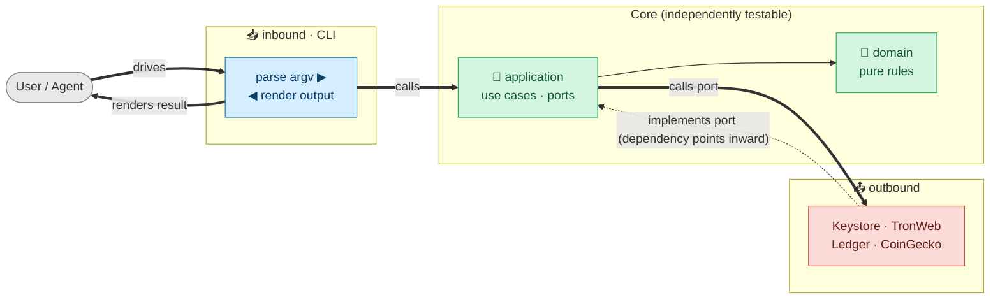

> Status: the single current architecture contract
> Applies to version: `wallet-cli 0.1.x`
> Runtime: Node.js 20+, ESM, TypeScript
> Current chain support: TRON (mainnet, Nile, Shasta)

This document fully defines the system boundaries, dependency direction, composition, command routing, application ports, wallet and transaction flows, persistence, output, and extension rules of the TypeScript Wallet CLI. The document itself is the single specification for architecture and behavior; it does not require any other design document to be understood.

If the implementation and this document disagree, the change must fix one side or the other — the document must not describe an abstraction that does not exist for any length of time.

---

## 1. System Goals and Boundaries

### 1.1 Goals

1. Provide humans and agents with the same stable CLI, JSON envelope, command id, and exit codes.
2. Keep Domain and Application as the core; isolate external I/O behind ports and adapters.
3. inbound CLI and outbound infrastructure are peers, assembled only in Bootstrap.
4. Keep chain-family differences inside the family plugin, family use cases, gateway, and signing strategy.
5. Encrypt private keys, mnemonics, and BIP39 passphrases at rest; Ledger/watch-only hold no secrets.
6. Each execution produces exactly one terminal result on stdout; progress and diagnostics go to stderr.
7. A single Zod schema drives validation, yargs arity, help, and JSON Schema.
8. Use dependency-cruiser, typecheck, contract tests, unit tests, and build to prevent architectural and behavioral regression.

### 1.2 Current Boundaries

- The only formal `ChainFamily` is currently `tron`; EVM is a planned but not-yet-public family.
- Ledger currently implements only the TRON app.
- Network transport is TRON FullNode HTTP / TronWeb; `httpEndpoint` is not an Ethereum JSON-RPC or gRPC endpoint.
- `create`, the various `import` commands, `delete`, and `backup` may be interactive in a controlled way; other commands fail fast when arguments are missing.
- Secrets are not accepted from argv plaintext or ordinary files; only a dedicated stdin channel or hidden TTY prompt is allowed.

---

## 2. Architecture and Dependency Rules

### 2.1 The Four Architectural Areas

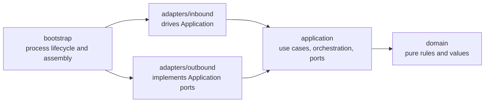

| Area | May depend on | Must not depend on |
| --- | --- | --- |
| `domain` | Node / third-party pure libraries, same area | `application`, `adapters`, `bootstrap` |
| `application` | `domain`, application-internal contracts/ports | `adapters`, `bootstrap` |
| `adapters/inbound` | `application`, `domain`, inbound-internal | `adapters/outbound`, `bootstrap` |
| `adapters/outbound` | `application` ports, `domain`, outbound-internal | `adapters/inbound`, `bootstrap` |
| `bootstrap` | all areas | none; but it only does assembly and process lifecycle |

These are conceptual dependency rules. Even when a type-only import produces no runtime edge, it must still follow the same direction. Circular dependencies are always forbidden.

The diagram below is a detailed view (dependency view) of the same rules. **Solid lines are the runtime call direction (left to right); dashed lines are the compile-time dependency/implements direction (always pointing inward).** Their opposite directions are exactly what dependency inversion looks like in concrete form: application calls outbound (rightward), but outbound depends on application's port (leftward). This diagram depicts responsibilities and dependencies, not the order of process execution; the real runtime entry/exit is wrapped by `bootstrap/runner.ts` (see §3.1).

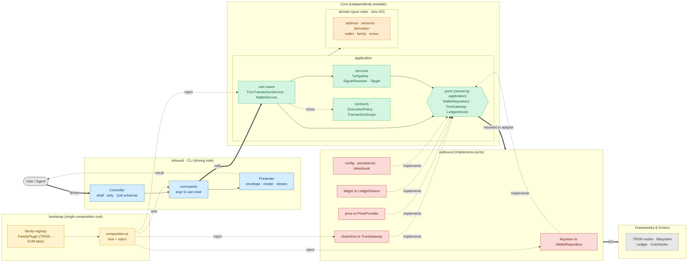

### 2.2 Why inbound and outbound do not depend on each other

A CLI command should not know about Keystore, TronWeb, CoinGecko, or the Ledger transport; it only calls a use case. An outbound adapter likewise should not know about Zod, yargs, the CLI envelope, or the renderer; it only implements an application port. The two are injected into the same object graph only in `bootstrap/composition.ts`.

### 2.3 Actual Directory Responsibilities

```text
src/
├── index.ts                         # process entry
├── bootstrap/
│   ├── argv.ts                      # global/secret flags scan before yargs
│   ├── runner.ts                    # invocation lifecycle + terminal error funnel
│   ├── composition.ts               # the single general composition root
│   ├── family-registry.ts           # enabled family plugins and familyMap
│   └── families/
│       ├── types.ts                 # FamilyPlugin contract
│       └── tron.ts                  # TRON gateway/use cases/commands assembly
├── domain/
│   ├── address/ amounts/ derivation/# pure value rules
│   ├── errors/                      # typed errors + exit semantics
│   ├── family/ resources/ sources/ # exhaustive facts registries
│   ├── types/                       # domain data shapes
│   └── wallet/                      # account refs, address projections, vault codec
├── application/
│   ├── contracts/                   # execution policy/scope/progress
│   ├── ports/                       # required external capabilities
│   ├── services/                    # target/capability/signer/pipeline/confirmation
│   └── use-cases/                   # wallet/config/message/TRON workflows
└── adapters/
    ├── inbound/cli/
    │   ├── commands/                # schema + use-case translation
    │   ├── contracts/ context/      # CLI-only command/runtime contracts
    │   ├── globals/ arity/ schemas/ # flag single source + Zod projections
    │   ├── shell/ registry/ help/   # routing and discovery
    │   ├── input/                   # secret + prompt
    │   └── output/ render/ stream/  # terminal presentation
    └── outbound/
        ├── chain/tron/              # gateway, history, signing strategy
        ├── config/ keystore/        # config and wallet persistence
        ├── ledger/                  # device adapter
        ├── persistence/             # crypto, atomic FS, backup writer
        ├── tokenbook/               # TokenRepository
        └── price/                   # PriceProvider
```

---

## 3. Startup, Composition, and Process Lifecycle

### 3.1 Startup Flow

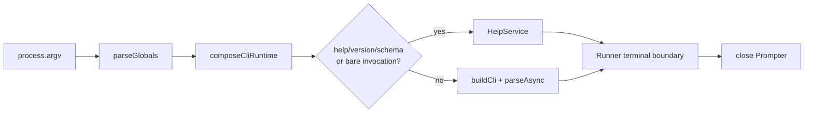

1. `src/index.ts` only calls `main(process.argv)` and sets `process.exitCode`; it does not call `process.exit()`.
2. `bootstrap/argv.ts` scans globals before yargs, because the output mode and secret source must be decided first.
3. `composeCliRuntime()` loads config and builds streams, formatter, outbound adapters, application services/use cases, the command registry, and the target/capability gates.
4. `FAMILY_REGISTRY` assembles each family's metadata, sign strategy, gateway factory, and command module into a plugin.
5. The family plugin builds family-specific use cases and then injects them into the inbound `ChainModule`.
6. Command-backed capabilities are derived from the registry's `capability` field and merged with network traits.
7. A meta request short-circuits before building the yargs execution, but uses the same streams and error-output rules.
8. The Runner catches all typed/unknown errors, normalizes them, emits output, decides the exit code, and finally closes the `/dev/tty` handle.

### 3.2 The `FamilyPlugin` Contract

```ts
interface FamilyPlugin<F extends ChainFamily> {
  readonly meta: FamilyMeta & { family: F }
  readonly signStrategy: SignStrategy
  createGateway(network: NetworkDescriptor): ChainGatewayMap[F]
  createModule(deps: FamilyApplicationDependencies): ChainModule
}
```

`bootstrap/families/tron.ts` is TRON's concrete composition: it builds the `TronRpcClient`, the TronGrid history reader, the TRON use cases, and the `TronModule`. Application and adapters must not import the family registry in reverse.

---

## 4. Command Contract and Dispatch

### 4.1 `CommandDefinition`

`CommandDefinition` is the contract of the inbound CLI adapter, not a Domain/Application model.

| Field | Contract |
| --- | --- |
| `path` | Neutral commands use the full path; chain commands use a cross-family logical path. |
| `family` | Omitted for neutral commands; when present, the resolved network selects the family implementation. |
| `stdin` | A dedicated stdin channel for `privateKey`, `mnemonic`, `tx`, `message`. |
| `network` | `none`, `optional`, `required`; today both optional/required can fall back to the default network. |
| `wallet` | `none` or `optional`; optional can override the active account with `--account`. |
| `auth` | An unlock declaration for help/catalog; actual software signing uses lazy decrypt. |
| `broadcasts` | Controls whether help reveals `--wait`. |
| `passwordMode` | `establish` or `verify`, controls interactive master-password priming. |
| `interactive` | Only commands that explicitly opt in may open a TTY prompt. |
| `capability` | A per-network capability that must pass before execution. |
| `fields` / `input` | Zod field metadata and the complete validation schema. |
| `run` | Translates CLI input/context into a use-case call and returns structured data. |
| `formatText` | Optional text renderer; JSON does not use it. |

The stable command id is derived from metadata: a neutral command is `path.join(".")`, e.g. `import.mnemonic`; a chain command is `family.path`, e.g. `tron.tx.send`.

### 4.2 The Two Command Classes and Routing

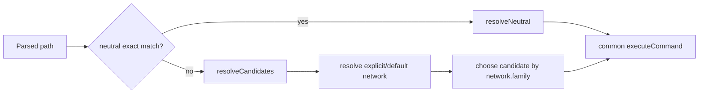

- `tron` is not a public prefix for ordinary execution commands; `--network` decides the family.
- Help/JSON Schema may use the family prefix to address a concrete implementation precisely.
- An unknown top-level/subcommand/flag must return `unknown_command` or `invalid_option`; yargs must not silently succeed.

### 4.3 The Fixed Dispatch Order

```mermaid
flowchart LR
    ROUTE[Route] --> FLAGS[Reject unknown flags]
    FLAGS --> TARGET[Resolve target]
    TARGET --> CAP[Capability gate]
    CAP --> PASSWORD[Optional password prime]
    PASSWORD --> GAP[Optional TTY gap-fill]
    GAP --> ZOD[Zod parse]
    ZOD --> CTX[Build ExecutionContext]
    CTX --> ACCOUNT[Resolve account if wallet-bound]
    ACCOUNT --> RUN[Command → use case]
    RUN --> FORMAT[Text or JSON]
    FORMAT --> RESULT[Stream result exactly once]
```

`ExecutionContext` is the CLI context; an Application workflow receives only the narrower `ExecutionPolicy`, `ExecutionSelection`, `AccountScope`, or `TransactionScope`, and does not depend on the full picture of CLI streams/config/envelope.

---

## 5. The Public Command Surface

```text
wallet-cli
├── create
├── import mnemonic | private-key | ledger | watch
├── list | use | current | rename | derive | backup | delete
├── config | networks
├── account balance | info | history | portfolio
├── token balance | info | add | list | remove
├── tx send | broadcast | status | info
├── contract call | send | deploy | info
├── stake freeze | unfreeze | withdraw | cancel-unfreeze | delegate | undelegate
├── message sign
└── block [number]
```

Neutral commands do not touch a chain. Chain commands are currently all provided by the TRON plugin. All transaction-creating commands jointly support:

- `--dry-run`: build + estimate, no decrypt, no sign, no broadcast.
- `--sign-only`: build + estimate + sign, returns a signed transaction.
- No mode flag: sign + broadcast.
- `--wait`: wait for confirmation only after broadcast.

### 5.1 Global Flags

| Flag | Runtime semantics |
| --- | --- |
| `--output` / `-o` | `text` or `json`; defaults from config. |
| `--network` | Canonical network id; a chain command falls back to `defaultNetwork` when omitted. |
| `--account` | Account ref/label/address; overrides only for this execution. |
| `--timeout` | Timeout for a single RPC/device operation. |
| `--verbose` / `-v` | Additional diagnostics. |
| `--wait` | Poll for confirmation after broadcast. |
| `--wait-timeout` | Upper bound for confirmation polling, default 60000 ms. |
| `--password-stdin` | Read the master password from fd 0. |
| `--help` / `--version` / `--json-schema` | Meta requests. |

The single registration point for global flags is `adapters/inbound/cli/globals/GLOBAL_FLAG_SPECS`; the argv scan, yargs options, and help/catalog are all projected from it.

---

## 6. Domain Model

### 6.1 Wallet, Account, and Source

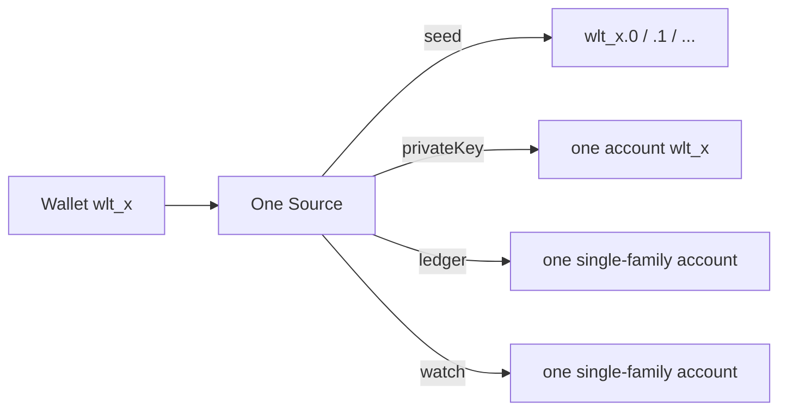

```ts
type Source =
  | { type: "seed"; vaultId: string; addresses: Record<string, ChainAddresses> }
  | { type: "privateKey"; keyId: string; addresses: ChainAddresses }
  | { type: "ledger"; family: ChainFamily; path: string; address: string }
  | { type: "watch"; family: ChainFamily; address: string }
```

| Source | HD | Local secret | Family scope | Signing |
| --- | --- | --- | --- | --- |
| seed | yes | encrypted entropy/passphrase | all enabled families | software |
| privateKey | no | encrypted raw key | all enabled families | software |
| ledger | no | none | single family/path | device |
| watch | no | none | single family | forbidden |

The account is the unit of selection and operation. `--account` accepts a canonical ref, a unique label, or a unique address; for a multi-account seed, when only a wallet ref is given, the index must not be guessed.

### 6.2 Derivation and Addresses

- BIP39 English wordlist; `create` generates 128-bit entropy (12 words).
- HD path: `m/44'/{coinType}'/{account}'/0/0`; the TRON coin type is 195.
- secp256k1 derives the address from an uncompressed 65-byte public key.
- The seed vault stores encrypted entropy and an optional BIP39 passphrase, not the mnemonic string directly.
- The public address cache lives in wallet metadata; read/build/estimate do not require decrypting secrets.
- The Domain `family`, `sources`, and `resources` registries must be exhaustively keyed; adding a union member forces the type system to fill in the related facts.

### 6.3 Active Account

- The first registered account automatically becomes active.
- `use` persistently changes `activeAccount`; `--account` does not persist.
- When the active account is deleted, the first remaining account is chosen; if none, it is set to `null`.
- `current` returns only the persistent active account.

---

## 7. Application: Use Cases, Services, and Ports

### 7.1 Ports

Application defines capabilities, not concrete technologies:

| Port | Purpose | Current adapter |
| --- | --- | --- |
| `WalletRepository` / `AccountStore` | wallet/account query, mutation, decrypt | `Keystore` |
| `BackupWriter` | safely write a plaintext backup | `SecureBackupWriter` |
| `ConfigDocumentRepository` | atomic config document update | `YamlConfigDocument` |
| `NetworkRegistry` | canonical network id/default resolution | outbound config registry |
| `LedgerDevice` | address, tx/message signing, app config | `Ledger` |
| `ChainGatewayProvider` | obtain a gateway by network/family | `ChainGatewayRegistry` |
| `TronGateway` | TRON reads/build/estimate/broadcast | `TronRpcClient` |
| `TronHistoryReader` | TronGrid transaction history | `TronGridHistoryReader` |
| `TokenRepository` | official/user token book | `TokenBook` |
| `PriceProvider` | best-effort USD price | CoinGecko/Null provider |
| `PromptPort` | the minimal interaction capability Application needs | inbound Prompter |

`PromptPort` is one of the few ports implemented by an inbound adapter and consumed by Application; this does not change the dependency direction, because Application owns only the interface.

### 7.2 Use Cases

- `WalletService`: create/import/list/use/current/rename/derive/delete/backup, with no knowledge of JSON/Zod/yargs.
- `ConfigService`: effective config view, key validation, canonical network normalization, and document update.
- `MessageService`: sign a message via the signer port.
- TRON use cases: account, token, transaction, contract, stake, block; they use only the TRON gateway and the necessary shared ports.

An inbound command's responsibility is to turn argv/Zod input and `ExecutionContext` into use-case input and then choose a stable output view; it must not do persistence or provider transport itself.

### 7.3 Reusable Services

- `TargetResolver`: network selection and single-family account compatibility.
- `CapabilityRegistry`: per-network feature gate.
- `SignerResolver`: source → software/device signer.
- `TxPipeline`: shared build/estimate/sign/broadcast lifecycle.
- `transactionMode`: decides `dryRun`/`signOnly`/broadcast mode.
- `tronConfirmation`: TRON-specific polling/receipt normalization, not pushed into the generic pipeline.

---

## 8. Network, Gateway, and Capability

The current descriptor:

```ts
interface TronNetworkDescriptor {
  id: string
  family: "tron"
  chainId: string
  aliases: string[]
  httpEndpoint?: string
  feeModel?: "tron-resource"
  capabilities: string[]
}
```

| ID | Alias | Endpoint |
| --- | --- | --- |
| `tron:mainnet` | `tron` | `https://api.trongrid.io` |
| `tron:nile` | `nile` | `https://nile.trongrid.io` |
| `tron:shasta` | `shasta` | `https://api.shasta.trongrid.io` |

Canonical-id resolution is case-insensitive. Aliases remain descriptor metadata but are not accepted as network selectors. Both `network: optional/required` adopt `config.defaultNetwork` when not specified, and that value must be a canonical id. Ledger/watch pin a single family, and a family mismatch must fail before any RPC.

`ChainGatewayRegistry` is injected with the family factory by Bootstrap and caches the client by network id. Its generic `client()` may only use the truly common minimal capabilities; a family use case obtains the `TronGateway` via the guarded `get(net, "tron")`. TRON staking and the future EVM gas/nonce must not be forced into a universal gateway.

Capabilities consist of two parts: the command-backed keys declared by registered commands, plus the network traits in `NetworkDescriptor.capabilities`. The gate must happen before the use case.

---

## 9. Signer and Transaction Flow

### 9.1 Signer Resolution

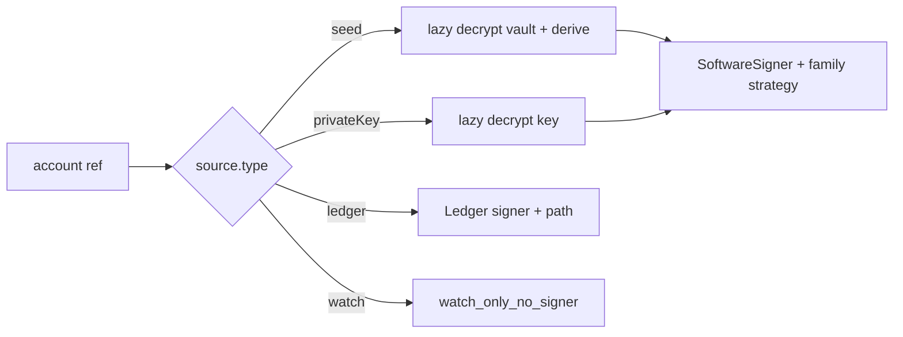

The software signer obtains the key only at the moment of an actual `sign()`; a dry-run does not trigger decryption. The Ledger signer verifies the app/address before signing, and if the cached address does not match the device it returns `wrong_device_seed`.

### 9.2 Pipeline

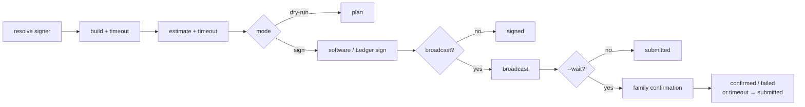

The pipeline knows only the signer and the `Broadcaster` port; the family use case provides build, estimate, and confirm callbacks. `timeoutMs` limits a single operation; `waitTimeoutMs` limits confirmation polling. Once a transaction has been broadcast, a polling error/timeout must not reclassify the command as not-broadcast — it returns `submitted`.

### 9.3 Ledger

- When `SPECULOS_PORT` is present, use the Speculos HTTP transport; otherwise USB/HID.
- Transports and `hw-app-trx` are lazily imported and closed after each operation.
- The `m/` is stripped from the Ledger path before it is passed to the app.
- APDU `0x6985` → `signing_rejected`; an unavailable device/app/transport → `auth_required`.

---

## 10. Persistence and Cryptography

### 10.1 Root and Files

The root uses a non-empty `WALLET_CLI_HOME` in order of preference, otherwise `$HOME/.wallet-cli`.

```text
<root>/
├── config.yaml
├── wallets.json
├── tokens.json
├── verifier.json
├── vaults/vlt_<id>.json
├── keys/key_<id>.json
└── backups/<accountId>-<timestamp>.json
```

`AtomicFileStore` writes use a unique temp file in the same directory, mode `0600`, and an atomic rename. Mutations are serialized with `<target>.lock` + `O_EXCL`; a dead PID/stale lock can be reclaimed.

### 10.2 `wallets.json`

```json
{
  "version": 1,
  "activeAccount": "wlt_abcd1234.0",
  "wallets": [{
    "id": "wlt_abcd1234",
    "source": {
      "type": "seed",
      "vaultId": "vlt_efgh5678",
      "addresses": { "0": { "tron": "T..." } }
    }
  }],
  "labels": { "wlt_abcd1234.0": "main" }
}
```

IDs are random 5-byte Crockford base32 lowercase strings. Labels are case-insensitively unique and must not begin with `wlt_`. The seed's known indices equal the `addresses` keys; Ledger/watch are deduplicated by source identity and are not merged with a software wallet that has the same address.

### 10.3 Token and Config

The user entries in `tokens.json` are partitioned by `<networkId>|<accountRef>`; the effective list is official first, then user-only, deduplicated by `(kind,id)`. Official entries cannot be deleted/overwritten.

`config.yaml` is shallow-merged with the builtin config. The only writable keys are `defaultNetwork`, `defaultOutput`, `timeoutMs`; `networks` is a CLI read-only view. Runtime globals are not written back to config.

### 10.4 Encrypted Blobs

`verifier.json`, vaults, and keys use scrypt (N=262144, r=8, p=1, dkLen=32), AES-128-CTR, and a `keccak256(derivedKey[16..31] + ciphertext)` MAC. Each blob has its own 32-byte salt and 16-byte IV but shares the keystore master password. A MAC mismatch returns `auth_failed`; the password is never written to disk.

Backup is allowed only for seed/private-key; the plaintext secret file must be `0600` and must not overwrite an existing file; the terminal/envelope returns only metadata, not the secret.

---

## 11. Secret and Interaction Policy

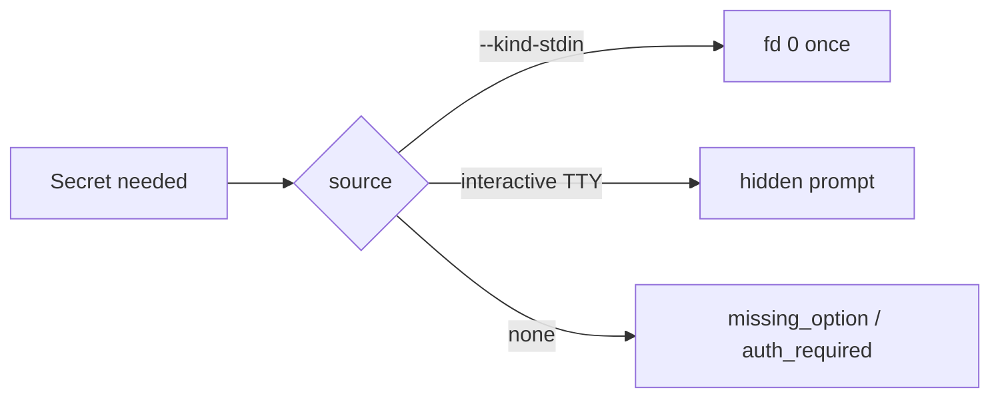

- A handler must not read `process.stdin` directly; `StreamManager.readStdinOnce()` reads at most once per execution.
- A single invocation may use fd 0 through only one `--*-stdin` channel.
- Secret argv, `MASTER_PASSWORD`, `--*-file`, and ordinary env secrets are not supported.
- A secret must not enter logs, diagnostics, error details, or the result envelope.
- Interactive allowlist: create, the four imports, delete, backup; the order is password → field gap-fill/account selection → command confirm.

---

## 12. Output, Stream, and Error

| Data | Text mode | JSON mode |
| --- | --- | --- |
| Successful terminal result | stdout once | one result envelope on stdout |
| Failed terminal result | stderr once | one error envelope on stdout |
| Progress | stderr | stderr JSON event |
| Warning | stderr/collected | `meta.warnings` |
| Debug | verbose stderr | verbose stderr |

The JSON schema is fixed as `wallet-cli.result.v1`. A chain command envelope includes family, network id/name, and chain id; a neutral command omits chain. `bigint` is converted to a decimal string and `Uint8Array` to hex. A second terminal result must throw `internal_error`.

Exit codes: success/meta = 0; execution error = 1; usage error = 2. An unknown exception is normalized into a redacted `internal_error`; the raw text of a third-party error must not enter the public envelope.

---

## 13. Help and Machine-Readable Introspection

Supports root/group/leaf help, version, the full catalog JSON Schema, and a single-command JSON Schema. The data flow:

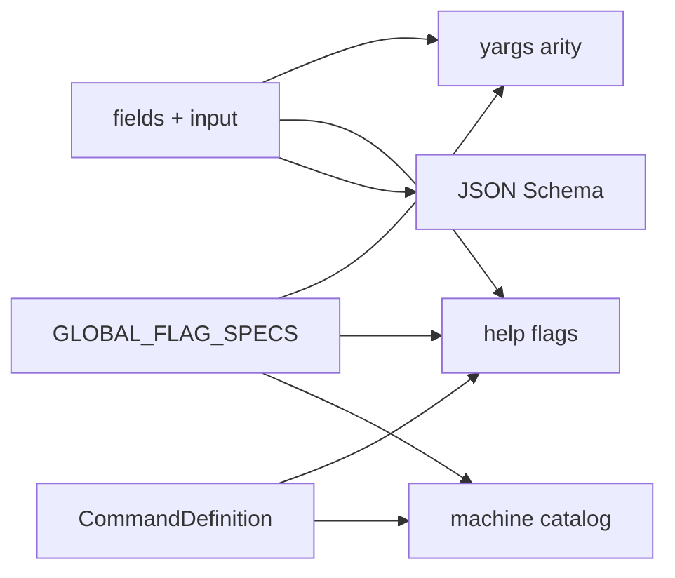

A hand-maintained command flag table must not be created separately. The public help/output is a stable contract; when it changes, automated tests must verify root, group, leaf, JSON Schema, and functional scenarios.

---

## 14. Rules for Adding Features

### 14.1 Adding a Command

1. Decide whether it is a neutral or a family logical command.
2. Application first creates/extends the use case and the required ports.
3. Outbound capabilities implement the port with an adapter; the use case must not import the adapter.
4. The inbound command defines the Zod fields/input, policy metadata, use-case translation, and renderer.
5. Register it with the neutral registrar or the family `ChainModule`.
6. Add use-case, adapter, registry/dispatch, and output/help tests, and update the inventory in this document.

A command is forbidden to build TronWeb/Keystore directly, write to process stdout, perform a filesystem mutation, or treat a provider wire response as the renderer's business model.

### 14.2 Adding a Chain Family

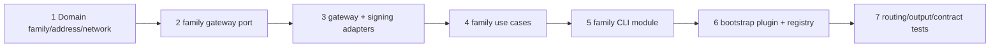

Adding a family must extend `ChainFamily`/`FAMILIES`, the discriminated network/address types, `ChainGatewayMap`, the sign strategy, the gateway, use cases, commands, the family plugin, and networks/render/tests. Only a genuinely identical intent and I/O shape may be factored into a shared port; the TRON resource model and the EVM gas/nonce must remain separate.

### 14.3 Adding a Wallet Source

Synchronously update the `Source` union, `SOURCE_KINDS`, the import workflow, repository persistence/migration, dedup, signer resolution, cleanup, descriptor rendering, and tests. An unknown source must not fall into a silent default.

---

## 15. Invariants That Must Be Maintained

### 15.1 Architecture

- Domain has no external I/O and does not depend on upper layers.
- Production Application does not import adapters/bootstrap.
- Inbound/Outbound adapters do not import each other.
- `bootstrap/composition.ts` is the single general composition root; family-specific composition lives in plugins.
- Application owns the ports; adapters implement the ports.
- No circular dependencies and no use of type-only imports to bypass a conceptual boundary.

### 15.2 Behavior and Security

- JSON stdout is exactly one terminal frame, schema `wallet-cli.result.v1`.
- The usage/execution/success exit codes are fixed at 2/1/0.
- Secrets do not enter argv/env/log/envelope; stdin uses at most one channel per execution, read once.
- Watch-only never signs; dry-run never decrypts, signs, or broadcasts.
- All persistent mutations are locked, and all replacement writes use an atomic rename.
- A broadcast transaction does not become a command failure because of a confirmation timeout.
- An unknown exception is redacted from the user.

### 15.3 Verification Gates

```bash
npm run typecheck
npm run depcruise
npm test
npm run build
```

When real TRON behavior is involved, additionally run `npm run test:live:nile` with an isolated wallet home; test secrets must not be logged or copied. An architectural change must at minimum pass typecheck, dependency-cruiser, unit tests, and build.

---

## 16. Architectural Judgment Criteria

When ownership is disputed, decide in order:

1. No I/O, describes business values and invariants: Domain.
2. Describes what the product does or what external capability it needs: Application use case/service/port.
3. Turns terminal/argv/Zod into application input: Inbound CLI adapter.
4. Implements filesystem, HTTP, device, price, etc. as a port: Outbound adapter.
5. Chooses a concrete implementation and wires the object graph: Bootstrap.

If a single module is parsing argv, calling a provider, writing a file, and rendering output all at once, the responsibilities have not yet been separated. The core standard is not the directory name, but whether dependencies point from the outside in, whether external details are replaceable, and whether the use case can be tested with only ports.
