# TypeScript Wallet CLI 架構規格（Source of Truth）

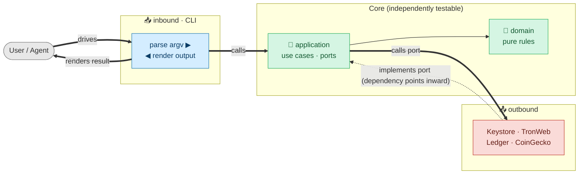

> 狀態：現行唯一架構契約  
> 適用版本：`wallet-cli 0.1.x`  
> 執行環境：Node.js 20+、ESM、TypeScript  
> 現行鏈支援：TRON（mainnet、Nile、Shasta）

本文件完整定義 TypeScript Wallet CLI 的系統邊界、依賴方向、composition、命令路由、application ports、錢包與交易流程、持久化、輸出及擴充規則。本文件本身即為架構與行為的唯一規格，不依賴其他設計文件才能解讀。

若實作與本文件不一致，變更必須同時修正其中一方，不得讓文件長期描述不存在的 abstraction。

---

## 1. 系統目標與邊界

### 1.1 目標

1. 對人員與 agent 提供同一套穩定 CLI、JSON envelope、command id 與 exit code。
2. 以 Domain 與 Application 為核心；外部 I/O 透過 ports 和 adapters 隔離。
3. inbound CLI 與 outbound infrastructure 是 peers，只能在 Bootstrap 組裝。
4. chain-family 差異保留在 family plugin、family use case、gateway 與 signing strategy。
5. 私鑰、mnemonic 與 BIP39 passphrase 加密落盤；Ledger/watch-only 不保存秘密。
6. stdout 每次執行只產生一個終局結果；進度與診斷走 stderr。
7. Zod schema 同時驅動驗證、yargs arity、help 與 JSON Schema。
8. 以 dependency-cruiser、typecheck、contract tests、unit tests 與 build 防止架構和行為退化。

### 1.2 現行邊界

- 正式 `ChainFamily` 目前只有 `tron`；EVM 是已規劃但尚未公開的 family。
- Ledger 目前只實作 TRON app。
- Network transport 是 TRON FullNode HTTP / TronWeb；`httpEndpoint` 不是 Ethereum JSON-RPC 或 gRPC endpoint。
- `create`、各種 `import`、`delete`、`backup` 可受控互動；其他命令缺參數時 fail fast。
- 秘密不接受 argv 明文或一般檔案來源；只允許專屬 stdin channel 或 hidden TTY prompt。

---

## 2. 架構與依賴規則

### 2.1 四個架構區域

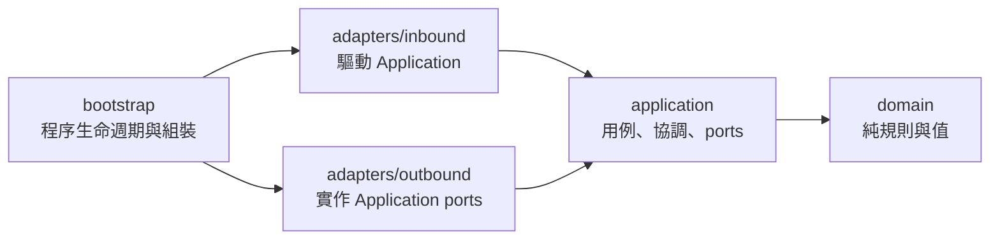

| 區域 | 可以依賴 | 禁止依賴 |
| --- | --- | --- |
| `domain` | Node/第三方純函式庫、同區域 | `application`、`adapters`、`bootstrap` |
| `application` | `domain`、application 內部 contracts/ports | `adapters`、`bootstrap` |
| `adapters/inbound` | `application`、`domain`、inbound 內部 | `adapters/outbound`、`bootstrap` |
| `adapters/outbound` | `application` ports、`domain`、outbound 內部 | `adapters/inbound`、`bootstrap` |
| `bootstrap` | 所有區域 | 無；但只做組裝與程序生命週期 |

以上是概念依賴規則。即使 type-only import 不一定產生 runtime edge，也必須遵守同一方向。循環依賴一律禁止。

下圖是同一套規則的詳細視圖（dependency view）。**實線是執行期呼叫方向（由左至右）；虛線是編譯期依賴/實作方向（一律指向核心）**。兩者方向相反正是依賴反轉的具體呈現：application 呼叫 outbound（往右），但 outbound 依賴 application 的 port（往左）。本圖描繪職責與依賴，不是程序執行順序；真實 runtime 入口/出口由 `bootstrap/runner.ts` 包裝（見 §3.1）。

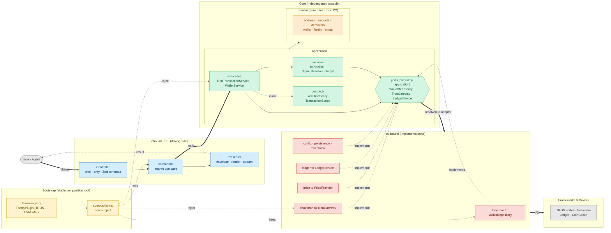

### 2.2 為什麼 inbound 與 outbound 不互相依賴

CLI command 不應知道 Keystore、TronWeb、CoinGecko 或 Ledger transport；它只呼叫 use case。Outbound adapter 也不應知道 Zod、yargs、CLI envelope 或 renderer；它只實作 application port。兩者只在 `bootstrap/composition.ts` 被注入同一個 object graph。

### 2.3 實際目錄責任

```text
src/
├── index.ts                         # process entry
├── bootstrap/
│   ├── argv.ts                      # yargs 前的 global/secret flags scan
│   ├── runner.ts                    # invocation lifecycle + terminal error funnel
│   ├── composition.ts               # 唯一一般 composition root
│   ├── family-registry.ts           # enabled family plugins 與 familyMap
│   └── families/
│       ├── types.ts                 # FamilyPlugin contract
│       └── tron.ts                  # TRON gateway/use cases/commands 組裝
├── domain/
│   ├── address/ amounts/ derivation/# 純 value rules
│   ├── errors/                      # typed errors + exit semantics
│   ├── family/ resources/ sources/ # exhaustive facts registries
│   ├── types/                       # domain data shapes
│   └── wallet/                      # account refs、address projections、vault codec
├── application/
│   ├── contracts/                   # execution policy/scope/progress
│   ├── ports/                       # 所需外部能力
│   ├── services/                    # target/capability/signer/pipeline/confirmation
│   └── use-cases/                   # wallet/config/message/TRON workflows
└── adapters/
    ├── inbound/cli/
    │   ├── commands/                # schema + use-case translation
    │   ├── contracts/ context/      # CLI-only command/runtime contracts
    │   ├── globals/ arity/ schemas/ # flag single source + Zod projections
    │   ├── shell/ registry/ help/   # routing and discovery
    │   ├── input/                   # secret + prompt
    │   └── output/ render/ stream/  # terminal presentation
    └── outbound/
        ├── chain/tron/              # gateway、history、signing strategy
        ├── config/ keystore/        # config 與 wallet persistence
        ├── ledger/                  # device adapter
        ├── persistence/             # crypto、atomic FS、backup writer
        ├── tokenbook/               # TokenRepository
        └── price/                   # PriceProvider
```

---

## 3. 啟動、組裝與程序生命週期

### 3.1 啟動流程

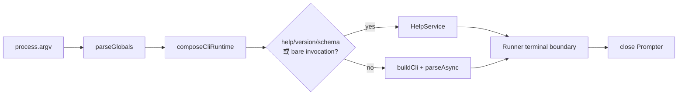

1. `src/index.ts` 只呼叫 `main(process.argv)` 並設定 `process.exitCode`，不呼叫 `process.exit()`。
2. `bootstrap/argv.ts` 在 yargs 前掃描 globals，因為 output mode 與 secret source 必須先決定。
3. `composeCliRuntime()` 載入 config，建立 streams、formatter、outbound adapters、application services/use cases、command registry 與 target/capability gates。
4. `FAMILY_REGISTRY` 將每個 family 的 metadata、sign strategy、gateway factory 與 command module 組成 plugin。
5. family plugin 建立 family-specific use cases，再把它們注入 inbound `ChainModule`。
6. command-backed capabilities 從 registry 的 `capability` 欄位推導，與 network traits 合併。
7. meta request 在建立 yargs execution 前短路，但使用相同 streams 與錯誤輸出規則。
8. Runner 捕捉所有 typed/unknown errors、正規化、輸出、決定 exit code，最後關閉 `/dev/tty` handle。

### 3.2 `FamilyPlugin` 契約

```ts
interface FamilyPlugin<F extends ChainFamily> {
  readonly meta: FamilyMeta & { family: F }
  readonly signStrategy: SignStrategy
  createGateway(network: NetworkDescriptor): ChainGatewayMap[F]
  createModule(deps: FamilyApplicationDependencies): ChainModule
}
```

`bootstrap/families/tron.ts` 是 TRON 的具體 composition：建立 `TronRpcClient`、TronGrid history reader、TRON use cases 與 `TronModule`。Application 與 adapters 不得反向 import family registry。

---

## 4. 命令契約與 Dispatch

### 4.1 `CommandDefinition`

`CommandDefinition` 是 inbound CLI adapter 的契約，不是 Domain/Application model。

| 欄位 | 契約 |
| --- | --- |
| `path` | 中立命令使用完整 path；chain 命令使用跨 family logical path。 |
| `family` | 缺省為中立命令；存在時由 resolved network 選 family implementation。 |
| `stdin` | `privateKey`、`mnemonic`、`tx`、`message` 專屬 stdin channel。 |
| `network` | `none`、`optional`、`required`；現行 optional/required 均可 fallback default network。 |
| `wallet` | `none` 或 `optional`；optional 可用 `--account` 覆寫 active。 |
| `auth` | help/catalog 的解鎖宣告；實際軟體簽名採 lazy decrypt。 |
| `broadcasts` | 控制 help 是否揭露 `--wait`。 |
| `passwordMode` | `establish` 或 `verify`，控制互動式 master password priming。 |
| `interactive` | 只有明確 opt-in 的命令可開啟 TTY prompt。 |
| `capability` | 執行前需要通過的 per-network capability。 |
| `fields` / `input` | Zod field metadata 與完整 validation schema。 |
| `run` | 把 CLI input/context 轉譯成 use-case 呼叫，回傳 structured data。 |
| `formatText` | 可選 text renderer；JSON 不使用它。 |

Stable command id 由 metadata 推導：中立命令是 `path.join(".")`，例如 `import.mnemonic`；chain 命令是 `family.path`，例如 `tron.tx.send`。

### 4.2 兩類命令與路由

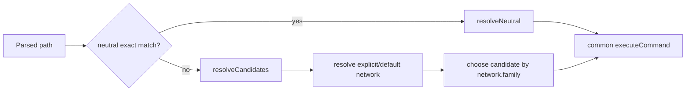

- `tron` 不是一般執行命令的 public prefix；`--network` 決定 family。
- Help/JSON Schema 可用 family prefix 精確定址具體 implementation。
- 未知 top-level/subcommand/flag 必須回 `unknown_command` 或 `invalid_option`，不可由 yargs 靜默成功。

### 4.3 Dispatch 固定順序

```mermaid
flowchart LR
    ROUTE[Route] --> FLAGS[Reject unknown flags]
    FLAGS --> TARGET[Resolve target]
    TARGET --> CAP[Capability gate]
    CAP --> PASSWORD[Optional password prime]
    PASSWORD --> GAP[Optional TTY gap-fill]
    GAP --> ZOD[Zod parse]
    ZOD --> CTX[Build ExecutionContext]
    CTX --> ACCOUNT[Resolve account if wallet-bound]
    ACCOUNT --> RUN[Command → use case]
    RUN --> FORMAT[Text or JSON]
    FORMAT --> RESULT[Stream result exactly once]
```

`ExecutionContext` 是 CLI context；Application workflow 只接收較窄的 `ExecutionPolicy`、`ExecutionSelection`、`AccountScope` 或 `TransactionScope`，不依賴 CLI streams/config/envelope 全貌。

---

## 5. 公開命令面

```text
wallet-cli
├── create
├── import mnemonic | private-key | ledger | watch
├── list | use | current | rename | derive | backup | delete
├── config | networks
├── account balance | info | history | portfolio
├── token balance | info | add | list | remove
├── tx send | broadcast | status | info
├── contract call | send | deploy | info
├── stake freeze | unfreeze | withdraw | cancel-unfreeze | delegate | undelegate
├── message sign
└── block [number]
```

中立命令不連鏈。Chain commands 目前全部由 TRON plugin 提供。所有建立 transaction 的命令共同支援：

- `--dry-run`：build + estimate，不解密、不簽名、不廣播。
- `--sign-only`：build + estimate + sign，回傳 signed transaction。
- 無 mode flag：sign + broadcast。
- `--wait`：僅在 broadcast 後等待 confirmation。

### 5.1 Global flags

| Flag | Runtime 語意 |
| --- | --- |
| `--output` / `-o` | `text` 或 `json`；預設取 config。 |
| `--network` | network id/alias；chain command 省略時取 `defaultNetwork`。 |
| `--account` | account ref/label/address；只覆寫本次執行。 |
| `--timeout` | 單次 RPC/device operation timeout。 |
| `--verbose` / `-v` | 額外 diagnostic。 |
| `--wait` | broadcast 後輪詢 confirmation。 |
| `--wait-timeout` | confirmation polling 上限，預設 60000 ms。 |
| `--password-stdin` | master password 從 fd 0 讀取。 |
| `--help` / `--version` / `--json-schema` | meta requests。 |

Global flags 的唯一登記點是 `adapters/inbound/cli/globals/GLOBAL_FLAG_SPECS`；argv scan、yargs options 與 help/catalog 都由它投影。

---

## 6. Domain 模型

### 6.1 Wallet、Account 與 Source

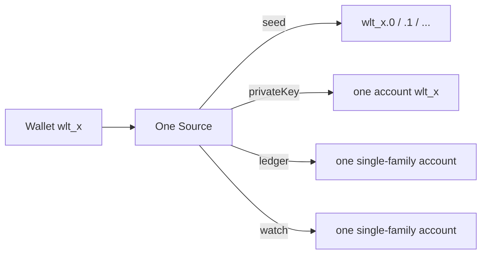

```ts
type Source =
  | { type: "seed"; vaultId: string; addresses: Record<string, ChainAddresses> }
  | { type: "privateKey"; keyId: string; addresses: ChainAddresses }
  | { type: "ledger"; family: ChainFamily; path: string; address: string }
  | { type: "watch"; family: ChainFamily; address: string }
```

| Source | HD | 本地秘密 | Family 範圍 | 簽名 |
| --- | --- | --- | --- | --- |
| seed | 是 | encrypted entropy/passphrase | 所有 enabled families | software |
| privateKey | 否 | encrypted raw key | 所有 enabled families | software |
| ledger | 否 | 無 | 單一 family/path | device |
| watch | 否 | 無 | 單一 family | 禁止 |

Account 是選擇與操作單位。`--account` 可接受 canonical ref、唯一 label 或唯一 address；多 account seed 若只給 wallet ref，不得猜測 index。

### 6.2 Derivation 與地址

- BIP39 English wordlist；`create` 產生 128-bit entropy（12 words）。
- HD path：`m/44'/{coinType}'/{account}'/0/0`；TRON coin type 為 195。
- secp256k1 使用 uncompressed 65-byte public key 推導地址。
- Seed vault 保存 encrypted entropy 與 optional BIP39 passphrase，不直接保存 mnemonic 字串。
- 公開 address cache 位於 wallet metadata；read/build/estimate 不需解密秘密。
- Domain `family`、`sources`、`resources` registries 必須 exhaustively keyed；新增 union member 時由型別系統迫使相關 facts 補齊。

### 6.3 Active account

- 第一個註冊 account 自動成為 active。
- `use` 持久修改 `activeAccount`；`--account` 不持久化。
- 刪除 active account 時選第一個剩餘 account，沒有則設 `null`。
- `current` 只回持久 active account。

---

## 7. Application：用例、Services 與 Ports

### 7.1 Ports

Application 定義能力，不定義具體技術：

| Port | 用途 | 現行 adapter |
| --- | --- | --- |
| `WalletRepository` / `AccountStore` | wallet/account query、mutation、decrypt | `Keystore` |
| `BackupWriter` | 安全寫出 plaintext backup | `SecureBackupWriter` |
| `ConfigDocumentRepository` | config document 原子更新 | `YamlConfigDocument` |
| `NetworkRegistry` | network id/alias/default resolution | outbound config registry |
| `LedgerDevice` | address、tx/message signing、app config | `Ledger` |
| `ChainGatewayProvider` | 依 network/family 取得 gateway | `ChainGatewayRegistry` |
| `TronGateway` | TRON reads/build/estimate/broadcast | `TronRpcClient` |
| `TronHistoryReader` | TronGrid transaction history | `TronGridHistoryReader` |
| `TokenRepository` | official/user token book | `TokenBook` |
| `PriceProvider` | best-effort USD price | CoinGecko/Null provider |
| `PromptPort` | application 需要的最小互動能力 | inbound Prompter |

`PromptPort` 是少數由 inbound adapter 實作、Application 消費的 port；這不改變依賴方向，因為 Application 只擁有 interface。

### 7.2 Use cases

- `WalletService`：create/import/list/use/current/rename/derive/delete/backup，不知道 JSON/Zod/yargs。
- `ConfigService`：effective config view、key validation、canonical network normalization 與 document update。
- `MessageService`：依 signer port 簽訊息。
- TRON use cases：account、token、transaction、contract、stake、block；只使用 TRON gateway 與必要的 shared ports。

Inbound command 的責任是把 argv/Zod input 和 `ExecutionContext` 轉成 use-case input，再選擇 stable output view；不得自行做 persistence 或 provider transport。

### 7.3 Reusable services

- `TargetResolver`：network selection 與 single-family account compatibility。
- `CapabilityRegistry`：per-network feature gate。
- `SignerResolver`：source → software/device signer。
- `TxPipeline`：共用 build/estimate/sign/broadcast lifecycle。
- `transactionMode`：`dryRun`/`signOnly`/broadcast mode 判定。
- `tronConfirmation`：TRON-specific polling/receipt normalization，未塞入 generic pipeline。

---

## 8. Network、Gateway 與 Capability

目前 descriptor：

```ts
interface TronNetworkDescriptor {
  id: string
  family: "tron"
  chainId: string
  aliases: string[]
  httpEndpoint?: string
  feeModel?: "tron-resource"
  capabilities: string[]
}
```

| ID | Alias | Endpoint |
| --- | --- | --- |
| `tron:mainnet` | `tron` | `https://api.trongrid.io` |
| `tron:nile` | `nile` | `https://nile.trongrid.io` |
| `tron:shasta` | `shasta` | `https://api.shasta.trongrid.io` |

解析不分大小寫；ambiguous alias 必須失敗。`network: optional/required` 都會在未明示時採 `config.defaultNetwork`。Ledger/watch pin 單一 family，family mismatch 必須在 RPC 前失敗。

`ChainGatewayRegistry` 由 Bootstrap 注入 family factory，以 network id cache client。它的 generic `client()` 只能使用真正共有的最小能力；family use case 透過 guarded `get(net, "tron")` 取得 `TronGateway`。不得把 TRON staking 與未來 EVM gas/nonce 硬塞進 universal gateway。

Capabilities 由兩部分組成：registered commands 宣告的 command-backed keys，加上 `NetworkDescriptor.capabilities` 的 network traits。Gate 必須發生在 use case 前。

---

## 9. Signer 與交易流程

### 9.1 Signer resolution

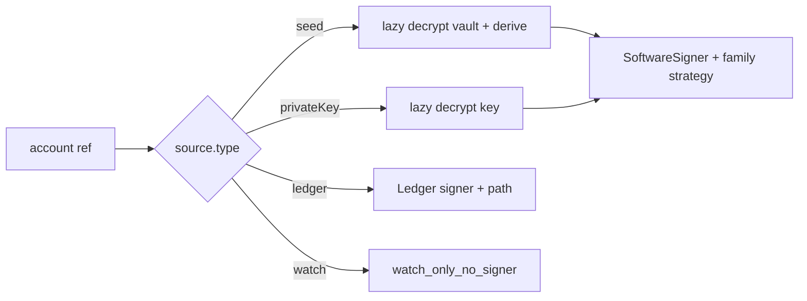

Software signer 僅在實際 `sign()` 時取 key；dry-run 不觸發解密。Ledger signer 在簽名前驗證 app/address，cached address 與裝置不符回 `wrong_device_seed`。

### 9.2 Pipeline

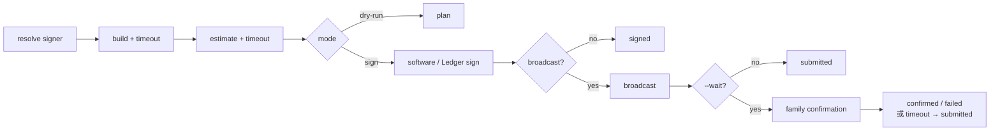

Pipeline 只知道 signer 與 `Broadcaster` port；family use case 提供 build、estimate、confirm callbacks。`timeoutMs` 限制單次 operation；`waitTimeoutMs` 限制 confirmation polling。交易已廣播後，polling error/timeout 不得把命令改判為未廣播，而是回 `submitted`。

### 9.3 Ledger

- `SPECULOS_PORT` 存在時使用 Speculos HTTP；否則 USB/HID。
- transports 與 `hw-app-trx` lazy import，每次 operation 後關閉。
- Ledger path 傳給 app 前移除 `m/`。
- APDU `0x6985` → `signing_rejected`；裝置/app/transport 不可用 → `auth_required`。

---

## 10. 持久化與密碼學

### 10.1 Root 與檔案

Root 依序使用非空 `WALLET_CLI_HOME`，否則 `$HOME/.wallet-cli`。

```text
<root>/
├── config.yaml
├── wallets.json
├── tokens.json
├── verifier.json
├── vaults/vlt_<id>.json
├── keys/key_<id>.json
└── backups/<accountId>-<timestamp>.json
```

`AtomicFileStore` writes 使用同目錄 unique temp file、mode `0600`、atomic rename。Mutation 以 `<target>.lock` + `O_EXCL` 序列化；死 PID/stale lock 可回收。

### 10.2 `wallets.json`

```json
{
  "version": 1,
  "activeAccount": "wlt_abcd1234.0",
  "wallets": [{
    "id": "wlt_abcd1234",
    "source": {
      "type": "seed",
      "vaultId": "vlt_efgh5678",
      "addresses": { "0": { "tron": "T..." } }
    }
  }],
  "labels": { "wlt_abcd1234.0": "main" }
}
```

IDs 是隨機 5-byte Crockford base32 小寫字串。Labels case-insensitive unique 且不可用 `wlt_` 開頭。Seed known indices 等於 `addresses` keys；Ledger/watch 依 source identity dedup，不與相同地址的 software wallet 合併。

### 10.3 Token 與 Config

`tokens.json` 的 user entries 以 `<networkId>|<accountRef>` 分區；effective list 是 official 先、user-only 後，依 `(kind,id)` 去重。Official entries 不可刪除/覆蓋。

`config.yaml` 與 builtin config shallow merge。可寫 keys 只有 `defaultNetwork`、`defaultOutput`、`timeoutMs`；`networks` 是 CLI read-only view。Runtime globals 不寫回 config。

### 10.4 Encrypted blobs

`verifier.json`、vaults 與 keys 使用 scrypt（N=262144、r=8、p=1、dkLen=32）、AES-128-CTR 與 `keccak256(derivedKey[16..31] + ciphertext)` MAC。每個 blob 有獨立 32-byte salt 與 16-byte IV，但共用 keystore master password。MAC 不符回 `auth_failed`；密碼永不落盤。

Backup 只允許 seed/private-key，plaintext secret file 必須為 `0600` 且不覆寫既有檔案；terminal/envelope 只回 metadata，不回秘密。

---

## 11. Secret 與互動政策

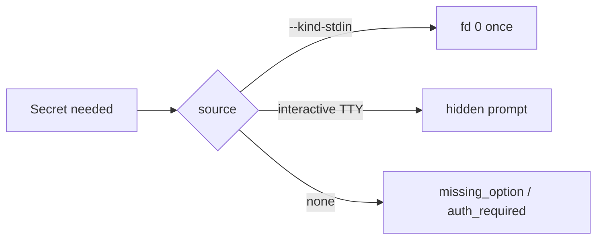

- Handler 不得直接讀 `process.stdin`；`StreamManager.readStdinOnce()` 每次執行最多一次。
- 一次 invocation 只能由一種 `--*-stdin` channel 使用 fd 0。
- 不支援 secret argv、`MASTER_PASSWORD`、`--*-file` 或一般 env secret。
- Secret 不得進 log、diagnostic、error details、result envelope。
- Interactive allowlist：create、四種 import、delete、backup；順序為 password → field gap-fill/account selection → command confirm。

---

## 12. 輸出、Stream 與錯誤

| 資料 | Text mode | JSON mode |
| --- | --- | --- |
| 成功終局結果 | stdout 一次 | stdout 一個 result envelope |
| 失敗終局結果 | stderr 一次 | stdout 一個 error envelope |
| Progress | stderr | stderr JSON event |
| Warning | stderr/收集 | `meta.warnings` |
| Debug | verbose stderr | verbose stderr |

JSON schema 固定為 `wallet-cli.result.v1`。Chain command envelope 包含 family、network id/name、chain id；中立命令省略 chain。`bigint` 轉十進位字串，`Uint8Array` 轉 hex。第二次 terminal result 必須拋 `internal_error`。

Exit code：成功/meta = 0；execution error = 1；usage error = 2。未知 exception 正規化成 redacted `internal_error`，第三方錯誤原文不可進 public envelope。

---

## 13. Help 與機器可讀自省

支援 root/group/leaf help、version、全 catalog JSON Schema 與單一命令 JSON Schema。資料流：

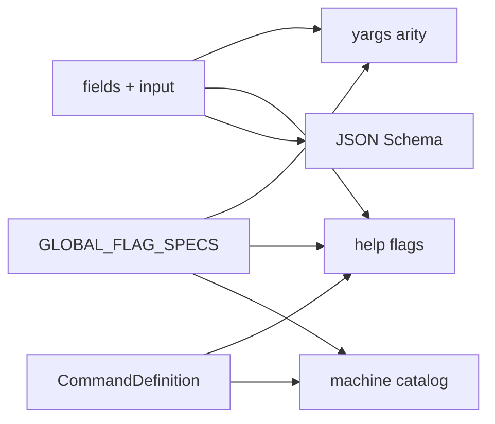

不得另建手工 command flag table。公開 help/output 是穩定契約；變更時必須以自動化測試驗證 root、group、leaf、JSON Schema 與 functional scenarios。

---

## 14. 新增功能的規則

### 14.1 新增命令

1. 決定 neutral 或 family logical command。
2. Application 先建立/擴充 use case 與需要的 port。
3. Outbound 能力用 adapter 實作 port，不讓 use case import adapter。
4. Inbound command 定義 Zod fields/input、policy metadata、use-case translation 與 renderer。
5. 註冊到 neutral registrar 或 family `ChainModule`。
6. 加入 use-case、adapter、registry/dispatch、output/help tests，並更新本文件 inventory。

禁止 command 直接建立 TronWeb/Keystore、寫 process stdout、做 filesystem mutation，或把 provider wire response 當成 renderer 的業務模型。

### 14.2 新增 chain family

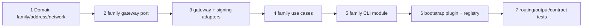

新增 family 必須擴充 `ChainFamily`/`FAMILIES`、discriminated network/address types、`ChainGatewayMap`、sign strategy、gateway、use cases、commands、family plugin、networks/render/tests。只有真正相同的 intent 與 I/O shape 才抽 shared port；TRON resource model 與 EVM gas/nonce 必須分離。

### 14.3 新增 wallet source

同步更新 `Source` union、`SOURCE_KINDS`、import workflow、repository persistence/migration、dedup、signer resolution、cleanup、descriptor rendering 與 tests。未知 source 不可落入 silent default。

---

## 15. 必須維持的不變量

### 15.1 架構

- Domain 無外部 I/O 且不依賴上層。
- Production Application 不 import adapters/bootstrap。
- Inbound/Outbound adapters 互不 import。
- `bootstrap/composition.ts` 是唯一一般 composition root；family-specific composition 在 plugins。
- Application 擁有 ports；adapter 實作 ports。
- 不允許循環依賴或以 type-only import 規避概念邊界。

### 15.2 行為與安全

- JSON stdout 恰好一個 terminal frame，schema 為 `wallet-cli.result.v1`。
- Usage/execution/success exit codes 固定為 2/1/0。
- Secret 不進 argv/env/log/envelope；stdin 每次最多一個 channel、讀一次。
- Watch-only 永不簽名；dry-run 永不解密、簽名或廣播。
- 所有 persistent mutation 鎖定，所有替換寫入 atomic rename。
- 已廣播交易不因 confirmation timeout 變成 command failure。
- Unknown exception 對使用者 redacted。

### 15.3 驗證門檻

```bash
npm run typecheck
npm run depcruise
npm test
npm run build
```

涉及真實 TRON behavior 時另執行隔離 wallet home 的 `npm run test:live:nile`；不得記錄或複製測試秘密。架構變更至少必須通過 typecheck、dependency-cruiser、unit tests 與 build。

---

## 16. 架構判斷準則

遇到歸屬爭議時依序判斷：

1. 不含 I/O、描述業務值與不變量：Domain。
2. 描述產品要做什麼或需要何種外部能力：Application use case/service/port。
3. 將 terminal/argv/Zod 轉為 application input：Inbound CLI adapter。
4. 實作 filesystem、HTTP、device、price 等 port：Outbound adapter。
5. 選擇具體 implementation 並連接 object graph：Bootstrap。

若一個模組同時 parsing argv、呼叫 provider、寫檔與 render output，代表責任尚未拆開。核心標準不是目錄名稱，而是依賴是否由外向內、外部細節是否可替換、use case 是否能只靠 ports 測試。
